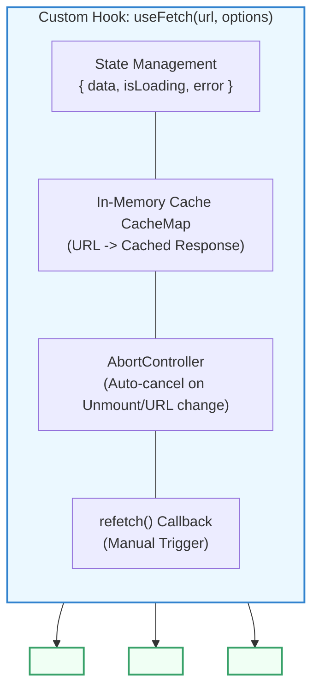

## 🏗️ ១. ស្ថាបត្យកម្មនៃ `useFetch` Custom Hook



---

## 💻 ២. កូដពេញលេញនៃ `src/hooks/useFetch.js` (ជាមួយ Caching & Refetch)

```javascript
// src/hooks/useFetch.js
import { useState, useEffect, useRef, useCallback } from 'react';

// 🗄️ In-Memory Cache រក្សាទុក Responses ក្នុង Session
const cache = new Map();

export function useFetch(url, options = {}) {
  const [data, setData] = useState(null);
  const [isLoading, setIsLoading] = useState(true);
  const [error, setError] = useState(null);

  // ប្រើ Ref ដើម្បីបង្កើត Refetch Key Trigger
  const [reloadIndex, setReloadIndex] = useState(0);

  // Function សម្រាប់អនុញ្ញាតឱ្យ User ចុច Refresh ដោយដៃ
  const refetch = useCallback(() => {
    if (url) cache.delete(url); // លុប Cache ចាស់ចោលដើម្បីទាញទិន្នន័យថ្មីពី Server
    setReloadIndex((prev) => prev + 1);
  }, [url]);

  useEffect(() => {
    if (!url) {
      setData(null);
      setIsLoading(false);
      return;
    }

    // ⚡ ពិនិត្យមើល Cache ជាមុនសិន
    if (cache.has(url)) {
      setData(cache.get(url));
      setIsLoading(false);
      setError(null);
      return;
    }

    const controller = new AbortController();
    setIsLoading(true);
    setError(null);

    const executeFetch = async () => {
      try {
        const response = await fetch(url, {
          ...options,
          signal: controller.signal,
        });

        if (!response.ok) {
          throw new Error(`HTTP Error Status: ${response.status} (${response.statusText})`);
        }

        const json = await response.json();

        // រក្សាទុកក្នុង Cache សម្រាប់ប្រើលើកក្រោយ
        cache.set(url, json);

        setData(json);
      } catch (err) {
        if (err.name !== 'AbortError') {
          setError(err.message || 'មានបញ្ហាមិនអាចទាញយកទិន្នន័យបានទេ');
        }
      } finally {
        setIsLoading(false);
      }
    };

    executeFetch();

    // 🧹 Cleanup: Cancel request ពេល URL ផ្លាស់ប្តូរ ឬ Component Unmount
    return () => {
      controller.abort();
    };
  }, [url, reloadIndex]);

  return { data, isLoading, error, refetch };
}
```

---

## 🚀 ៣. ការហៅប្រើប្រាស់ក្នុង Component (Tabbed Post Explorer)

```jsx
// src/components/TabbedPostExplorer.jsx
import { useState } from 'react';
import { useFetch } from '../hooks/useFetch';

const CATEGORIES = [
  { id: 1, name: 'បច្ចេកវិទ្យា (Tech)', limit: 3 },
  { id: 2, name: 'ការរចនា (Design)', limit: 5 },
  { id: 3, name: 'ពាណិជ្ជកម្ម (Business)', limit: 4 },
];

export default function TabbedPostExplorer() {
  const [selectedCat, setSelectedCat] = useState(CATEGORIES[0]);

  // ហៅ useFetch យ៉ាងខ្លី — ពេល selectedCat ដូរ URL ដូរ Hook នឹងទាញយកស្វ័យប្រវត្តិ!
  const { data: posts, isLoading, error, refetch } = useFetch(
    `https://jsonplaceholder.typicode.com/posts?_limit=${selectedCat.limit}`
  );

  return (
    <div className="max-w-lg mx-auto p-6 bg-white dark:bg-slate-900 border border-slate-200 dark:border-slate-800 rounded-3xl shadow-xl space-y-5">
      <div className="flex justify-between items-center pb-3 border-b border-slate-200 dark:border-slate-800">
        <div>
          <h2 className="text-base font-black text-slate-800 dark:text-white flex items-center gap-2">
            <span>📚</span> Tabbed Post Explorer
          </h2>
          <p className="text-xs text-slate-500">ដំណើរការដោយ Custom `useFetch` Hook</p>
        </div>

        <button
          onClick={refetch}
          disabled={isLoading}
          className="px-3 py-1.5 bg-indigo-50 dark:bg-indigo-950/40 text-indigo-600 dark:text-indigo-400 hover:bg-indigo-100 rounded-xl text-xs font-bold transition"
        >
          {isLoading ? '...' : '🔄 Refetch'}
        </button>
      </div>

      {/* CATEGORY TABS */}
      <div className="flex gap-2">
        {CATEGORIES.map((cat) => (
          <button
            key={cat.id}
            onClick={() => setSelectedCat(cat)}
            className={`px-3 py-1.5 rounded-xl text-xs font-bold transition ${
              selectedCat.id === cat.id
                ? 'bg-indigo-600 text-white shadow'
                : 'bg-slate-100 dark:bg-slate-800 text-slate-600 dark:text-slate-300 hover:bg-slate-200'
            }`}
          >
            {cat.name}
          </button>
        ))}
      </div>

      {/* ── STATES ── */}
      {isLoading && (
        <div className="py-12 text-center text-xs text-slate-400 animate-pulse">
          ⏳ កំពុងទាញយកទិន្នន័យពី Server...
        </div>
      )}

      {error && !isLoading && (
        <div className="p-4 bg-rose-50 border border-rose-200 text-rose-600 rounded-2xl text-xs text-center">
          ⚠️ {error}
        </div>
      )}

      {!isLoading && !error && (
        <ul className="space-y-2.5 max-h-72 overflow-y-auto pr-1">
          {posts?.map((post) => (
            <li
              key={post.id}
              className="p-3.5 bg-slate-50 dark:bg-slate-800/50 rounded-2xl border border-slate-100 dark:border-slate-800 text-xs space-y-1"
            >
              <h4 className="font-bold text-slate-800 dark:text-white capitalize">
                {post.title}
              </h4>
              <p className="text-[11px] text-slate-500 line-clamp-2">{post.body}</p>
            </li>
          ))}
        </ul>
      )}
    </div>
  );
}
```

---

## 🔍 ៤. ការវិភាគចំណុចគន្លឹះនៃស្ថាបត្យកម្ម

1. **In-Memory Caching ជាមួយ `Map()`:**  
   នៅពេល User ចុចប្តូរ Tab ពី Tech ➔ Design រួចត្រឡប់មក Tech វិញ `useFetch` នឹងទាញទិន្នន័យចេញពី `cache.get(url)` ភ្លាមៗ (Instant Zero-latency Loading) ដោយមិនចាំបាច់បាញ់ HTTP Request ឡើងវិញឡើយ!
2. **Refetch Buster:**  
   នៅពេល User ចង់បានទិន្នន័យស្រស់បំផុតពី Server ការហៅ `refetch()` នឹងដំណើរការ `cache.delete(url)` ជាមុន រួចទើបបាញ់ HTTP Request ថ្មី។

---

## 🧠 ៥. សង្ខេប Mental Model ងាយចាំ

| លក្ខណៈពិសេស | ដំណោះស្រាយក្នុង `useFetch` |
| :--- | :--- |
| **Tri-State Management** | ផ្ទុក `{ data, isLoading, error }` ក្នុង Hook តែមួយ |
| **Memory Leak Protection** | រុំព័ទ្ធដោយ `AbortController` ក្នុង `useEffect` cleanup |
| **Instant Navigation** | In-Memory `cache.set(url, json)` |
| **Manual Refresh** | `refetch()` trigger តាមរយៈ reload index |
