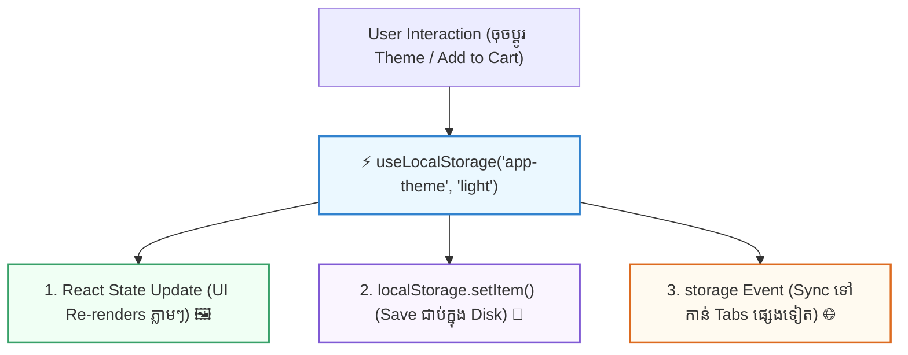

## 🗄️ ១. បញ្ហានៃ Native `localStorage` ធៀបនឹង React State

នៅក្នុង React ៖
- `useState` ➔ ធ្វើឱ្យ UI Re-render ពេល State ប្តូរ ប៉ុន្តែ **បាត់បង់ទិន្នន័យពេល Refresh (F5)**។
- `localStorage` ➔ រក្សាទុកទិន្នន័យជាប់រហូតលើ Browser ប៉ុន្តែ **មិនបង្កឱ្យ UI Re-render ឡើយ** ពេលកែប្រែតម្លៃ។



---

## 💻 ២. កូដពេញលេញនៃ `src/hooks/useLocalStorage.js`

```javascript
// src/hooks/useLocalStorage.js
import { useState, useEffect, useCallback } from 'react';

export function useLocalStorage(key, initialValue) {
  // ── ១. LAZY INITIAL STATE (អានពី Storage តែម្តងគត់លើ Mount) ──
  const [storedValue, setStoredValue] = useState(() => {
    if (typeof window === 'undefined') return initialValue;

    try {
      const item = window.localStorage.getItem(key);
      // បើមានទិន្នន័យ Parse ជា JSON បើគ្មានយក initialValue
      return item ? JSON.parse(item) : initialValue;
    } catch (error) {
      console.warn(`⚠️ Error reading localStorage key "${key}":`, error);
      return initialValue;
    }
  });

  // ── ២. CUSTOM SETTER FUNCTION (គាំទ្រទាំងតម្លៃផ្ទាល់ និង Function Updates) ──
  const setValue = useCallback(
    (value) => {
      try {
        setStoredValue((prev) => {
          // គាំទ្រ setter ដូច useState: setValue(prev => !prev)
          const valueToStore = value instanceof Function ? value(prev) : value;

          if (typeof window !== 'undefined') {
            if (valueToStore === undefined) {
              window.localStorage.removeItem(key);
            } else {
              window.localStorage.setItem(key, JSON.stringify(valueToStore));
            }
          }

          return valueToStore;
        });
      } catch (error) {
        console.warn(`⚠️ Error setting localStorage key "${key}":`, error);
      }
    },
    [key]
  );

  // ── ៣. CROSS-TAB SYNCHRONIZATION (ស្តាប់ Storage Events ពី Tabs ផ្សេង) ──
  useEffect(() => {
    const handleStorageChange = (e) => {
      if (e.key === key && e.newValue !== null) {
        try {
          setStoredValue(JSON.parse(e.newValue));
        } catch {
          setStoredValue(e.newValue);
        }
      }
    };

    window.addEventListener('storage', handleStorageChange);
    return () => window.removeEventListener('storage', handleStorageChange);
  }, [key]);

  return [storedValue, setValue];
}
```

---

## 🚀 ៣. ការអនុវត្តជាក់ស្តែង ៖ Auto-saving Form Draft

ខាងក្រោមនេះជា Form ដែលមានសមត្ថភាព **Auto-save សេចក្តីព្រាង (Draft)** ពេលកំពុងវាយ — ទោះបីជា User ច្រឡំដៃបិទ Tab ឬ Refresh ក៏អក្សរមិនបាត់បង់ឡើយ៖

```jsx
// src/components/AutoSaveNote.jsx
import { useLocalStorage } from '../hooks/useLocalStorage';

export default function AutoSaveNote() {
  // ចុះឈ្មោះ State ភ្ជាប់ជាមួយ localStorage key 'draft_note'
  const [draft, setDraft] = useLocalStorage('draft_note', {
    title: '',
    content: '',
    lastSaved: null,
  });

  const handleChange = (field, value) => {
    setDraft((prev) => ({
      ...prev,
      [field]: value,
      lastSaved: new Date().toLocaleTimeString(),
    }));
  };

  const handleClear = () => {
    setDraft({ title: '', content: '', lastSaved: null });
  };

  return (
    <div className="max-w-md mx-auto p-6 bg-white dark:bg-slate-900 border border-slate-200 dark:border-slate-800 rounded-3xl shadow-xl space-y-4">
      <div className="flex justify-between items-center pb-3 border-b border-slate-200 dark:border-slate-800">
        <div>
          <h3 className="font-bold text-sm text-slate-800 dark:text-white flex items-center gap-2">
            <span>📝</span> Auto-saving Draft Note
          </h3>
          <p className="text-[11px] text-slate-500">
            {draft.lastSaved ? `រក្សាទុកចុងក្រោយម៉ោង: ${draft.lastSaved}` : 'មិនទាន់មានការកែប្រែ'}
          </p>
        </div>

        <button
          onClick={handleClear}
          className="text-xs text-rose-500 hover:text-rose-600 font-bold"
        >
          លុបសេចក្តីព្រាង
        </button>
      </div>

      <div className="space-y-3">
        <input
          type="text"
          value={draft.title}
          onChange={(e) => handleChange('title', e.target.value)}
          placeholder="ចំណងជើងអត្ថបទ..."
          className="w-full px-3.5 py-2 border rounded-xl text-xs dark:bg-slate-800 dark:text-white focus:outline-none focus:ring-2 focus:ring-indigo-500"
        />

        <textarea
          rows={5}
          value={draft.content}
          onChange={(e) => handleChange('content', e.target.value)}
          placeholder="សរសេរខ្លឹមសារនៅទីនេះ (ទិន្នន័យនឹង Sync ចូល LocalStorage ស្វ័យប្រវត្តិ)..."
          className="w-full p-3.5 border rounded-2xl text-xs dark:bg-slate-800 dark:text-white focus:outline-none focus:ring-2 focus:ring-indigo-500"
        />
      </div>

      <div className="p-3 bg-indigo-50 dark:bg-indigo-950/40 border border-indigo-100 dark:border-indigo-900/60 rounded-xl text-[11px] text-indigo-700 dark:text-indigo-300">
        💡 <b>សាកល្បងពិសោធន៍:</b> វាយអត្ថបទរួចចុច Refresh (F5) ឬបើក Tab ថ្មី — អត្ថបទរបស់អ្នកនឹងនៅរក្សាដដែល ១០០%!
      </div>
    </div>
  );
}
```

---

## 🧠 ៤. សង្ខេប Mental Model ងាយចាំ

| មុខងារ | បច្ចេកទេសអនុវត្ត | អត្ថប្រយោជន៍ចម្បង |
| :--- | :--- | :--- |
| **Lazy Read** | `useState(() => JSON.parse(...))` | អាន Storage តែ ១ ដងគត់លើ Mount (លឿន) |
| **Functional Setter** | `setValue(prev => next)` | ដំណើរការដូច `useState` ដើមរបស់ React ១០០% |
| **Cross-Tab Sync** | `window.addEventListener('storage')` | ធ្វើបច្ចុប្បន្នភាពទិន្នន័យឆ្លងកាត់ Tabs ស្វ័យប្រវត្តិ |
| **Safe Error Handling** | `try / catch` block ជុំវិញ Storage | ការពារ App កុំឱ្យ Crash ពេល User បិទ Cookies/Storage |
