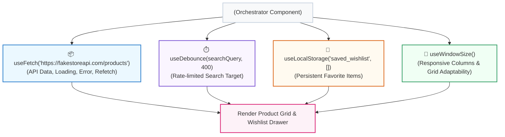

## 🛍️ ១. ស្ថាបត្យកម្ម Hook Composition Blueprint

នៅក្នុងគម្រោងនេះ យើងនឹងបង្កើត **E-Commerce Product Explorer** ដោយផ្គុំ Custom Hooks ចំនួន ៤ ដំណើរការជាមួយគ្នា ៖



---

## 💻 ២. កូដពេញលេញនៃគម្រោង (`src/ProductExplorerApp.jsx`)

```jsx
// src/ProductExplorerApp.jsx
import { useState, useMemo } from 'react';
import { useFetch } from './hooks/useFetch';
import { useDebounce } from './hooks/useDebounce';
import { useLocalStorage } from './hooks/useLocalStorage';
import { useWindowSize } from './hooks/useWindowSize';

export default function ProductExplorerApp() {
  // ── ១. HOOK 1: RESPONSIVE SCREEN ADAPTABILITY ──
  const { isMobile } = useWindowSize();

  // ── ២. HOOK 2: DATA FETCHING FROM REST API ──
  const { data: products, isLoading, error, refetch } = useFetch(
    'https://fakestoreapi.com/products'
  );

  // ── ៣. HOOK 3: DEBOUNCED SEARCH QUERY ──
  const [search, setSearch] = useState('');
  const debouncedSearch = useDebounce(search, 400);

  // ── ៤. HOOK 4: PERSISTENT WISHLIST STATE ──
  const [wishlist, setWishlist] = useLocalStorage('ecommerce_wishlist', []);

  // Category Filter State
  const [selectedCategory, setSelectedCategory] = useState('all');

  // Toggle Favorite
  const toggleWishlist = (id) => {
    setWishlist((prev) =>
      prev.includes(id) ? prev.filter((item) => item !== id) : [...prev, id]
    );
  };

  // ── ៥. FILTERED & SEARCHED PRODUCTS (Derived State) ──
  const filteredProducts = useMemo(() => {
    if (!products) return [];

    return products.filter((p) => {
      const matchSearch = p.title
        .toLowerCase()
        .includes(debouncedSearch.toLowerCase());
      const matchCategory =
        selectedCategory === 'all' || p.category === selectedCategory;
      return matchSearch && matchCategory;
    });
  }, [products, debouncedSearch, selectedCategory]);

  return (
    <div className="min-h-screen bg-slate-100 dark:bg-slate-950 p-4 sm:p-8">
      <div className="max-w-5xl mx-auto bg-white dark:bg-slate-900 rounded-3xl shadow-2xl border border-slate-200 dark:border-slate-800 p-6 space-y-6">
        
        {/* TOP HEADER */}
        <div className="flex flex-col sm:flex-row justify-between items-start sm:items-center gap-4 pb-4 border-b border-slate-200 dark:border-slate-800">
          <div>
            <h1 className="text-xl font-black text-slate-800 dark:text-white flex items-center gap-2">
              <span>🛍️</span> Modern Product Explorer
            </h1>
            <p className="text-xs text-slate-500 mt-1">
              ផ្គុំ Custom Hooks: useFetch + useDebounce + useLocalStorage + useWindowSize
            </p>
          </div>

          <div className="flex items-center gap-3">
            <span className="px-3.5 py-1.5 bg-rose-50 dark:bg-rose-950/50 text-rose-600 dark:text-rose-400 font-bold rounded-xl text-xs border border-rose-200 dark:border-rose-900 flex items-center gap-1.5 shadow-sm">
              <span>❤️ Wishlist:</span>
              <b>{wishlist.length}</b>
            </span>

            <button
              onClick={refetch}
              disabled={isLoading}
              className="px-3 py-1.5 bg-slate-100 dark:bg-slate-800 hover:bg-slate-200 text-slate-700 dark:text-slate-300 font-bold rounded-xl text-xs transition"
            >
              {isLoading ? '...' : '🔄 Refresh'}
            </button>
          </div>
        </div>

        {/* SEARCH & FILTERS BAR */}
        <div className="grid grid-cols-1 sm:grid-cols-3 gap-3">
          <div className="sm:col-span-2 relative">
            <input
              type="text"
              value={search}
              onChange={(e) => setSearch(e.target.value)}
              placeholder="ស្វែងរកតាមឈ្មោះផលិតផល... (Debounce 400ms)"
              className="w-full px-4 py-2.5 bg-slate-50 dark:bg-slate-800 border border-slate-200 dark:border-slate-700 rounded-2xl text-xs dark:text-white focus:outline-none focus:ring-2 focus:ring-indigo-500"
            />
          </div>

          <select
            value={selectedCategory}
            onChange={(e) => setSelectedCategory(e.target.value)}
            className="px-3 py-2.5 bg-slate-50 dark:bg-slate-800 border border-slate-200 dark:border-slate-700 rounded-2xl text-xs dark:text-white focus:outline-none focus:ring-2 focus:ring-indigo-500 cursor-pointer"
          >
            <option value="all">គ្រប់ប្រភេទ (All Categories)</option>
            <option value="men's clothing">សម្លៀកបំពាក់បុរស</option>
            <option value="women's clothing">សម្លៀកបំពាក់នារី</option>
            <option value="jewelery">គ្រឿងអលង្ការ</option>
            <option value="electronics">អេឡិចត្រូនិច</option>
          </select>
        </div>

        {/* ── ១. LOADING SKELETON ── */}
        {isLoading && (
          <div className={`grid gap-4 ${isMobile ? 'grid-cols-1' : 'grid-cols-2 md:grid-cols-3'}`}>
            {[1, 2, 3, 4, 5, 6].map((n) => (
              <div key={n} className="p-4 bg-slate-50 dark:bg-slate-800/40 rounded-2xl border animate-pulse space-y-3">
                <div className="h-32 bg-slate-200 dark:bg-slate-700 rounded-xl" />
                <div className="h-3 bg-slate-200 dark:bg-slate-700 rounded w-3/4" />
                <div className="h-3 bg-slate-200 dark:bg-slate-700 rounded w-1/4" />
              </div>
            ))}
          </div>
        )}

        {/* ── ២. ERROR BANNER ── */}
        {error && !isLoading && (
          <div className="p-6 bg-rose-50 border border-rose-200 text-rose-600 rounded-2xl text-center text-xs font-bold">
            ⚠️ {error}
          </div>
        )}

        {/* ── ៣. PRODUCT GRID ── */}
        {!isLoading && !error && (
          <div>
            {filteredProducts.length === 0 ? (
              <p className="text-center py-12 text-xs text-slate-400">
                រកមិនឃើញផលិតផលដែលត្រូវនឹងពាក្យស្វែងរកឡើយ!
              </p>
            ) : (
              <div className={`grid gap-4 ${isMobile ? 'grid-cols-1' : 'grid-cols-2 md:grid-cols-3'}`}>
                {filteredProducts.map((product) => {
                  const isSaved = wishlist.includes(product.id);

                  return (
                    <div
                      key={product.id}
                      className="p-4 bg-white dark:bg-slate-900 rounded-2xl border border-slate-100 dark:border-slate-800 shadow-sm hover:shadow-md transition flex flex-col justify-between space-y-3 group"
                    >
                      <div className="h-36 flex items-center justify-center p-2 bg-slate-50 dark:bg-slate-800/50 rounded-xl">
                        
                      </div>

                      <div>
                        <span className="text-[10px] font-bold text-indigo-600 uppercase">
                          {product.category}
                        </span>
                        <h4 className="font-bold text-xs text-slate-800 dark:text-slate-100 line-clamp-1 mt-1">
                          {product.title}
                        </h4>
                      </div>

                      <div className="flex justify-between items-center pt-2 border-t border-slate-100 dark:border-slate-800">
                        <span className="font-black text-sm text-slate-900 dark:text-white">
                          ${product.price}
                        </span>

                        <button
                          onClick={() => toggleWishlist(product.id)}
                          className={`px-3 py-1.5 rounded-xl text-xs font-bold transition flex items-center gap-1 ${
                            isSaved
                              ? 'bg-rose-500 text-white shadow'
                              : 'bg-slate-100 dark:bg-slate-800 text-slate-600 dark:text-slate-300 hover:bg-slate-200'
                          }`}
                        >
                          <span>{isSaved ? '❤️' : '🤍'}</span>
                          <span>{isSaved ? 'Saved' : 'Wishlist'}</span>
                        </button>
                      </div>
                    </div>
                  );
                })}
              </div>
            )}
          </div>
        )}

      </div>
    </div>
  );
}
```

---

## 🔍 ៣. ការវិភាគចំណុចគន្លឹះនៃស្ថាបត្យកម្ម

1. **Declarative Hook Consumption:**  
   សង្កេតមើល `ProductExplorerApp` ៖ វាគ្មានកូដ `fetch()`, គ្មាន `setTimeout()`, គ្មាន `localStorage.setItem()`, និងគ្មាន `addEventListener()` សោះឡើយ! កូដទាំងអស់ត្រូវបានបំបែកជា Custom Hooks ស្អាតស្អំ។
2. **Persistence across Sessions:**  
   ទិន្នន័យ Wishlist ដែល User បានចុច ❤️ នឹងត្រូវបានរក្សាទុកក្នុង LocalStorage ជានិច្ច មិនបាត់បង់ឡើយពេលបិទ Browser។
3. **Responsive UI:**  
   `useWindowSize` ជួយប្តូរ Grid Layout ពី 1 Column លើទូរស័ព្ទ ទៅជា 3 Columns លើ Desktop ដោយរលូន។

---

## 🏆 ៤. បញ្ជីត្រួតពិនិត្យការអនុវត្ត (Checklist)

- [x] Custom Hooks ទាំង ៤ (`useFetch`, `useDebounce`, `useLocalStorage`, `useWindowSize`) ផ្គុំគ្នាដោយគ្មានកំហុស
- [x] Live Search ដំណើរការជាមួយ Debounce (400ms) កាត់បន្ថយការគណនា
- [x] Wishlist ដំណើរការជាមួយ Persistent Storage (ចុច Refresh នៅរក្សាដដែល)
- [x] Tri-State UI ដំណើរការពេញលេញ (Skeleton Loader, Error State, Product Grid)
