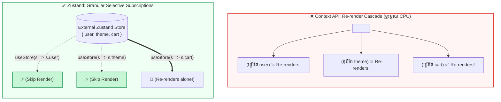

## 💥 ១. The Context Re-render Problem (បញ្ហាដែលត្រូវដោះស្រាយ)

React Context API គឺជាឧបករណ៍ដ៏អស្ចារ្យសម្រាប់ចៀសវាង Prop Drilling។ ក៏ប៉ុន្តែ នៅពេលដែល Application របស់អ្នករីកធំឡើង Context API មានដែនកំណត់ធំមួយ ៖  
**«Context API មិនមានយន្តការ Selective Subscription ឡើយ!»**

ប្រសិនបើអ្នកបង្កើត Context ធំមួយ `{ user, theme, cart, notifications }` ៖  
រាល់ពេលដែល User ចុច *Add to Cart* ➔ តម្លៃ `cart` ផ្លាស់ប្តូរ ➔ **គ្រប់ Components ទាំងអស់ដែលអាន Context នេះ (រួមទាំង UserProfile, Sidebar, ThemeToggle) នឹងត្រូវ Re-render ទាំងអស់!**



---

## 💻 ២. ការបង្ហាញបញ្ហាក្នុងកូដជាក់ស្តែង (Proof in Code)

### ❌ បញ្ហាក្នុង Context API:

```jsx
// 1. GlobalContext.jsx
const GlobalContext = createContext(null);

export function GlobalProvider({ children }) {
  const [user] = useState({ name: 'Sok Dara', role: 'Admin' });
  const [cart, setCart] = useState([]);

  const addToCart = (item) => setCart((prev) => [...prev, item]);

  return (
    <GlobalContext.Provider value={{ user, cart, addToCart }}>
      {children}
    </GlobalContext.Provider>
  );
}

// 2. UserProfile.jsx — Component នេះប្រើតែ 'user' មិនដែលប៉ះពាល់ 'cart' ឡើយ!
function UserProfile() {
  const { user } = useContext(GlobalContext);
  
  // ⚠️ នឹង Console.log រាល់ពេល User ចុច Add to Cart!
  console.log('🔴 UserProfile Re-rendered!'); 

  return <div>👤 {user.name} ({user.role})</div>;
}
```

### 💣 ហេតុអ្វីបានជា `UserProfile` Re-render?
1. ពេល `addToCart` ដំណើរការ `setCart` ធ្វើឱ្យ `GlobalProvider` Re-render។
2. Object ក្នុង `value={{ user, cart, addToCart }}` ទទួលបាន New Reference ក្នុង Memory។
3. React ពិនិត្យឃើញ `value` ប្រែប្រួល ទើបបញ្ជាឱ្យ **គ្រប់ Component ណាដែលហៅ `useContext(GlobalContext)` ត្រូវ Re-render ទាំងអស់** ដោយគ្មានការលើកលែង!

---

## ⚡ ៣. ដំណោះស្រាយដ៏មានឥទ្ធិពល ៖ Zustand Granular Selectors

នៅក្នុង Zustand យើងអាចជ្រើសរើសអានតែ Field ណាដែល Component ពិតជាត្រូវការ (Selective Subscription) ៖

```javascript
// 1. បង្កើត Zustand Store ក្រៅ React Tree
import { create } from 'zustand';

export const useStore = create((set) => ({
  user: { name: 'Sok Dara', role: 'Admin' },
  cart: [],
  addToCart: (item) => set((s) => ({ cart: [...s.cart, item] })),
}));
```

```jsx
// 2. UserProfile គ្រាន់តែ Subscribe លើ 'state.user' ប៉ុណ្ណោះ
function UserProfile() {
  const user = useStore((state) => state.user);

  // ✅ នឹងមិន Re-render ឡើយនៅពេល cart ផ្លាស់ប្តូរ!
  console.log('🟢 UserProfile Rendered');

  return <div>👤 {user.name}</div>;
}
```

---

## 🎯 ៤. State Management Decision Matrix (យុទ្ធសាស្ត្រជ្រើសរើស Tool)

| ប្រភេទ State (State Category) | ឧបករណ៍ដែលស័ក្តិសមបំផុត | ឧទាហរណ៍ជាក់ស្តែង |
| :--- | :--- | :--- |
| **Local Component State** | `useState` / `useReducer` | Form Input, Accordion Open/Close, Modal Toggle |
| **Low-Frequency Global State** | **React Context API** | Theme (Dark/Light), Language (km/en), Auth User Session |
| **High-Frequency Complex Client State** | **Zustand** | E-Commerce Cart, Canvas Editor, Music Player, Multi-step Wizard |
| **Server Cache State (Async API)** | **TanStack Query (React Query)** | Fetching API Lists, Auto-polling, Mutation, Pagination Caching |

---

## 🧠 ៥. សង្ខេប Mental Model ងាយចាំ

- **Context API** មិនមែនជា State Manager ទេ តែជា **Dependency Injection / Transport Mechanism** សម្រាប់បញ្ជូន Props ពីលើចុះក្រោមដោយគ្មាន Prop Drilling។
- **Zustand** គឺជា **True Central State Manager** ដែលមាន Selective Subscriptions, គ្មាន Provider Wrapper, និងមាន Performance ខ្ពស់បំផុត។
