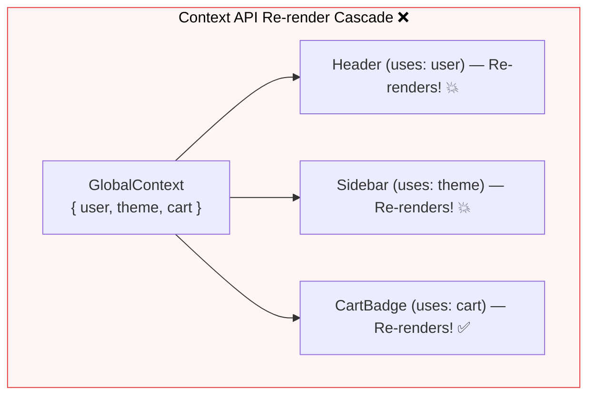

## 💥 1. The Context Re-render Problem



---

## 💻 2. Demonstrating the Problem in Code

### 💻 Code បង្ហាញពី Re-render Problem ក្នុង Context:

```jsx
// AppContext.jsx
const AppContext = createContext();

export function AppProvider({ children }) {
  const [user, setUser] = useState({ name: 'Dara' });
  const [cart, setCart] = useState([]);

  // ⚠️ រាល់ពេល cart ប្រែប្រួល object ថ្មីត្រូវបានបង្កើតក្នុង value
  return (
    <AppContext.Provider value={{ user, cart, setCart }}>
      {children}
    </AppContext.Provider>
  );
}

// UserProfile.jsx (Component នេះប្រើតែ 'user' មិនប៉ះ 'cart' ឡើយ)
function UserProfile() {
  const { user } = useContext(AppContext);
  console.log('UserProfile Rendered!'); // ⚠️ Re-render រាល់ពេល User Add to Cart!
  return <div>👤 {user.name}</div>;
}
```

### 🔍 ការពន្យល់មួយជួរៗ (Line-by-Line Explanation):

1. `value={{ user, cart, setCart }}`
   - នៅពេល `setCart` ត្រូវបានហៅ `AppProvider` នឹង re-render ហើយបង្កើត Object reference ថ្មីសម្រាប់ `value`។
2. `const { user } = useContext(AppContext);`
   - ដោយសារ `AppContext` ទទួលបាន Object reference ថ្មី React នឹងបង្ខំឱ្យ Component ណាដែលប្រើ `useContext(AppContext)` Re-render ទាំងអស់។
3. `console.log('UserProfile Rendered!')`
   - `UserProfile` នឹង Re-render ឥតប្រយោជន៍រាល់ពេល Cart Update ទោះបីទិន្នន័យ `user` មិនបានប្រែប្រួលសូម្បីតែបន្តិចក៏ដោយ!

---

## ⚡ 3. The Solution: Selective Subscription ជាមួយ Zustand

```javascript
// Zustand Store គាំទ្រ Selective Subscription!
const useStore = create((set) => ({
  user: { name: 'Dara' },
  cart: [],
  addToCart: (item) => set((s) => ({ cart: [...s.cart, item] })),
}));

// UserProfile គ្រាន់តែ subscribe លើ state.user ប៉ុណ្ណោះ
function UserProfile() {
  const user = useStore((state) => state.user); // ✅ នឹងមិន Re-render ពេល cart ប្រែប្រួលឡើយ!
  return <div>👤 {user.name}</div>;
}
```

---

## 🎯 4. State Management Decision Matrix

| ប្រភេទ State (State Type) | ឧបករណ៍ដែលត្រូវប្រើ (Recommended Tool) |
|--------------------------|-------------------------------------|
| **Simple Static State** (Theme, Language) | ✅ React Context API |
| **Complex Client State** (Cart, Modals, Filters) | ✅ Zustand |
| **Server Cache State** (API Data, Caching) | ✅ TanStack Query (React Query) |
| **Local Component State** (Input form, toggles) | ✅ `useState` / `useReducer` |
