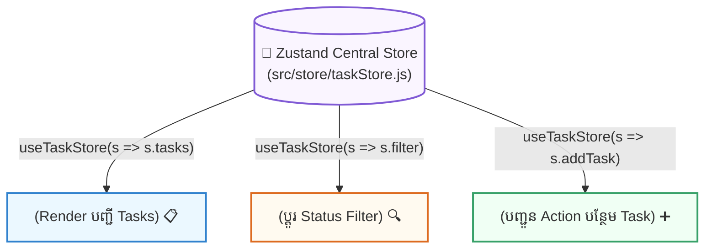

## 🐻 ១. ហេតុអ្វីត្រូវជ្រើសរើស Zustand? (Why Zustand?)

Zustand (ភាសាអាល្លឺម៉ង់មានន័យថា "State") គឺជា Global State Management Library ដ៏ពេញនិយមបំផុតក្នុង React Ecosystem បច្ចុប្បន្ន ៖
1. **Zero Provider Hell:** មិនចាំបាច់រុំព័ទ្ធ `<App>` ដោយ `<Provider>` ច្រើនជាន់ឡើយ។
2. **Tiny Bundle Size:** មានទំហំត្រឹមតែ **~1KB** ប៉ុណ្ណោះ។
3. **Granular Selectors:** កម្ចាត់ចោលបញ្ហា Re-render របស់ Context API ទាំងស្រុង។
4. **No Boilerplate:** មិនចាំបាច់បង្កើត Reducers, Dispatchers, Types, ឬ Thunks ស្មុគស្មាញដូច Redux ឡើយ។



---

## 🛠️ ២. ការដំឡើង និងការបង្កើត Zustand Store

```bash
npm install zustand
```

### 💻 កូដបង្កើត Store (`src/store/taskStore.js`):

```javascript
// src/store/taskStore.js
import { create } from 'zustand';

export const useTaskStore = create((set, get) => ({
  // ── ១. INITIAL STATES ──
  tasks: [
    { id: 1, title: 'រៀន Zustand State Management', done: true, priority: 'High' },
    { id: 2, title: 'បង្កើត Responsive Data Grid', done: false, priority: 'Medium' },
  ],
  filter: 'ALL', // 'ALL' | 'ACTIVE' | 'COMPLETED'
  isLoading: false,

  // ── ២. SYNCHRONOUS ACTIONS ──
  addTask: (title, priority = 'Medium') =>
    set((state) => ({
      tasks: [
        ...state.tasks,
        { id: Date.now(), title: title.trim(), done: false, priority },
      ],
    })),

  toggleTask: (id) =>
    set((state) => ({
      tasks: state.tasks.map((t) =>
        t.id === id ? { ...t, done: !t.done } : t
      ),
    })),

  deleteTask: (id) =>
    set((state) => ({
      tasks: state.tasks.filter((t) => t.id !== id),
    })),

  setFilter: (filter) => set({ filter }), // 👈 Shallow merge ស្វ័យប្រវត្តិ!

  // ── ៣. ASYNC ACTION (FETCH DATA ពី API) ──
  fetchSampleTasks: async () => {
    set({ isLoading: true });
    try {
      const res = await fetch('https://jsonplaceholder.typicode.com/todos?_limit=3');
      const data = await res.json();
      
      const formatted = data.map((item) => ({
        id: item.id,
        title: item.title,
        done: item.completed,
        priority: 'Low',
      }));

      set({ tasks: formatted, isLoading: false });
    } catch {
      set({ isLoading: false });
    }
  },

  // ── ៤. GETTER FUNCTION (ប្រើ get() ដើម្បីគណនា) ──
  getActiveTaskCount: () => {
    return get().tasks.filter((t) => !t.done).length;
  },
}));
```

---

## 🚀 ៣. ការប្រើប្រាស់ក្នុង React Components ជាមួយ Granular Selectors

### 📂 សមាសភាគទី ១ ៖ `TaskHeader.jsx` (Display Only)

```jsx
// src/components/TaskHeader.jsx
import { useTaskStore } from '../store/taskStore';

export function TaskHeader() {
  // ✅ Subscribe តែលើ activeCount និង isLoading ប៉ុណ្ណោះ
  const activeCount = useTaskStore((state) => state.getActiveTaskCount());
  const isLoading = useTaskStore((state) => state.isLoading);
  const fetchSampleTasks = useTaskStore((state) => state.fetchSampleTasks);

  return (
    <div className="flex justify-between items-center pb-4 border-b border-slate-200 dark:border-slate-800">
      <div>
        <h2 className="text-base font-black text-slate-800 dark:text-white flex items-center gap-2">
          <span>📋</span> Zustand Task Manager
        </h2>
        <p className="text-xs text-slate-500">នៅសល់ {activeCount} Tasks មិនទាន់ធ្វើ</p>
      </div>

      <button
        onClick={fetchSampleTasks}
        disabled={isLoading}
        className="px-3 py-1.5 bg-indigo-50 dark:bg-indigo-950/40 text-indigo-600 dark:text-indigo-400 hover:bg-indigo-100 rounded-xl text-xs font-bold transition"
      >
        {isLoading ? 'កំពុងទាញ...' : '☁️ Fetch Sample'}
      </button>
    </div>
  );
}
```

---

### 📂 សមាសភាគទី ២ ៖ `TaskInput.jsx` (Actions Only)

```jsx
// src/components/TaskInput.jsx
import { useState } from 'react';
import { useTaskStore } from '../store/taskStore';

export function TaskInput() {
  const [text, setText] = useState('');
  const [priority, setPriority] = useState('Medium');

  // ✅ ទាញយក Action — មិនបង្កឱ្យ Component នេះ Re-render ពេល tasks ផ្លាស់ប្តូរឡើយ!
  const addTask = useTaskStore((state) => state.addTask);

  const handleSubmit = (e) => {
    e.preventDefault();
    if (!text.trim()) return;
    addTask(text, priority);
    setText('');
  };

  return (
    <form onSubmit={handleSubmit} className="flex gap-2">
      <input
        type="text"
        value={text}
        onChange={(e) => setText(e.target.value)}
        placeholder="បញ្ចូល Task ថ្មី..."
        className="flex-1 px-3.5 py-2 border rounded-xl text-xs dark:bg-slate-800 dark:text-white focus:outline-none focus:ring-2 focus:ring-indigo-500"
      />
      <select
        value={priority}
        onChange={(e) => setPriority(e.target.value)}
        className="px-3 py-2 border rounded-xl text-xs dark:bg-slate-800 dark:text-white"
      >
        <option value="High">🔴 High</option>
        <option value="Medium">🟡 Medium</option>
        <option value="Low">🟢 Low</option>
      </select>
      <button
        type="submit"
        className="px-4 py-2 bg-indigo-600 hover:bg-indigo-700 text-white rounded-xl text-xs font-bold transition shadow"
      >
        + Add
      </button>
    </form>
  );
}
```

---

### 📂 សមាសភាគទី ៣ ៖ `TaskList.jsx` (List + Toggle)

```jsx
// src/components/TaskList.jsx
import { useTaskStore } from '../store/taskStore';

export function TaskList() {
  const tasks = useTaskStore((state) => state.tasks);
  const filter = useTaskStore((state) => state.filter);
  const toggleTask = useTaskStore((state) => state.toggleTask);
  const deleteTask = useTaskStore((state) => state.deleteTask);

  const filteredTasks = tasks.filter((t) => {
    if (filter === 'ACTIVE') return !t.done;
    if (filter === 'COMPLETED') return t.done;
    return true;
  });

  return (
    <ul className="space-y-2 max-h-72 overflow-y-auto pr-1">
      {filteredTasks.length === 0 ? (
        <li className="py-8 text-center text-xs text-slate-400">គ្មាន Task ត្រូវបង្ហាញឡើយ!</li>
      ) : (
        filteredTasks.map((task) => (
          <li
            key={task.id}
            className="p-3 bg-slate-50 dark:bg-slate-800/50 rounded-2xl border border-slate-100 dark:border-slate-800 flex items-center justify-between text-xs"
          >
            <div className="flex items-center gap-3">
              <input
                type="checkbox"
                checked={task.done}
                onChange={() => toggleTask(task.id)}
                className="w-4 h-4 rounded text-indigo-600 cursor-pointer"
              />
              <span className={task.done ? 'line-through text-slate-400' : 'text-slate-800 dark:text-white font-medium'}>
                {task.title}
              </span>
            </div>

            <div className="flex items-center gap-2">
              <span className={`px-2 py-0.5 rounded-md text-[10px] font-bold ${
                task.priority === 'High'
                  ? 'bg-rose-100 text-rose-700 dark:bg-rose-950/60 dark:text-rose-300'
                  : task.priority === 'Medium'
                  ? 'bg-amber-100 text-amber-700 dark:bg-amber-950/60 dark:text-amber-300'
                  : 'bg-emerald-100 text-emerald-700 dark:bg-emerald-950/60 dark:text-emerald-300'
              }`}>
                {task.priority}
              </span>
              <button
                onClick={() => deleteTask(task.id)}
                className="text-slate-400 hover:text-rose-500 font-bold ml-1"
              >
                ✕
              </button>
            </div>
          </li>
        ))
      )}
    </ul>
  );
}
```

---

## 🧠 ៤. សង្ខេប Mental Model ងាយចាំ

| គោលការណ៍ | កូដសរសេរ | អត្ថប្រយោជន៍ |
| :--- | :--- | :--- |
| **Store Definition** | `create((set, get) => ({ ... }))` | បង្កើត Store និង Actions ក្នុងទីតាំងតែមួយ |
| **Shallow Merge** | `set({ key: value })` | Update State ដោយស្វ័យប្រវត្តិ មិនបាច់ `...state` |
| **Granular Selector** | `useStore(s => s.key)` | Re-render តែពេល `s.key` ប្រែប្រួលប៉ុណ្ណោះ |
| **Async Action** | `fetchData: async () => { ... }` | ដំណើរការ API ផ្ទាល់ក្នុង Store ដោយគ្មាន Thunk |
