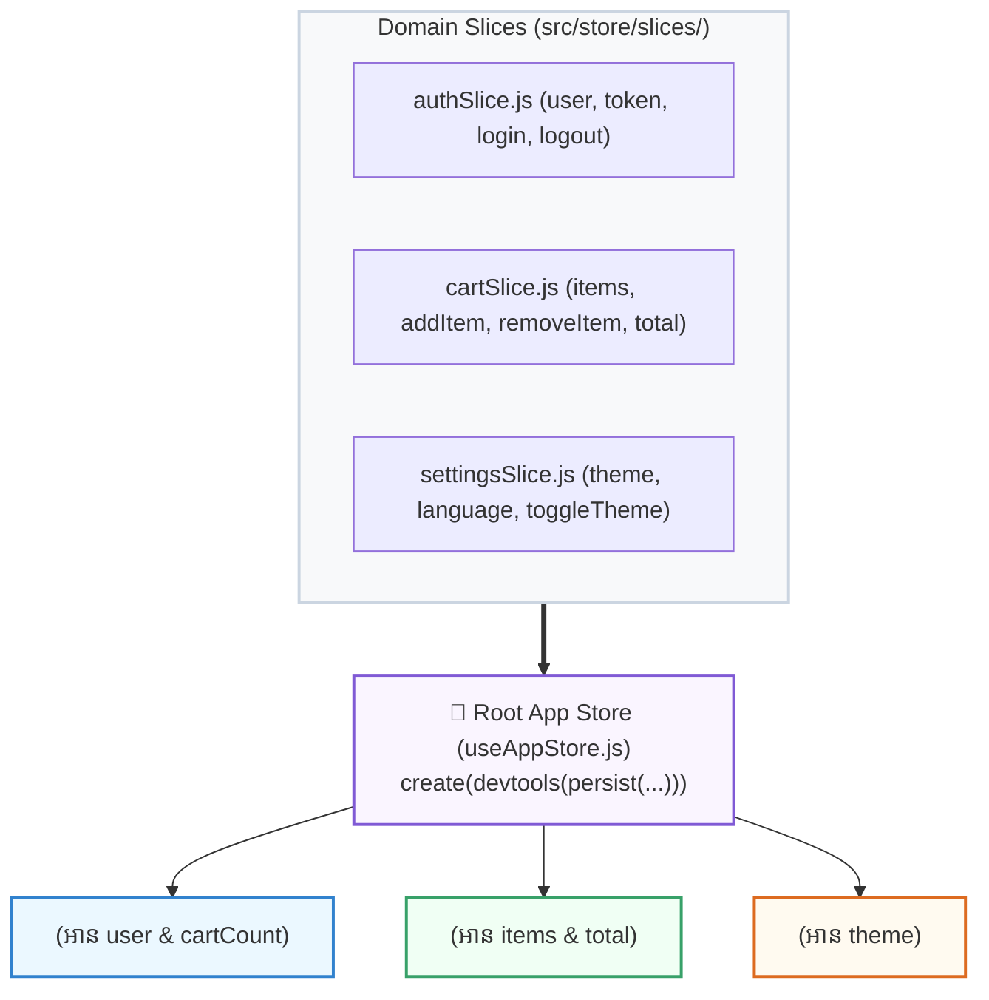

## 🍕 ១. The Slice Pattern (ស្ថាបត្យកម្មសម្រាប់ Large-scale Enterprise Apps)

នៅពេលដែលកម្មវិធីរបស់អ្នកមានទំហំធំ ការសរសេរ State ទាំងអស់ក្នុងឯកសារតែមួយនឹងធ្វើឱ្យកូដវែងរាប់ពាន់ជួរ។ យើងបែងចែកវាជា **Domain Slices** ៖



---

## 💻 ២. ការបង្កើត Slices នីមួយៗ

### 📂 ឯកសារទី ១ ៖ `src/store/slices/authSlice.js`

```javascript
// src/store/slices/authSlice.js
export const createAuthSlice = (set, get) => ({
  user: null,
  token: null,
  isAuthenticated: false,

  login: (userData, token) =>
    set({
      user: userData,
      token,
      isAuthenticated: true,
    }),

  logout: () =>
    set({
      user: null,
      token: null,
      isAuthenticated: false,
    }),
});
```

---

### 📂 ឯកសារទី ២ ៖ `src/store/slices/cartSlice.js`

```javascript
// src/store/slices/cartSlice.js
export const createCartSlice = (set, get) => ({
  items: [],

  addItem: (product) =>
    set((state) => {
      const existing = state.items.find((i) => i.id === product.id);
      if (existing) {
        return {
          items: state.items.map((i) =>
            i.id === product.id ? { ...i, qty: i.qty + 1 } : i
          ),
        };
      }
      return { items: [...state.items, { ...product, qty: 1 }] };
    }),

  removeItem: (id) =>
    set((state) => ({
      items: state.items.filter((i) => i.id !== id),
    })),

  clearCart: () => set({ items: [] }),

  // Getter គណនាតម្លៃសរុប
  getGrandTotal: () =>
    get().items.reduce((sum, item) => sum + item.price * item.qty, 0),
});
```

---

### 📂 ឯកសារទី ៣ ៖ `src/store/useAppStore.js` (Root Store + Middleware)

```javascript
// src/store/useAppStore.js
import { create } from 'zustand';
import { persist, devtools } from 'zustand/middleware';
import { createAuthSlice } from './slices/authSlice';
import { createCartSlice } from './slices/cartSlice';

export const useAppStore = create(
  devtools(
    persist(
      (...a) => ({
        // ច្របាច់ Slices ទាំងអស់បញ្ចូលគ្នា
        ...createAuthSlice(...a),
        ...createCartSlice(...a),
      }),
      {
        name: 'enterprise-app-storage', // Key name ក្នុង LocalStorage
        // 🛡️ Selective Persistence: Save តែទិន្នន័យចាំបាច់ប៉ុណ្ណោះ!
        partialize: (state) => ({
          user: state.user,
          token: state.token,
          isAuthenticated: state.isAuthenticated,
          items: state.items,
        }),
      }
    ),
    { name: 'AppStore' } // Name បង្ហាញក្នុង Redux DevTools Extension
  )
);
```

---

## 🚀 ៣. ការប្រើប្រាស់ក្នុង React Components

```jsx
// src/components/StoreHeader.jsx
import { useAppStore } from '../store/useAppStore';

export default function StoreHeader() {
  // ✅ ទាញយក State ពី Slices ផ្សេងគ្នាដោយរលូន
  const user = useAppStore((state) => state.user);
  const isAuthenticated = useAppStore((state) => state.isAuthenticated);
  const items = useAppStore((state) => state.items);
  const grandTotal = useAppStore((state) => state.getGrandTotal());
  const logout = useAppStore((state) => state.logout);

  return (
    <header className="p-4 bg-white dark:bg-slate-900 border-b flex justify-between items-center max-w-3xl mx-auto">
      <div className="flex items-center gap-2">
        <span className="text-xl">🍕</span>
        <h1 className="font-bold text-sm text-slate-800 dark:text-white">
          Enterprise App (Sliced Store)
        </h1>
      </div>

      <div className="flex items-center gap-4 text-xs">
        {/* CART SUMMARY */}
        <div className="px-3 py-1.5 bg-indigo-50 dark:bg-indigo-950 text-indigo-600 dark:text-indigo-400 font-bold rounded-xl">
          🛒 {items.length} មុខ (${grandTotal})
        </div>

        {/* AUTH STATE */}
        {isAuthenticated ? (
          <div className="flex items-center gap-2">
            <span className="font-bold text-slate-700 dark:text-slate-300">
              {user.name}
            </span>
            <button
              onClick={logout}
              className="px-2.5 py-1 bg-rose-600 text-white font-bold rounded-lg"
            >
              Logout
            </button>
          </div>
        ) : (
          <span className="text-slate-400 font-semibold">Guest Mode</span>
        )}
      </div>
    </header>
  );
}
```

---

## 🧠 ៤. សង្ខេប Mental Model ងាយចាំ

| ឧបករណ៍ / Pattern | គោលបំណងចម្បង |
| :--- | :--- |
| **The Slice Pattern** | បំបែក Store ធំៗតាម Domain (`auth`, `cart`) រួចច្របាច់ចូលគ្នាក្នុង Root Store |
| **`persist` Middleware** | Auto-save & Rehydrate State ពី LocalStorage ដោយស្វ័យប្រវត្តិ |
| **`partialize` Option** | ជ្រើសរើស Save តែ Fields សំខាន់ៗ និងមិន Save Transient UI States |
| **`devtools` Middleware** | តាមដាន State Actions ក្នុង Redux DevTools Extension លើ Chrome |
