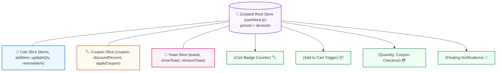

## 🛍️ ១. ស្ថាបត្យកម្មប្រព័ន្ធ (Architecture Blueprint)

នៅក្នុងគម្រោងនេះ យើងនឹងបង្កើត **Enterprise E-Commerce Store** ដោយប្រើប្រាស់ **Zustand Sliced Store** ៖



---

## 💻 ២. កូដពេញលេញនៃគម្រោង (`src/ZustandStoreApp.jsx`)

```jsx
// src/ZustandStoreApp.jsx
import { useState } from 'react';
import { create } from 'zustand';
import { persist } from 'zustand/middleware';

// ── ១. ZUSTAND PERSISTED STORE ──
export const useStore = create(
  persist(
    (set, get) => ({
      // ── CART STATE ──
      cart: [],
      couponCode: '',
      discountPercent: 0,
      toasts: [],

      // ── TOAST ACTIONS ──
      showToast: (message, type = 'success') => {
        const id = Date.now();
        set((state) => ({
          toasts: [...state.toasts, { id, message, type }],
        }));
        setTimeout(() => {
          set((state) => ({
            toasts: state.toasts.filter((t) => t.id !== id),
          }));
        }, 2500);
      },

      removeToast: (id) =>
        set((state) => ({
          toasts: state.toasts.filter((t) => t.id !== id),
        })),

      // ── CART ACTIONS ──
      addItem: (product) => {
        const { cart, showToast } = get();
        const existing = cart.find((i) => i.id === product.id);

        if (existing) {
          set({
            cart: cart.map((i) =>
              i.id === product.id ? { ...i, qty: i.qty + 1 } : i
            ),
          });
        } else {
          set({ cart: [...cart, { ...product, qty: 1 }] });
        }

        showToast(`បានបន្ថែម "${product.name}" ទៅក្នុងកន្ត្រក!`);
      },

      updateQty: (id, delta) => {
        const { cart } = get();
        const updated = cart
          .map((i) => (i.id === id ? { ...i, qty: i.qty + delta } : i))
          .filter((i) => i.qty > 0);

        set({ cart: updated });
      },

      removeItem: (id) => {
        const { cart, showToast } = get();
        const item = cart.find((i) => i.id === id);
        set({ cart: cart.filter((i) => i.id !== id) });
        if (item) showToast(`បានលុប "${item.name}" ចេញពីកន្ត្រក`, 'danger');
      },

      clearCart: () => {
        const { showToast } = get();
        set({ cart: [], couponCode: '', discountPercent: 0 });
        showToast('កន្ត្រកទំនិញត្រូវបានសំអាតរួចរាល់', 'info');
      },

      // ── COUPON ACTIONS ──
      applyCoupon: (code) => {
        const { showToast } = get();
        const clean = code.trim().toUpperCase();

        if (clean === 'ZUSTAND20') {
          set({ couponCode: clean, discountPercent: 20 });
          showToast('🎉 បានអនុវត្តបញ្ចុះតម្លៃ ២០% ជោគជ័យ!');
        } else {
          set({ couponCode: '', discountPercent: 0 });
          showToast('⚠️ កូដបញ្ចុះតម្លៃមិនត្រឹមត្រូវឡើយ', 'danger');
        }
      },

      // ── DERIVED GETTERS ──
      getCartMetrics: () => {
        const { cart, discountPercent } = get();
        const totalItems = cart.reduce((sum, i) => sum + i.qty, 0);
        const subtotal = cart.reduce((sum, i) => sum + i.price * i.qty, 0);
        const discountAmount = (subtotal * discountPercent) / 100;
        const grandTotal = Math.max(0, subtotal - discountAmount);

        return { totalItems, subtotal, discountAmount, grandTotal };
      },
    }),
    {
      name: 'zustand-ecommerce-cart',
      partialize: (state) => ({
        cart: state.cart,
        couponCode: state.couponCode,
        discountPercent: state.discountPercent,
      }),
    }
  )
);

// ── ២. PRODUCT DATA ──
const PRODUCTS = [
  { id: 1, name: 'React Mastery Pro Suite', price: 49, category: 'Frontend', icon: '⚛️' },
  { id: 2, name: 'Zustand & State Architecture', price: 29, category: 'Architecture', icon: '🐻' },
  { id: 3, name: 'Next.js 15 Full-Stack Suite', price: 69, category: 'Fullstack', icon: '▲' },
  { id: 4, name: 'Node.js & Backend Systems', price: 59, category: 'Backend', icon: '🟢' },
];

// ── ៣. UI COMPONENTS ──

function Navbar({ onOpenCart }) {
  const { totalItems, grandTotal } = useStore((state) =>
    state.getCartMetrics()
  );

  return (
    <header className="p-4 border-b border-slate-200 dark:border-slate-800 bg-white dark:bg-slate-900 flex justify-between items-center sticky top-0 z-30">
      <div className="flex items-center gap-2">
        <span className="text-xl">🐻</span>
        <h1 className="font-bold text-sm text-slate-800 dark:text-white">
          Zustand SuperStore
        </h1>
      </div>

      <button
        onClick={onOpenCart}
        className="px-4 py-2 bg-indigo-600 hover:bg-indigo-700 text-white rounded-xl text-xs font-bold transition shadow flex items-center gap-2"
      >
        <span>🛒</span>
        <span>{totalItems} មុខ</span>
        <span className="bg-indigo-500/50 px-2 py-0.5 rounded-md font-mono">
          ${grandTotal.toFixed(2)}
        </span>
      </button>
    </header>
  );
}

function ProductCard({ product }) {
  const addItem = useStore((state) => state.addItem);

  return (
    <div className="p-5 bg-white dark:bg-slate-900 rounded-3xl border border-slate-200 dark:border-slate-800 shadow-sm hover:shadow-md transition flex flex-col justify-between space-y-4">
      <div className="flex items-start justify-between">
        <span className="text-3xl p-2 bg-slate-50 dark:bg-slate-800 rounded-2xl">
          {product.icon}
        </span>
        <span className="text-[10px] font-bold uppercase tracking-wider px-2.5 py-1 bg-indigo-50 dark:bg-indigo-950/60 text-indigo-600 dark:text-indigo-400 rounded-full">
          {product.category}
        </span>
      </div>

      <div>
        <h3 className="font-bold text-sm text-slate-800 dark:text-white">
          {product.name}
        </h3>
        <p className="text-indigo-600 dark:text-indigo-400 font-black text-base mt-1">
          ${product.price}
        </p>
      </div>

      <button
        onClick={() => addItem(product)}
        className="w-full py-2 bg-slate-900 dark:bg-indigo-600 hover:bg-indigo-700 text-white rounded-xl text-xs font-bold transition shadow"
      >
        + Add to Cart
      </button>
    </div>
  );
}

function CartDrawer({ isOpen, onClose }) {
  const cart = useStore((state) => state.cart);
  const couponCode = useStore((state) => state.couponCode);
  const discountPercent = useStore((state) => state.discountPercent);
  const updateQty = useStore((state) => state.updateQty);
  const removeItem = useStore((state) => state.removeItem);
  const clearCart = useStore((state) => state.clearCart);
  const applyCoupon = useStore((state) => state.applyCoupon);
  const showToast = useStore((state) => state.showToast);

  const { subtotal, discountAmount, grandTotal } = useStore((state) =>
    state.getCartMetrics()
  );

  const [inputCoupon, setInputCoupon] = useState('');

  if (!isOpen) return null;

  const handleCouponSubmit = (e) => {
    e.preventDefault();
    applyCoupon(inputCoupon);
  };

  return (
    <div className="fixed inset-0 z-50 bg-black/50 backdrop-blur-sm flex justify-end animate-in fade-in duration-200">
      <div className="w-full max-w-sm bg-white dark:bg-slate-900 h-full p-6 shadow-2xl flex flex-col justify-between border-l border-slate-200 dark:border-slate-800">
        <div>
          <div className="flex justify-between items-center pb-4 border-b border-slate-200 dark:border-slate-800">
            <h2 className="font-bold text-base text-slate-800 dark:text-white">
              🛒 កន្ត្រកទំនិញ ({cart.length})
            </h2>
            <button
              onClick={onClose}
              className="text-slate-400 hover:text-slate-600 font-bold text-sm"
            >
              ✕ បិទ
            </button>
          </div>

          {/* ITEM LIST */}
          <ul className="divide-y divide-slate-100 dark:divide-slate-800 max-h-72 overflow-y-auto mt-4 pr-1">
            {cart.length === 0 ? (
              <li className="py-12 text-center text-xs text-slate-400">
                កន្ត្រកទំនិញនៅទទេស្អាត!
              </li>
            ) : (
              cart.map((item) => (
                <li
                  key={item.id}
                  className="py-3 flex justify-between items-center text-xs"
                >
                  <div>
                    <p className="font-bold text-slate-800 dark:text-white">
                      {item.name}
                    </p>
                    <p className="text-indigo-600 dark:text-indigo-400 font-semibold mt-0.5">
                      ${item.price} × {item.qty}
                    </p>
                  </div>

                  <div className="flex items-center gap-1.5">
                    <button
                      onClick={() => updateQty(item.id, -1)}
                      className="w-5 h-5 rounded bg-slate-100 dark:bg-slate-800 flex items-center justify-center font-bold"
                    >
                      -
                    </button>
                    <span className="w-4 text-center font-bold text-xs">
                      {item.qty}
                    </span>
                    <button
                      onClick={() => updateQty(item.id, 1)}
                      className="w-5 h-5 rounded bg-slate-100 dark:bg-slate-800 flex items-center justify-center font-bold"
                    >
                      +
                    </button>
                    <button
                      onClick={() => removeItem(item.id)}
                      className="text-rose-500 ml-2 font-bold"
                    >
                      ✕
                    </button>
                  </div>
                </li>
              ))
            )}
          </ul>
        </div>

        {/* BOTTOM CHECKOUT SECTION */}
        <div className="border-t border-slate-200 dark:border-slate-800 pt-4 space-y-3 text-xs">
          {/* COUPON INPUT */}
          <form onSubmit={handleCouponSubmit} className="flex gap-2">
            <input
              type="text"
              placeholder="កូដបញ្ចុះតម្លៃ: ZUSTAND20"
              value={inputCoupon}
              onChange={(e) => setInputCoupon(e.target.value)}
              className="flex-1 px-3 py-1.5 border rounded-xl dark:bg-slate-800 dark:text-white"
            />
            <button
              type="submit"
              className="px-3 py-1.5 bg-slate-800 text-white rounded-xl font-bold hover:bg-slate-700"
            >
              ប្រើកូដ
            </button>
          </form>

          {/* SUMMARY */}
          <div className="space-y-1 text-slate-600 dark:text-slate-400">
            <div className="flex justify-between">
              <span>តម្លៃដើម (Subtotal):</span>
              <span>${subtotal.toFixed(2)}</span>
            </div>
            {discountPercent > 0 && (
              <div className="flex justify-between text-emerald-600 font-bold">
                <span>បញ្ចុះតម្លៃ ({discountPercent}%):</span>
                <span>-${discountAmount.toFixed(2)}</span>
              </div>
            )}
            <div className="flex justify-between font-black text-sm text-slate-800 dark:text-white pt-2 border-t border-slate-200 dark:border-slate-800">
              <span>សរុបចុងក្រោយ:</span>
              <span>${grandTotal.toFixed(2)}</span>
            </div>
          </div>

          <div className="flex gap-2 pt-2">
            <button
              onClick={clearCart}
              className="px-3 py-2 bg-slate-100 dark:bg-slate-800 hover:bg-slate-200 rounded-xl font-bold text-slate-600 dark:text-slate-300 transition"
            >
              សំអាត
            </button>
            <button
              onClick={() =>
                showToast('🚀 ការបញ្ជាទិញទទួលបានជោគជ័យ! សូមអរគុណ។')
              }
              className="flex-1 py-2 bg-indigo-600 hover:bg-indigo-700 text-white rounded-xl font-bold transition shadow"
            >
              ទូទាត់ប្រាក់ (${grandTotal.toFixed(2)})
            </button>
          </div>
        </div>
      </div>
    </div>
  );
}

function ToastContainer() {
  const toasts = useStore((state) => state.toasts);
  const removeToast = useStore((state) => state.removeToast);

  return (
    <div className="fixed bottom-5 right-5 z-50 flex flex-col gap-2 pointer-events-none max-w-sm">
      {toasts.map((t) => (
        <div
          key={t.id}
          className={`pointer-events-auto px-4 py-3 rounded-2xl shadow-2xl text-xs font-bold flex items-center justify-between gap-3 text-white transition-all transform animate-in slide-in-from-bottom-3 ${
            t.type === 'danger'
              ? 'bg-rose-600'
              : t.type === 'info'
              ? 'bg-blue-600'
              : 'bg-emerald-600'
          }`}
        >
          <div className="flex items-center gap-2">
            <span>{t.type === 'danger' ? '🗑️' : '✨'}</span>
            <span>{t.message}</span>
          </div>
          <button
            onClick={() => removeToast(t.id)}
            className="opacity-75 hover:opacity-100 font-bold ml-2"
          >
            ✕
          </button>
        </div>
      ))}
    </div>
  );
}

// ── ៤. ROOT APP COMPONENT ──
export default function ZustandStoreApp() {
  const [isCartOpen, setIsCartOpen] = useState(false);

  return (
    <div className="min-h-[520px] max-w-2xl mx-auto my-8 bg-slate-50 dark:bg-slate-950 rounded-3xl border border-slate-200 dark:border-slate-800 shadow-2xl overflow-hidden flex flex-col">
      <Navbar onOpenCart={() => setIsCartOpen(true)} />

      <main className="p-6 flex-1">
        <h2 className="text-xs font-bold text-slate-500 uppercase tracking-wider mb-4">
          វគ្គសិក្សាពេញនិយម (Zustand Global Store)
        </h2>

        <div className="grid grid-cols-1 sm:grid-cols-2 gap-4">
          {PRODUCTS.map((product) => (
            <ProductCard key={product.id} product={product} />
          ))}
        </div>
      </main>

      <CartDrawer isOpen={isCartOpen} onClose={() => setIsCartOpen(false)} />
      <ToastContainer />
    </div>
  );
}
```

---

## 🔍 ៣. ការវិភាគចំណុចគន្លឹះនៃស្ថាបត្យកម្ម

1. **Zero Provider Tree:**  
   សង្កេតមើល `ZustandStoreApp` ៖ គ្មាន `<StoreProvider>` ឬ Context Wrappers ឡើយ។ Components អាចហៅ `useStore(selector)` ដោយផ្ទាល់ពីគ្រប់ទីកន្លែង។
2. **Action Trigger ពី Store ផ្ទាល់:**  
   នៅក្នុង `addItem` យើងអាចហៅ `showToast()` បានដោយផ្ទាល់ពីខាងក្នុង Store ដោយមិនចាំបាច់ឆ្លងកាត់ React Lifecycle ឡើយ។
3. **Session Persistence:**  
   `persist` middleware ធ្វើការ Save Cart ចូល LocalStorage ស្វ័យប្រវត្តិ។ សាកល្បងបន្ថែមទំនិញចូលកន្ត្រក រួចចុច Refresh (F5) នោះទិន្នន័យក្នុង Cart និង Coupon នឹងនៅរក្សាដដែល ១០០%!

---

## 🏆 ៤. បញ្ជីត្រួតពិនិត្យការអនុវត្ត (Checklist)

- [x] Zustand Store ដំណើរការដោយគ្មាន Context Provider Wrapper ឡើយ
- [x] Cart Actions (Add, Quantity +/-, Remove, Clear, Promo Discount) ដំណើរការត្រឹមត្រូវ
- [x] Persist Middleware រក្សាទុកទិន្នន័យ Cart ក្នុង LocalStorage ស្វ័យប្រវត្តិ
- [x] Toast Notification System បង្ហាញ Floating Alerts ស្វ័យប្រវត្តិពេលមាន Action
- [x] Product Grid មិន Re-render ឡើយនៅពេល Cart Summary ឬ Quantity ប្រែប្រួល
