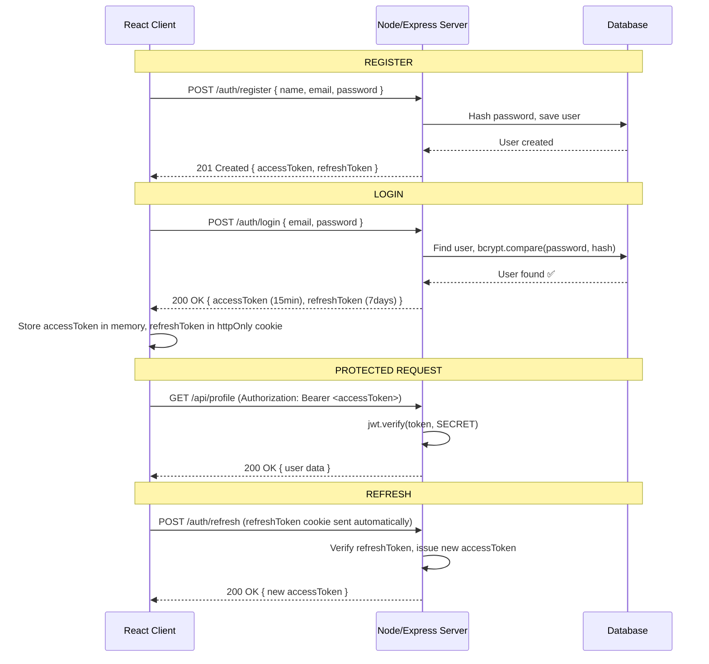

## 🔐 1. JWT Structure

JWT (JSON Web Token) ជា String បែប `header.payload.signature` ដែលអ្នក Server ចេញ (Sign) ហើយ Client ផ្ញើ Return ក្នុង Request ជា Proof of Identity:

```
eyJhbGciOiJIUzI1NiIsInR5cCI6IkpXVCJ9    ← Header (Base64: algorithm)
.eyJ1c2VySWQiOiIxMjMiLCJuYW1lIjoiUmF0aGEiLCJleHAiOjE3...  ← Payload (Base64: claims)
.SflKxwRJSMeKKF2QT4fwpMeJf36POk6yJV_adQssw5c              ← Signature (HMAC-SHA256)
```

```js
// Decoded Payload (NOT encrypted, anyone can read!)
{
  "userId": "123",
  "name": "Ratha",
  "role": "student",
  "iat": 1709856000,   // Issued At (Unix timestamp)
  "exp": 1709942400    // Expires At (24 hours later)
}
```

> **⚠️ Important:** JWT Payload ត្រូវបាន **Base64 encoded** ប៉ុន្តែ **NOT encrypted** — ដូច្នេះ ហាមដាក់ sensitive data (password, credit card) ក្នុង JWT payload!

---

## 🔄 2. Full Auth Flow



---

## 🗄️ 3. Token Storage Strategy Comparison

| Strategy | XSS Safe | CSRF Safe | Notes |
|----------|----------|-----------|-------|
| **Memory (JS variable)** | ✅ | ✅ | Lost on page refresh — requires refresh token |
| **localStorage** | ❌ | ✅ | Easy XSS target — avoid for sensitive apps |
| **sessionStorage** | ❌ | ✅ | Cleared on tab close |
| **httpOnly Cookie** | ✅ | ❌ (need CSRF token) | **Best for production** |

**Practical approach for course projects:**
```js
// Course-level: localStorage for simplicity (acceptable)
localStorage.setItem('token', accessToken);

// Production: accessToken in memory + refreshToken in httpOnly cookie
// Let the server set: res.cookie('refresh_token', token, { httpOnly: true, secure: true })
```
