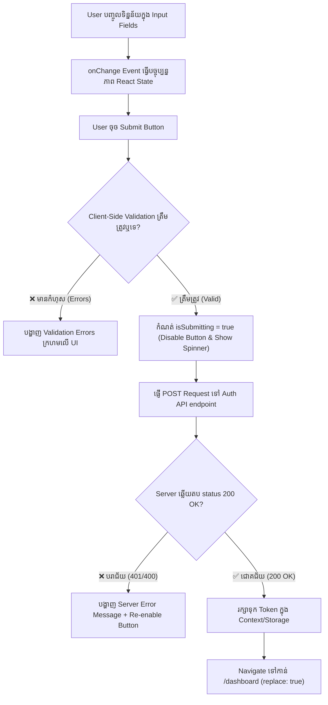

## 🗺️ ១. ស្ថាបត្យកម្ម Form Submission & Validation Lifecycle



---

## 📝 ២. Form State & Validation Logic

ដើម្បីបង្កើត Form ដែលមានគុណភាពកម្រិត Production យើងត្រូវគ្រប់គ្រង States យ៉ាងហោចណាស់ ៤ យ៉ាង៖
1. **`formData`**: ផ្ទុកតម្លៃអក្សរដែល User កំពុងវាយបញ្ចូល (`email`, `password`, `name`)។
2. **`errors`**: ផ្ទុកសារកំហុសសម្រាប់ Field នីមួយៗ (Client-side validation)។
3. **`isSubmitting`**: Boolean បញ្ជាក់ពីស្ថានភាពកំពុងផ្ញើ Request (Loading state)។
4. **`serverError`**: សារកំហុសដែលឆ្លើយតបត្រឡប់មកពី Server (ឧ. «អ៊ីម៉ែល ឬពាក្យសម្ងាត់មិនត្រឹមត្រូវ!»)។

### 🔍 ក្បួន Validation Rules (Regex & Logic):
- **Email Regex:** `/^[^\s@]+@[^\s@]+\.[^\s@]+$/`
- **Password Length:** យ៉ាងហោចណាស់ ៦ ទៅ ៨ តួអក្សរ
- **Confirm Password:** ត្រូវតែដូចគ្នា ១០០% ទៅនឹង Password

---

## 💻 ៣. Complete Integrated LoginForm Component

ខាងក្រោមនេះជា Component ពេញលេញសម្រាប់ Login Form ដែលមាន Show/Hide Password, Client Validation, Loading Spinner, Server Error Box, និង Auto-redirect៖

```jsx
// src/pages/LoginPage.jsx
import React, { useState } from 'react';
import { useNavigate, Link, Navigate, useLocation } from 'react-router-dom';
import { useAuth } from '../context/AuthContext';

export default function LoginPage() {
  const { isAuthenticated, login, isLoading: authLoading } = useAuth();
  const navigate = useNavigate();
  const location = useLocation();

  // ១. Form Fields State
  const [formData, setFormData] = useState({
    email: '',
    password: '',
  });

  // ២. UI & Error States
  const [errors, setErrors] = useState({});
  const [serverError, setServerError] = useState('');
  const [isSubmitting, setIsSubmitting] = useState(false);
  const [showPassword, setShowPassword] = useState(false);

  // ៣. ប្រសិនបើ User បាន Login រួចហើយ មិនឱ្យមើល Login Page ទៀតទេ
  const from = location.state?.from?.pathname || '/dashboard';
  if (!authLoading && isAuthenticated) {
    return <Navigate to={from} replace />;
  }

  // ៤. Client-Side Validation Function
  const validateForm = () => {
    const newErrors = {};
    const emailRegex = /^[^\s@]+@[^\s@]+\.[^\s@]+$/;

    if (!formData.email.trim()) {
      newErrors.email = 'សូមបញ្ចូលអ៊ីម៉ែលរបស់អ្នក!';
    } else if (!emailRegex.test(formData.email)) {
      newErrors.email = 'ទម្រង់អ៊ីម៉ែលមិនត្រឹមត្រូវឡើយ (ឧ. user@example.com)!';
    }

    if (!formData.password) {
      newErrors.password = 'សូមបញ្ចូលពាក្យសម្ងាត់!';
    } else if (formData.password.length < 6) {
      newErrors.password = 'ពាក្យសម្ងាត់ត្រូវមានយ៉ាងតិច ៦ តួអក្សរ!';
    }

    setErrors(newErrors);
    return Object.keys(newErrors).length === 0;
  };

  // ៥. Form Change Handler
  const handleChange = (e) => {
    const { name, value } = e.target;
    setFormData((prev) => ({ ...prev, [name]: value }));
    // សម្អាត Error នៃ Field នោះចោលភ្លាមពេល User កំពុងកែតម្រូវ
    if (errors[name]) {
      setErrors((prev) => ({ ...prev, [name]: '' }));
    }
    if (serverError) setServerError('');
  };

  // ៦. Submit Handler
  const handleSubmit = async (e) => {
    e.preventDefault();

    // ឆែក Client validation សិន
    if (!validateForm()) return;

    setIsSubmitting(true);
    setServerError('');

    try {
      // ឧទាហរណ៍ជាក់ស្តែង: const res = await fetch('/api/auth/login', { method: 'POST', body: JSON.stringify(formData) });
      // ក្លែងធ្វើ Network Request Delay ១ វិនាទី
      await new Promise((resolve) => setTimeout(resolve, 1000));

      // Mock Credential Check
      if (formData.email === 'admin@test.com' && formData.password === 'password123') {
        const mockUser = {
          id: 'usr_01',
          name: 'Sok Dara',
          email: formData.email,
          role: 'admin',
        };
        const mockToken = 'mock-jwt-token-xyz-123456';

        // Update Global Auth State
        login(mockUser, mockToken);

        // Navigate ទៅកាន់ទំព័រដើម ឬ Dashboard
        navigate(from, { replace: true });
      } else {
        throw new Error('អ៊ីម៉ែល ឬពាក្យសម្ងាត់មិនត្រឹមត្រូវឡើយ! (សាកល្បង: admin@test.com / password123)');
      }
    } catch (err) {
      setServerError(err.message);
    } finally {
      setIsSubmitting(false);
    }
  };

  return (
    <div className="min-h-screen bg-slate-100 dark:bg-slate-950 flex items-center justify-center p-4">
      <div className="w-full max-w-md bg-white dark:bg-slate-900 rounded-3xl shadow-xl border border-slate-200 dark:border-slate-800 p-8">
        {/* Header Section */}
        <div className="text-center mb-8">
          <div className="inline-flex items-center justify-center w-14 h-14 rounded-2xl bg-blue-500/10 text-blue-600 dark:text-blue-400 text-2xl font-black mb-3">
            🔐
          </div>
          <h1 className="text-2xl font-black text-slate-900 dark:text-white">ចូលគណនី</h1>
          <p className="text-sm text-slate-500 dark:text-slate-400 mt-1">
            សូមបញ្ចូល Email និង Password របស់អ្នកដើម្បីបន្ត
          </p>
        </div>

        {/* Server Error Alert */}
        {serverError && (
          <div className="mb-6 p-4 bg-rose-500/10 border border-rose-500/20 rounded-2xl flex items-start gap-3 text-rose-600 dark:text-rose-400 text-sm">
            <span className="text-lg">⚠️</span>
            <p className="leading-relaxed font-medium">{serverError}</p>
          </div>
        )}

        {/* Form Elements */}
        <form onSubmit={handleSubmit} noValidate className="space-y-5">
          {/* Email Field */}
          <div>
            <label className="block text-xs font-bold uppercase tracking-wider text-slate-700 dark:text-slate-300 mb-2">
              អ៊ីម៉ែល (Email Address)
            </label>
            <input
              type="email"
              name="email"
              value={formData.email}
              onChange={handleChange}
              placeholder="admin@test.com"
              disabled={isSubmitting}
              className={`w-full px-4 py-3 rounded-xl border text-sm transition focus:outline-none focus:ring-2 ${
                errors.email
                  ? 'border-rose-500 bg-rose-500/5 focus:ring-rose-400'
                  : 'border-slate-200 dark:border-slate-700 bg-slate-50 dark:bg-slate-800 focus:ring-blue-500'
              } text-slate-900 dark:text-white`}
            />
            {errors.email && (
              <p className="mt-1.5 text-xs text-rose-500 font-medium">❌ {errors.email}</p>
            )}
          </div>

          {/* Password Field */}
          <div>
            <div className="flex items-center justify-between mb-2">
              <label className="block text-xs font-bold uppercase tracking-wider text-slate-700 dark:text-slate-300">
                ពាក្យសម្ងាត់ (Password)
              </label>
              <Link
                to="/forgot-password"
                className="text-xs text-blue-600 dark:text-blue-400 font-semibold hover:underline"
              >
                ភ្លេចពាក្យសម្ងាត់?
              </Link>
            </div>
            <div className="relative">
              <input
                type={showPassword ? 'text' : 'password'}
                name="password"
                value={formData.password}
                onChange={handleChange}
                placeholder="••••••••"
                disabled={isSubmitting}
                className={`w-full px-4 py-3 pr-11 rounded-xl border text-sm transition focus:outline-none focus:ring-2 ${
                  errors.password
                    ? 'border-rose-500 bg-rose-500/5 focus:ring-rose-400'
                    : 'border-slate-200 dark:border-slate-700 bg-slate-50 dark:bg-slate-800 focus:ring-blue-500'
                } text-slate-900 dark:text-white`}
              />
              <button
                type="button"
                onClick={() => setShowPassword(!showPassword)}
                className="absolute right-3 top-1/2 -translate-y-1/2 text-slate-400 hover:text-slate-600 dark:hover:text-slate-200 text-xs font-bold"
              >
                {showPassword ? '🙈 Hide' : '👁️ Show'}
              </button>
            </div>
            {errors.password && (
              <p className="mt-1.5 text-xs text-rose-500 font-medium">❌ {errors.password}</p>
            )}
          </div>

          {/* Submit Button */}
          <button
            type="submit"
            disabled={isSubmitting}
            className="w-full py-3.5 px-4 bg-blue-600 hover:bg-blue-700 active:scale-[0.99] disabled:opacity-50 disabled:cursor-not-allowed text-white font-bold rounded-xl text-sm transition shadow-lg shadow-blue-500/25 flex items-center justify-center gap-2"
          >
            {isSubmitting ? (
              <>
                <span className="w-4 h-4 border-2 border-white/30 border-t-white rounded-full animate-spin" />
                <span>កំពុងផ្ទៀងផ្ទាត់...</span>
              </>
            ) : (
              <span>ចូលគណនី →</span>
            )}
          </button>
        </form>

        {/* Footer Link */}
        <div className="mt-8 pt-6 border-t border-slate-100 dark:border-slate-800 text-center">
          <p className="text-sm text-slate-500 dark:text-slate-400">
            មិនទាន់មានគណនីនៅឡើយ?{' '}
            <Link
              to="/register"
              className="text-blue-600 dark:text-blue-400 font-bold hover:underline"
            >
              ចុះឈ្មោះគណនីថ្មី
            </Link>
          </p>
        </div>
      </div>
    </div>
  );
}
```

---

## 🔍 ៤. ការពន្យល់កូដមួយជួរៗ (Line-by-Line Breakdown)

1. `const [formData, setFormData] = useState({ email: '', password: '' });`
   - ផ្ទុកតម្លៃអក្សរនៃ Input នីមួយៗជា Object តែមួយ ដែលងាយស្រួលគ្រប់គ្រង និងពង្រីកបន្ថែម។
2. `if (!authLoading && isAuthenticated) return <Navigate to={from} replace />;`
   - ប្រសិនបើ User បាន Login រួចរាល់ យើង Redirect គាត់ចេញពី Login Page ភ្លាមៗទៅកាន់ `from` (URL ដើមដែលគាត់ចង់ចូល) ឬ `/dashboard`។
3. `const validateForm = () => { ... }`
   - ត្រួតពិនិត្យភាពត្រឹមត្រូវនៃ Email និង Password ដោយប្រើ Regex និង Length Check មុននឹងអនុញ្ញាតឱ្យបញ្ជូន Request ទៅ Server។
4. `handleChange = (e) => { ... }`
   - ប្រើ Computed Property `[e.target.name]: e.target.value` ដើម្បី Update State នៃ Input ណាដែលកំពុងត្រូវបានវាយ និងលុបបំបាត់ Error របស់ Field នោះចេញភ្លាម។
5. `login(mockUser, mockToken);`
   - ហៅ Action ពី `useAuth()` ដើម្បី Save User Data និង Token ចូល Global State + Storage ដំណាលគ្នា។
6. `disabled={isSubmitting}`
   - បិទមិនឱ្យ User កែប្រែ Input ឬចុច Button ស្ទួនក្នុងអំឡុងពេល Request កំពុងដំណើរការ។

---

## 💡 ៥. Best Practices & Security Reminders

> [!TIP]
> 1. **Trim White Spaces:** ប្រើ `.trim()` លើ Field អ៊ីម៉ែលជានិច្ច ដើម្បីកុំឱ្យមានចន្លោះ Space ដោយអចេតនានៅខាងមុខ ឬខាងក្រោយ។
> 2. **Never Log Passwords:** ហាមសរសេរ `console.log(formData.password)` ក្នុងកូដ Production។
> 3. **Accessible Labels:** ប្រើ Tag `<label>` ត្រឹមត្រូវជានិច្ចសម្រាប់ Screen Readers និងការចុច Focus លើ Input។
> 4. **Disable Native HTML Tooltips (`noValidate`):** ដាក់ `noValidate` លើ Tag `<form>` ប្រសិនបើអ្នកចង់ប្រើប្រាស់ Custom Error Messages ផ្ទាល់ខ្លួនរបស់ React។
