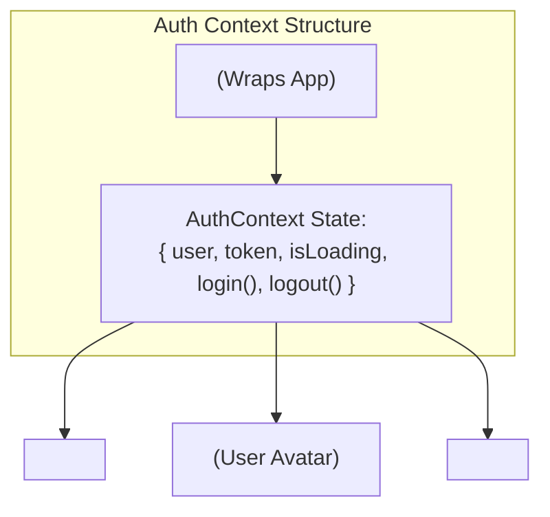

## 🏗️ 1. Auth Flow Architecture



---

## 💻 2. Building AuthContext Step by Step

### 💻 Code សម្រាប់តែ AuthContext Definition:

```jsx
// src/context/AuthContext.jsx
import { createContext, useContext, useState, useEffect } from 'react';

const AuthContext = createContext(null);

export function AuthProvider({ children }) {
  const [user, setUser] = useState(null);
  const [token, setToken] = useState(null);
  const [isLoading, setIsLoading] = useState(true); // 1. ចាប់ផ្តើមដោយ true

  // 2. Rehydrate State ពី LocalStorage ពេល Mount
  useEffect(() => {
    try {
      const savedToken = localStorage.getItem('auth_token');
      const savedUser = localStorage.getItem('auth_user');

      if (savedToken && savedUser) {
        setToken(savedToken);
        setUser(JSON.parse(savedUser));
      }
    } catch (err) {
      console.error('Failed to restore auth session:', err);
    } finally {
      setIsLoading(false); // 3. អានរួចរាល់ទើបបិទ loading
    }
  }, []);

  // 4. Action: Login
  const login = (userData, authToken) => {
    setUser(userData);
    setToken(authToken);
    localStorage.setItem('auth_token', authToken);
    localStorage.setItem('auth_user', JSON.stringify(userData));
  };

  // 5. Action: Logout
  const logout = () => {
    setUser(null);
    setToken(null);
    localStorage.removeItem('auth_token');
    localStorage.removeItem('auth_user');
  };

  const value = {
    user,
    token,
    isLoading,
    isAuthenticated: !!user && !!token,
    login,
    logout,
  };

  return <AuthContext.Provider value={value}>{children}</AuthContext.Provider>;
}

// 6. Custom Hook ងាយស្រួល Consume
export function useAuth() {
  const context = useContext(AuthContext);
  if (!context) {
    throw new Error('useAuth must be used within an AuthProvider');
  }
  return context;
}
```

### 🔍 ការពន្យល់មួយជួរៗ (Line-by-Line Explanation):

1. `const [isLoading, setIsLoading] = useState(true);`
   - ចាប់ផ្តើមដោយ `true` ដើម្បីផ្តល់សញ្ញាថា App កំពុងឆែកមើល Storage ថា User ធ្លាប់ Login ទុកពីមុនឬអត់។
2. `useEffect(() => { ... const savedToken = localStorage.getItem(...) }, []);`
   - ទាញយក Token និង User Object ពី Browser Storage មក restore ចូល React State វិញ។
3. `setIsLoading(false);`
   - បន្ទាប់ពី Restore រួចរាល់ យើងបិទ `isLoading = false` ដើម្បីឱ្យ Route Protection អាចធ្វើការសម្រេចចិត្តបានត្រឹមត្រូវ។
4. `const login = (userData, authToken) => { ... }`
   - Update ទាំង React State និង Storage ដំណាលគ្នា។
5. `const logout = () => { ... }`
   - សម្អាត State និង Storage ទាំងអស់ចោលដើម្បីបញ្ចប់ Session។
6. `export function useAuth()`
   - បង្កើត Custom Hook សម្រាប់ឱ្យ Components ផ្សេងៗប្រើប្រាស់ដោយមិនបាច់ import `AuthContext` និង `useContext` ដោយដៃឡើយ។
