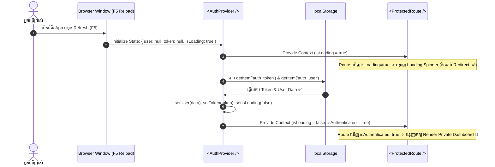

## 🏗️ ១. ស្ថាបត្យកម្ម AuthContext & Session Rehydration Lifecycle



---

## ⚠️ ២. យល់ដឹងពីបញ្ហា "Flash of Login Redirect"

នៅពេលគ្មានការគ្រប់គ្រង `isLoading` ឱ្យបានត្រឹមត្រូវ លំដាប់ព្រឹត្តិការណ៍ខុសឆ្គងខាងក្រោមនឹងកើតឡើង៖

```
[គ្មាន isLoading Guard]
1. F5 Refresh ទំព័រ /dashboard
2. AuthProvider ចាប់ផ្តើមជាមួយ user = null, isAuthenticated = false
3. ProtectedRoute ពិនិត្យឃើញ isAuthenticated = false ភ្លាមៗ
4. ProtectedRoute ធ្វើការ Redirect User ទៅកាន់ /login ភ្លាមៗ (Flash Redirect ❌)
5. មួយភ្លែតក្រោយមក useEffect ទើបអាន Storage ឃើញ Token... តែយឺតពេលហើយព្រោះ User ទៅដល់ Login បាត់!
```

> [!IMPORTANT]
> **ដំណោះស្រាយស្តង់ដារ ៖** ចាប់ផ្តើម Context ជាមួយ `isLoading: true` ជានិច្ច ហើយរង់ចាំរហូតដល់ `useEffect` អាន Storage ចប់សព្វគ្រប់ ទើបកំណត់ `isLoading: false`។

---

## 💻 ៣. Production-Grade AuthContext Implementation

ខាងក្រោមនេះជាកូដពេញលេញនៃ `AuthContext.jsx` ដែលមាន Action Methods, Safe Storage Handling, និង Custom Hook Guard៖

```jsx
// src/context/AuthContext.jsx
import React, { createContext, useContext, useState, useEffect, useMemo } from 'react';

// ១. បង្កើត Context Object
const AuthContext = createContext(null);

// Storage Keys
const TOKEN_KEY = 'edu_auth_token';
const USER_KEY = 'edu_auth_user';

export function AuthProvider({ children }) {
  const [user, setUser] = useState(null);
  const [token, setToken] = useState(null);
  const [isLoading, setIsLoading] = useState(true); // គន្លឹះសំខាន់បំផុត!

  // ២. Session Rehydration ពេល App Mount ដំបូង
  useEffect(() => {
    const rehydrateAuthSession = () => {
      try {
        const storedToken = localStorage.getItem(TOKEN_KEY);
        const storedUser = localStorage.getItem(USER_KEY);

        if (storedToken && storedUser) {
          setToken(storedToken);
          setUser(JSON.parse(storedUser));
        }
      } catch (error) {
        console.error('Error rehydrating auth session:', error);
        // ប្រសិនបើទិន្នន័យក្នុង storage ខូច (Corrupted JSON) សូមសម្អាតចោល
        localStorage.removeItem(TOKEN_KEY);
        localStorage.removeItem(USER_KEY);
      } finally {
        // បិទ Loading state បន្ទាប់ពីអានរួចរាល់ មិនថាមានទិន្នន័យ ឬអត់
        setIsLoading(false);
      }
    };

    rehydrateAuthSession();
  }, []);

  // ៣. Action: Login (រក្សាទុកក្នុង Memory State និង Persistent Storage)
  const login = (userData, authToken) => {
    setUser(userData);
    setToken(authToken);

    try {
      localStorage.setItem(TOKEN_KEY, authToken);
      localStorage.setItem(USER_KEY, JSON.stringify(userData));
    } catch (error) {
      console.error('Failed to save auth to localStorage:', error);
    }
  };

  // ៤. Action: Logout (សម្អាត Memory State និង Storage ទាំងអស់)
  const logout = () => {
    setUser(null);
    setToken(null);

    try {
      localStorage.removeItem(TOKEN_KEY);
      localStorage.removeItem(USER_KEY);
    } catch (error) {
      console.error('Failed to clear auth from localStorage:', error);
    }
  };

  // ៥. Action: Update User Profile (កែប្រែឈ្មោះ ឬព័ត៌មាន User)
  const updateUser = (updatedFields) => {
    setUser((prev) => {
      if (!prev) return null;
      const updated = { ...prev, ...updatedFields };
      localStorage.setItem(USER_KEY, JSON.stringify(updated));
      return updated;
    });
  };

  // ៦. Memoize Context Value ដើម្បីការពារ Unnecessary Re-renders
  const value = useMemo(
    () => ({
      user,
      token,
      isLoading,
      isAuthenticated: !!user && !!token,
      login,
      logout,
      updateUser,
    }),
    [user, token, isLoading]
  );

  return <AuthContext.Provider value={value}>{children}</AuthContext.Provider>;
}

// ៧. Custom Hook សម្រាប់ Consume Auth Context ប្រកបដោយសុវត្ថិភាព
export function useAuth() {
  const context = useContext(AuthContext);
  if (!context) {
    throw new Error('useAuth() must be used within an <AuthProvider> wrapper!');
  }
  return context;
}
```

---

## 🔍 ៤. ការពន្យល់កូដមួយជួរៗ (Line-by-Line Breakdown)

1. `const [isLoading, setIsLoading] = useState(true);`
   - កំណត់ថា Context កំពុងស្ថិតក្នុងដំណាក់កាលអាន Session ដំបូង។ គ្រប់ Protected Components នឹងរង់ចាំរហូតដល់ Loading នេះបញ្ចប់។
2. `useEffect(() => { ... }, []);`
   - ដំណើរការម្តងគត់នៅពេល App ដំបូងចាប់ផ្តើម ដើម្បីអាន Token និង User Profile ពី LocalStorage។
3. `setUser(JSON.parse(storedUser));`
   - Parse JSON String ពី Storage ត្រឡប់មកជា JavaScript Object ដើម្បីដាក់ចូល React State។
4. `isAuthenticated: !!user && !!token`
   - ប្រើ Double Negation (`!!`) ដើម្បីបំប្លែងទិន្នន័យឱ្យទៅជា Boolean (`true` ប្រសិនបើមានទាំង User និង Token, `false` ប្រសិនបើគ្មាន)។
5. `const value = useMemo(() => ({ ... }), [user, token, isLoading]);`
   - Memoize Object `value` ដើម្បីកុំឱ្យបង្កើត Object ថ្មីរាល់ពេល Provider re-render ដែលជួយសន្សំ Performance របស់ Consumers ទាំងអស់។
6. `if (!context) throw new Error(...)`
   - Runtime Guard ដែលជួយចាប់កំហុសភ្លាមៗ ប្រសិនបើ Developer ភ្លេច Wrap `<AuthProvider>` នៅលើ Root App។

---

## 💡 ៥. Best Practices សម្រាប់ការគ្រប់គ្រង Global Auth

> [!TIP]
> 1. **Centralized Keys:** បង្កើត Constants សម្រាប់ Storage Keys (ដូចជា `TOKEN_KEY`) ដើម្បីចៀសវាងការវាយខុសអក្សរ (Typos)។
> 2. **Try-Catch Around Storage:** Browser មួយចំនួន (ដូចជា Incognito Mode ឬពេល Storage ពេញ) អាច Throw Error ពេលហៅ `localStorage.setItem` — ការប្រើ `try-catch` ធានាថា App មិន Crash ឡើយ។
> 3. **Axios / Fetch Interceptors:** នៅក្នុង Production អ្នកអាចភ្ជាប់ AuthContext ជាមួយ Axios Interceptors ដើម្បីចាប់ 401 Unauthorized Errors ហើយហៅ `logout()` ដោយស្វ័យប្រវត្តិ។
