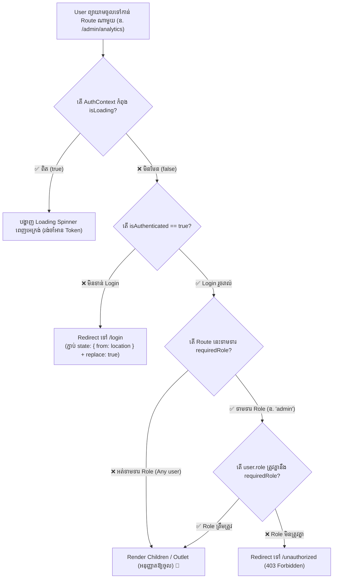

## 🛡️ ១. ស្ថាបត្យកម្ម Route Guard Decision Tree



---

## 💻 ២. ការបង្កើត `ProtectedRoute` Component (Production Standard)

ខាងក្រោមនេះជាកូដនៃ `ProtectedRoute.jsx` ដែលគាំទ្រទាំង Element Children និង Role-Based Authorization៖

```jsx
// src/components/ProtectedRoute.jsx
import React from 'react';
import { Navigate, useLocation } from 'react-router-dom';
import { useAuth } from '../context/AuthContext';

export function ProtectedRoute({ children, requiredRole }) {
  const { isAuthenticated, isLoading, user } = useAuth();
  const location = useLocation(); // ចងចាំ Path បច្ចុប្បន្ន

  // ១. ដំណាក់កាលរង់ចាំ Session Rehydration (ការពារ Flash of Redirect)
  if (isLoading) {
    return (
      <div className="min-h-screen bg-slate-900 flex flex-col items-center justify-center gap-4">
        <div className="w-12 h-12 border-4 border-blue-500/20 border-t-blue-500 rounded-full animate-spin" />
        <p className="text-slate-400 text-sm font-medium animate-pulse">
          🔒 កំពុងផ្ទៀងផ្ទាត់សិទ្ធិចូលប្រើប្រាស់...
        </p>
      </div>
    );
  }

  // ២. ប្រសិនបើមិនទាន់ Authenticated: Redirect ទៅ /login ព្រមទាំងភ្ជាប់ Location ដើម
  if (!isAuthenticated) {
    return <Navigate to="/login" state={{ from: location }} replace />;
  }

  // ៣. ប្រសិនបើ Route នេះទាមទារ Role ជាក់លាក់ ហើយ User គ្មាន Role នោះ
  if (requiredRole && user?.role !== requiredRole) {
    return <Navigate to="/unauthorized" replace />;
  }

  // ៤. ប្រសិនបើសិទ្ធិត្រឹមត្រូវទាំងអស់: អនុញ្ញាតឱ្យ Render កូន Component
  return children;
}
```

---

## 🗺️ ៣. Router Setup ក្នុង `App.jsx`

ខាងក្រោមនេះជារបៀបរៀបចំ Routes ដោយបែងចែករវាង **Public Routes**, **General Protected Routes**, និង **Admin-Only Routes**៖

```jsx
// src/App.jsx
import React from 'react';
import { BrowserRouter, Routes, Route, Navigate } from 'react-router-dom';
import { AuthProvider } from './context/AuthContext';
import { ProtectedRoute } from './components/ProtectedRoute';

// Public Pages
import HomePage from './pages/HomePage';
import LoginPage from './pages/LoginPage';
import RegisterPage from './pages/RegisterPage';
import UnauthorizedPage from './pages/UnauthorizedPage';

// Private Pages
import DashboardPage from './pages/DashboardPage';
import ProfilePage from './pages/ProfilePage';
import AdminDashboard from './pages/AdminDashboard';
import NotFoundPage from './pages/NotFoundPage';

export default function App() {
  return (
    <BrowserRouter>
      <AuthProvider>
        <Routes>
          {/* 🌐 ១. Public Routes (នរណាក៏អាចចូលមើលបាន) */}
          <Route path="/" element={<HomePage />} />
          <Route path="/login" element={<LoginPage />} />
          <Route path="/register" element={<RegisterPage />} />
          <Route path="/unauthorized" element={<UnauthorizedPage />} />

          {/* 🔒 ២. Standard Protected Routes (សម្រាប់ Authenticated Users ទាំងអស់) */}
          <Route
            path="/dashboard"
            element={
              <ProtectedRoute>
                <DashboardPage />
              </ProtectedRoute>
            }
          />
          <Route
            path="/profile"
            element={
              <ProtectedRoute>
                <ProfilePage />
              </ProtectedRoute>
            }
          />

          {/* 👑 ៣. Role-Based Protected Route (សម្រាប់តែ Admin ប៉ុណ្ណោះ) */}
          <Route
            path="/admin"
            element={
              <ProtectedRoute requiredRole="admin">
                <AdminDashboard />
              </ProtectedRoute>
            }
          />

          {/* 🚫 ៤. 404 Catch-All Route */}
          <Route path="*" element={<NotFoundPage />} />
        </Routes>
      </AuthProvider>
    </BrowserRouter>
  );
}
```

---

## 🔄 ៤. យន្តការ "Redirect-Back" ក្នុង `LoginPage`

នៅពេល User Login ជោគជ័យ យើងទាញយក `location.state?.from` ដើម្បីបញ្ជូនគាត់ទៅកាន់គោលដៅដើមវិញ៖

```jsx
// src/pages/LoginPage.jsx (Excerpt)
import { useLocation, useNavigate } from 'react-router-dom';
import { useAuth } from '../context/AuthContext';

export default function LoginPage() {
  const { login } = useAuth();
  const location = useLocation();
  const navigate = useNavigate();

  // ទាញយក URL ដើមដែល User ចង់ចូល ឬយក /dashboard ជា Default
  const intendedDestination = location.state?.from?.pathname || '/dashboard';

  const handleLoginSuccess = (userData, token) => {
    // Save to global auth
    login(userData, token);

    // Redirect ទៅកាន់ទំព័រដើមវិញភ្លាមៗ (replace: true ការពារកុំឱ្យចុច Back មក Login វិញ)
    navigate(intendedDestination, { replace: true });
  };

  // ...
}
```

---

## 🔍 ៥. ការពន្យល់កូដមួយជួរៗ (Line-by-Line Breakdown)

1. `const location = useLocation();`
   - ចាប់យក Object នៃ Route បច្ចុប្បន្ន (រួមមាន `pathname`, `search`, `hash`) ដើម្បីបញ្ជូនជា State ទៅកាន់ទំព័រ Login។
2. `if (isLoading) return <LoadingSpinner />;`
   - បង្ហាញ UI រង់ចាំក្នុងអំឡុងពេល Rehydration ដើម្បីការពារបញ្ហា Flash of Redirect។
3. `<Navigate to="/login" state={{ from: location }} replace />`
   - ធ្វើការ Redirect ទៅកាន់ `/login` ដោយមិនបន្ថែម Entry ថ្មីក្នុង Browser History Stack (`replace`) និងបញ្ជូន Location ចាស់តាមរយៈ `state`។
4. `if (requiredRole && user?.role !== requiredRole)`
   - ត្រួតពិនិត្យសិទ្ធិតាម Role។ បើ User មាន Role ធម្មតា (ឧ. `student`) តែព្យាយាមចូល Route `admin` វានឹងបញ្ជូនទៅ `/unauthorized`។
5. `return children;`
   - ប្រសិនបើការត្រួតពិនិត្យទាំងអស់បានឆ្លងកាត់ដោយជោគជ័យ Component នឹង Render Page Content ជូន User។

---

## 💡 ៦. Security Principles សម្រាប់ Frontend Developers

> [!WARNING]
> **ច្បាប់មាសនៃ SPA Security ៖**
> 1. **Frontend Route Guards គឺជា UX Feature មិនមែនជា Data Security ឡើយ!**  
>    អ្នកប្រើប្រាស់ដែលមានជំនាញបច្ចេកទេស អាចបើក Developer Console ហើយកែប្រែ State ក្នុង Memory ដើម្បីមើលឃើញប៊ូតុង ឬ UI របស់ Admin បាន។
> 2. **Backend API ត្រូវតែជាអ្នកការពារទិន្នន័យ (Enforce Authorization) ៖**  
>    រាល់ Endpoint ដូចជា `DELETE /api/users/:id` ឬ `GET /api/admin/financials` ត្រូវតែពិនិត្យ JWT Role នៅលើ Server Middleware ជានិច្ច ទោះបីជា UI នៅលើ Frontend ត្រូវបានលាក់ ឬបង្ហាញក៏ដោយ។
