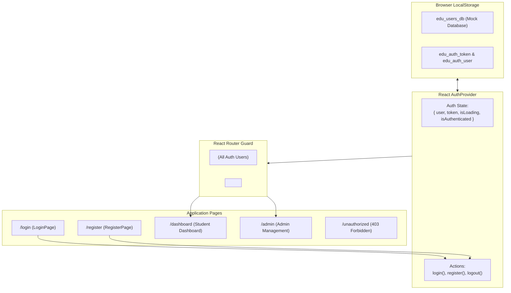

## 🏛️ ១. ស្ថាបត្យកម្មប្រព័ន្ធនៃ Mini Project (System Architecture)



---

## 📁 ២. រចនាសម្ព័ន្ធ Folder នៃគម្រោង (Project Directory Structure)

```
src/
├── context/
│   └── AuthContext.jsx          # Global Auth State + Mock Storage DB
├── components/
│   ├── Navbar.jsx               # Header with User Avatar, Role Badge & Logout
│   └── ProtectedRoute.jsx       # Route Guard with RBAC support
├── pages/
│   ├── LoginPage.jsx            # Login form + Demo Account Switcher
│   ├── RegisterPage.jsx         # Registration form with validation
│   ├── DashboardPage.jsx        # Protected Student Learning Portal
│   ├── AdminPage.jsx            # Protected Admin User Management
│   └── UnauthorizedPage.jsx     # 403 Forbidden Error screen
└── App.jsx                      # Router & Provider Configuration
```

---

## 💻 ៣. កូដពេញលេញនៃគ្រប់ Files (Production-Grade Code)

### ១. `src/context/AuthContext.jsx` (Global State & Mock DB)

```jsx
import React, { createContext, useContext, useState, useEffect } from 'react';

const AuthContext = createContext(null);

const STORAGE_KEYS = {
  TOKEN: 'edu_portal_token',
  USER: 'edu_portal_user',
  USERS_DB: 'edu_portal_mock_users_db',
};

// Initial Mock Database ប្រសិនបើទើបបើកដំបូង
const INITIAL_MOCK_USERS = [
  {
    id: 'usr_admin',
    name: 'លោក គង់ ចាន់ថន (Admin)',
    email: 'admin@edu.kh',
    password: 'password123',
    role: 'admin',
    avatar: '👨‍💼',
    enrolledCourses: ['React Masterclass', 'Node.js Enterprise'],
  },
  {
    id: 'usr_student',
    name: 'កញ្ញា សុខ សុជាតា (Student)',
    email: 'student@edu.kh',
    password: 'password123',
    role: 'student',
    avatar: '👩‍🎓',
    enrolledCourses: ['HTML & Modern CSS', 'JavaScript Deep Dive'],
  },
];

export function AuthProvider({ children }) {
  const [user, setUser] = useState(null);
  const [token, setToken] = useState(null);
  const [isLoading, setIsLoading] = useState(true);

  // 初始化 Mock Users DB និង Restore Auth State
  useEffect(() => {
    try {
      // 1. រៀបចំ Mock DB
      if (!localStorage.getItem(STORAGE_KEYS.USERS_DB)) {
        localStorage.setItem(STORAGE_KEYS.USERS_DB, JSON.stringify(INITIAL_MOCK_USERS));
      }

      // 2. Rehydrate Active Session
      const savedToken = localStorage.getItem(STORAGE_KEYS.TOKEN);
      const savedUser = localStorage.getItem(STORAGE_KEYS.USER);

      if (savedToken && savedUser) {
        setToken(savedToken);
        setUser(JSON.parse(savedUser));
      }
    } catch (err) {
      console.error('Session Rehydration Failed:', err);
    } finally {
      setIsLoading(false);
    }
  }, []);

  // Helper សម្រាប់ទាញយក User DB
  const getUsersDB = () => {
    return JSON.parse(localStorage.getItem(STORAGE_KEYS.USERS_DB) || '[]');
  };

  // Action: Login
  const login = async (email, password) => {
    // ក្លែងធ្វើ Network Latency 600ms
    await new Promise((r) => setTimeout(r, 600));

    const users = getUsersDB();
    const foundUser = users.find(
      (u) => u.email.toLowerCase() === email.toLowerCase() && u.password === password
    );

    if (!foundUser) {
      throw new Error('អ៊ីម៉ែល ឬពាក្យសម្ងាត់មិនត្រឹមត្រូវឡើយ!');
    }

    const { password: _, ...userSafe } = foundUser;
    const generatedToken = `jwt-token-${Date.now()}-${userSafe.id}`;

    setUser(userSafe);
    setToken(generatedToken);
    localStorage.setItem(STORAGE_KEYS.TOKEN, generatedToken);
    localStorage.setItem(STORAGE_KEYS.USER, JSON.stringify(userSafe));

    return userSafe;
  };

  // Action: Register
  const register = async ({ name, email, password, role = 'student' }) => {
    await new Promise((r) => setTimeout(r, 600));

    const users = getUsersDB();
    if (users.some((u) => u.email.toLowerCase() === email.toLowerCase())) {
      throw new Error('អ៊ីម៉ែលនេះមានគណនីក្នុងប្រព័ន្ធរួចរាល់ហើយ!');
    }

    const newUser = {
      id: `usr_${Date.now()}`,
      name,
      email,
      password,
      role,
      avatar: role === 'admin' ? '👨‍💼' : '🧑‍🎓',
      enrolledCourses: ['React Masterclass'],
    };

    // Save to DB
    const updatedUsers = [...users, newUser];
    localStorage.setItem(STORAGE_KEYS.USERS_DB, JSON.stringify(updatedUsers));

    // Auto-login
    const { password: _, ...userSafe } = newUser;
    const generatedToken = `jwt-token-${Date.now()}-${userSafe.id}`;

    setUser(userSafe);
    setToken(generatedToken);
    localStorage.setItem(STORAGE_KEYS.TOKEN, generatedToken);
    localStorage.setItem(STORAGE_KEYS.USER, JSON.stringify(userSafe));

    return userSafe;
  };

  // Action: Logout
  const logout = () => {
    setUser(null);
    setToken(null);
    localStorage.removeItem(STORAGE_KEYS.TOKEN);
    localStorage.removeItem(STORAGE_KEYS.USER);
  };

  return (
    <AuthContext.Provider
      value={{
        user,
        token,
        isLoading,
        isAuthenticated: !!user && !!token,
        login,
        register,
        logout,
        getUsersDB,
      }}
    >
      {children}
    </AuthContext.Provider>
  );
}

export function useAuth() {
  const ctx = useContext(AuthContext);
  if (!ctx) throw new Error('useAuth must be used within <AuthProvider>');
  return ctx;
}
```

---

### ២. `src/components/ProtectedRoute.jsx` (Route Guard)

```jsx
import React from 'react';
import { Navigate, useLocation } from 'react-router-dom';
import { useAuth } from '../context/AuthContext';

export function ProtectedRoute({ children, requiredRole }) {
  const { isAuthenticated, isLoading, user } = useAuth();
  const location = useLocation();

  if (isLoading) {
    return (
      <div className="min-h-screen bg-slate-950 flex flex-col items-center justify-center">
        <div className="w-10 h-10 border-4 border-blue-500/20 border-t-blue-500 rounded-full animate-spin mb-4" />
        <p className="text-slate-400 text-sm animate-pulse">🔒 កំពុងផ្ទៀងផ្ទាត់សិទ្ធិ...</p>
      </div>
    );
  }

  if (!isAuthenticated) {
    return <Navigate to="/login" state={{ from: location }} replace />;
  }

  if (requiredRole && user?.role !== requiredRole) {
    return <Navigate to="/unauthorized" replace />;
  }

  return children;
}
```

---

### ៣. `src/components/Navbar.jsx` (Global Header)

```jsx
import React from 'react';
import { Link, useNavigate, useLocation } from 'react-router-dom';
import { useAuth } from '../context/AuthContext';

export default function Navbar() {
  const { user, isAuthenticated, logout } = useAuth();
  const navigate = useNavigate();
  const location = useLocation();

  const handleLogout = () => {
    logout();
    navigate('/login', { replace: true });
  };

  return (
    <header className="sticky top-0 z-40 bg-white/80 dark:bg-slate-900/80 backdrop-blur-md border-b border-slate-200 dark:border-slate-800 px-6 py-3.5">
      <div className="max-w-7xl mx-auto flex items-center justify-between">
        {/* Logo */}
        <Link to="/" className="flex items-center gap-2.5 font-black text-slate-900 dark:text-white text-lg">
          <span className="text-2xl">🎓</span>
          <span>EduPortal</span>
        </Link>

        {/* Navigation Links */}
        <nav className="flex items-center gap-6 text-sm font-semibold">
          {isAuthenticated ? (
            <>
              <Link
                to="/dashboard"
                className={`transition ${
                  location.pathname === '/dashboard'
                    ? 'text-blue-600 dark:text-blue-400'
                    : 'text-slate-600 dark:text-slate-300 hover:text-blue-600'
                }`}
              >
                Dashboard
              </Link>

              {user?.role === 'admin' && (
                <Link
                  to="/admin"
                  className={`transition flex items-center gap-1.5 px-2.5 py-1 rounded-lg ${
                    location.pathname === '/admin'
                      ? 'bg-amber-500/10 text-amber-600 dark:text-amber-400 border border-amber-500/20'
                      : 'text-amber-600 hover:bg-amber-500/5'
                  }`}
                >
                  <span>👑</span>
                  <span>Admin Panel</span>
                </Link>
              )}

              {/* User Profile Pill */}
              <div className="flex items-center gap-3 pl-4 border-l border-slate-200 dark:border-slate-700">
                <div className="flex items-center gap-2.5">
                  <span className="text-2xl">{user?.avatar}</span>
                  <div className="text-left hidden sm:block">
                    <p className="text-xs font-bold text-slate-800 dark:text-white leading-none">
                      {user?.name}
                    </p>
                    <span
                      className={`text-[10px] font-black uppercase tracking-wider px-1.5 py-0.5 rounded-md inline-block mt-0.5 ${
                        user?.role === 'admin'
                          ? 'bg-amber-500/10 text-amber-600 dark:text-amber-400'
                          : 'bg-blue-500/10 text-blue-600 dark:text-blue-400'
                      }`}
                    >
                      {user?.role}
                    </span>
                  </div>
                </div>

                <button
                  onClick={handleLogout}
                  className="px-3 py-1.5 bg-rose-50 dark:bg-rose-500/10 text-rose-600 dark:text-rose-400 rounded-xl text-xs font-bold hover:bg-rose-100 transition"
                >
                  ចាកចេញ (Logout)
                </button>
              </div>
            </>
          ) : (
            <div className="flex items-center gap-3">
              <Link
                to="/login"
                className="px-4 py-2 text-slate-700 dark:text-slate-200 font-bold hover:text-blue-600 transition"
              >
                ចូលគណនី
              </Link>
              <Link
                to="/register"
                className="px-4 py-2 bg-blue-600 hover:bg-blue-700 text-white font-bold rounded-xl transition shadow-sm"
              >
                ចុះឈ្មោះ →
              </Link>
            </div>
          )}
        </nav>
      </div>
    </header>
  );
}
```

---

### ៤. `src/pages/LoginPage.jsx` (Login with Demo Switcher)

```jsx
import React, { useState } from 'react';
import { useNavigate, useLocation, Link, Navigate } from 'react-router-dom';
import { useAuth } from '../context/AuthContext';

export default function LoginPage() {
  const { isAuthenticated, login, isLoading: authLoading } = useAuth();
  const navigate = useNavigate();
  const location = useLocation();

  const [formData, setFormData] = useState({ email: '', password: '' });
  const [error, setError] = useState('');
  const [isSubmitting, setIsSubmitting] = useState(false);

  const from = location.state?.from?.pathname || '/dashboard';

  if (!authLoading && isAuthenticated) {
    return <Navigate to={from} replace />;
  }

  const handleSubmit = async (e) => {
    e.preventDefault();
    if (!formData.email || !formData.password) {
      setError('សូមបំពេញ Email និង Password ឱ្យបានពេញលេញ!');
      return;
    }

    setIsSubmitting(true);
    setError('');

    try {
      await login(formData.email, formData.password);
      navigate(from, { replace: true });
    } catch (err) {
      setError(err.message);
    } finally {
      setIsSubmitting(false);
    }
  };

  // Quick Demo Autofill Helper
  const setDemoAccount = (role) => {
    if (role === 'admin') {
      setFormData({ email: 'admin@edu.kh', password: 'password123' });
    } else {
      setFormData({ email: 'student@edu.kh', password: 'password123' });
    }
    setError('');
  };

  return (
    <div className="min-h-screen bg-slate-100 dark:bg-slate-950 flex items-center justify-center p-4">
      <div className="w-full max-w-md bg-white dark:bg-slate-900 rounded-3xl shadow-xl border border-slate-200 dark:border-slate-800 p-8">
        <div className="text-center mb-6">
          <span className="text-4xl inline-block mb-2">🔐</span>
          <h1 className="text-2xl font-black text-slate-900 dark:text-white">ចូលប្រើប្រាស់</h1>
          <p className="text-xs text-slate-500 mt-1">ជ្រើសរើស Demo Account ឬវាយបញ្ចូលដោយដៃ</p>
        </div>

        {/* Demo Fast Switcher */}
        <div className="mb-6 p-3.5 bg-blue-50 dark:bg-blue-950/40 rounded-2xl border border-blue-100 dark:border-blue-900">
          <p className="text-xs font-bold text-blue-900 dark:text-blue-300 mb-2.5">
            ⚡ Quick Demo Accounts (ចុចដើម្បីបំពេញស្វ័យប្រវត្តិ):
          </p>
          <div className="grid grid-cols-2 gap-2">
            <button
              type="button"
              onClick={() => setDemoAccount('student')}
              className="px-3 py-2 bg-white dark:bg-slate-800 text-blue-600 dark:text-blue-400 rounded-xl text-xs font-bold shadow-xs hover:border-blue-500 border border-slate-200 dark:border-slate-700 transition"
            >
              👩‍🎓 Demo Student
            </button>
            <button
              type="button"
              onClick={() => setDemoAccount('admin')}
              className="px-3 py-2 bg-white dark:bg-slate-800 text-amber-600 dark:text-amber-400 rounded-xl text-xs font-bold shadow-xs hover:border-amber-500 border border-slate-200 dark:border-slate-700 transition"
            >
              👨‍💼 Demo Admin
            </button>
          </div>
        </div>

        {error && (
          <div className="mb-5 p-3.5 bg-rose-500/10 border border-rose-500/20 rounded-xl text-xs font-medium text-rose-600 dark:text-rose-400">
            ⚠️ {error}
          </div>
        )}

        <form onSubmit={handleSubmit} className="space-y-4">
          <div>
            <label className="block text-xs font-bold text-slate-700 dark:text-slate-300 mb-1.5">
              អ៊ីម៉ែល (Email)
            </label>
            <input
              type="email"
              value={formData.email}
              onChange={(e) => setFormData((p) => ({ ...p, email: e.target.value }))}
              placeholder="user@edu.kh"
              className="w-full px-4 py-3 rounded-xl border border-slate-200 dark:border-slate-700 bg-slate-50 dark:bg-slate-800 text-sm text-slate-900 dark:text-white focus:ring-2 focus:ring-blue-500 outline-none"
            />
          </div>

          <div>
            <label className="block text-xs font-bold text-slate-700 dark:text-slate-300 mb-1.5">
              ពាក្យសម្ងាត់ (Password)
            </label>
            <input
              type="password"
              value={formData.password}
              onChange={(e) => setFormData((p) => ({ ...p, password: e.target.value }))}
              placeholder="••••••••"
              className="w-full px-4 py-3 rounded-xl border border-slate-200 dark:border-slate-700 bg-slate-50 dark:bg-slate-800 text-sm text-slate-900 dark:text-white focus:ring-2 focus:ring-blue-500 outline-none"
            />
          </div>

          <button
            type="submit"
            disabled={isSubmitting}
            className="w-full py-3.5 bg-blue-600 hover:bg-blue-700 disabled:opacity-50 text-white font-bold rounded-xl text-sm transition shadow-lg shadow-blue-500/20 flex items-center justify-center gap-2"
          >
            {isSubmitting ? (
              <>
                <span className="w-4 h-4 border-2 border-white/30 border-t-white rounded-full animate-spin" />
                <span>កំពុងចូល...</span>
              </>
            ) : (
              <span>ចូលគណនី →</span>
            )}
          </button>
        </form>

        <p className="text-center text-xs text-slate-500 mt-6">
          មិនទាន់មានគណនី?{' '}
          <Link to="/register" className="text-blue-600 font-bold hover:underline">
            ចុះឈ្មោះទីនេះ
          </Link>
        </p>
      </div>
    </div>
  );
}
```

---

### ៥. `src/pages/DashboardPage.jsx` (Protected Student Portal)

```jsx
import React from 'react';
import { useAuth } from '../context/AuthContext';
import Navbar from '../components/Navbar';

export default function DashboardPage() {
  const { user } = useAuth();

  const courses = [
    { title: 'React 19 & Next.js Masterclass', progress: 75, icon: '⚛️', lessons: '24/32' },
    { title: 'TypeScript for Full-Stack Pros', progress: 40, icon: '🔷', lessons: '12/30' },
    { title: 'Tailwind CSS & Modern UI/UX', progress: 100, icon: '🎨', lessons: '18/18' },
  ];

  return (
    <div className="min-h-screen bg-slate-100 dark:bg-slate-950">
      <Navbar />

      <main className="max-w-6xl mx-auto px-6 py-8 space-y-8">
        {/* Welcome Banner */}
        <div className="bg-gradient-to-r from-blue-600 via-indigo-600 to-purple-600 rounded-3xl p-8 text-white shadow-xl flex items-center justify-between">
          <div>
            <div className="inline-flex items-center gap-2 px-3 py-1 bg-white/10 rounded-full text-xs font-bold text-blue-100 mb-3">
              <span>{user?.avatar}</span>
              <span>តួនាទី: {user?.role?.toUpperCase()}</span>
            </div>
            <h1 className="text-3xl font-black mb-1">សូមស្វាគមន៍, {user?.name}! 👋</h1>
            <p className="text-blue-100 text-sm">
              បន្តការសិក្សារបស់អ្នកថ្ងៃនេះ ដើម្បីក្លាយជា Full-Stack Developer អាជីព។
            </p>
          </div>
        </div>

        {/* Stats Grid */}
        <div className="grid grid-cols-1 md:grid-cols-3 gap-6">
          <div className="bg-white dark:bg-slate-900 rounded-2xl p-6 border border-slate-200 dark:border-slate-800 shadow-sm">
            <p className="text-xs font-bold uppercase tracking-wider text-slate-400 mb-1">វគ្គសិក្សាកំពុងរៀន</p>
            <p className="text-3xl font-black text-slate-900 dark:text-white">3 វគ្គ</p>
          </div>
          <div className="bg-white dark:bg-slate-900 rounded-2xl p-6 border border-slate-200 dark:border-slate-800 shadow-sm">
            <p className="text-xs font-bold uppercase tracking-wider text-slate-400 mb-1">មេរៀនបានបញ្ចប់</p>
            <p className="text-3xl font-black text-emerald-600 dark:text-emerald-400">54 មេរៀន</p>
          </div>
          <div className="bg-white dark:bg-slate-900 rounded-2xl p-6 border border-slate-200 dark:border-slate-800 shadow-sm">
            <p className="text-xs font-bold uppercase tracking-wider text-slate-400 mb-1">វិញ្ញាបនបត្រទទួលបាន</p>
            <p className="text-3xl font-black text-blue-600 dark:text-blue-400">1 សន្លឹក</p>
          </div>
        </div>

        {/* Enrolled Courses Progress */}
        <div className="bg-white dark:bg-slate-900 rounded-2xl p-6 border border-slate-200 dark:border-slate-800 shadow-sm">
          <h2 className="text-lg font-black text-slate-900 dark:text-white mb-6">
            📚 វឌ្ឍនភាពនៃការសិក្សា (Enrolled Courses)
          </h2>
          <div className="space-y-6">
            {courses.map((course) => (
              <div key={course.title} className="p-4 rounded-xl bg-slate-50 dark:bg-slate-800/50 border border-slate-100 dark:border-slate-700/60">
                <div className="flex items-center justify-between mb-2">
                  <div className="flex items-center gap-3">
                    <span className="text-2xl">{course.icon}</span>
                    <div>
                      <h3 className="text-sm font-bold text-slate-800 dark:text-white">{course.title}</h3>
                      <p className="text-xs text-slate-400">បញ្ចប់បាន {course.lessons}</p>
                    </div>
                  </div>
                  <span className="text-xs font-black text-blue-600 dark:text-blue-400">{course.progress}%</span>
                </div>
                <div className="w-full bg-slate-200 dark:bg-slate-700 rounded-full h-2 overflow-hidden">
                  <div
                    className={`h-full rounded-full transition-all duration-700 ${
                      course.progress === 100 ? 'bg-emerald-500' : 'bg-blue-600'
                    }`}
                    style={{ width: `${course.progress}%` }}
                  />
                </div>
              </div>
            ))}
          </div>
        </div>
      </main>
    </div>
  );
}
```

---

### ៦. `src/pages/AdminPage.jsx` (Role-Protected Admin Management)

```jsx
import React, { useState } from 'react';
import { useAuth } from '../context/AuthContext';
import Navbar from '../components/Navbar';

export default function AdminPage() {
  const { user, getUsersDB } = useAuth();
  const [usersList] = useState(getUsersDB());

  return (
    <div className="min-h-screen bg-slate-100 dark:bg-slate-950">
      <Navbar />

      <main className="max-w-6xl mx-auto px-6 py-8 space-y-8">
        {/* Admin Header */}
        <div className="bg-gradient-to-r from-amber-500 to-orange-600 rounded-3xl p-8 text-white shadow-xl">
          <div className="inline-flex items-center gap-1.5 px-3 py-1 bg-white/20 rounded-full text-xs font-bold mb-3">
            <span>👑</span>
            <span>RESTRICTED ACCESS — ADMIN ONLY</span>
          </div>
          <h1 className="text-3xl font-black mb-1">ផ្ទាំងគ្រប់គ្រងប្រព័ន្ធ (Admin Control Center)</h1>
          <p className="text-amber-100 text-sm">
            អ្នកមានសិទ្ធិពេញលេញក្នុងការគ្រប់គ្រង Users, Roles, និង System Permissions។
          </p>
        </div>

        {/* Users Management Table */}
        <div className="bg-white dark:bg-slate-900 rounded-2xl border border-slate-200 dark:border-slate-800 shadow-sm overflow-hidden">
          <div className="p-6 border-b border-slate-200 dark:border-slate-800 flex items-center justify-between">
            <h2 className="text-lg font-black text-slate-900 dark:text-white">
              👥 បញ្ជីគណនីទាំងអស់ក្នុងប្រព័ន្ធ ({usersList.length})
            </h2>
          </div>

          <div className="overflow-x-auto">
            <table className="w-full text-left text-sm">
              <thead className="bg-slate-50 dark:bg-slate-800/50 text-slate-500 dark:text-slate-400 text-xs uppercase font-bold tracking-wider">
                <tr>
                  <th className="px-6 py-4">User</th>
                  <th className="px-6 py-4">Email</th>
                  <th className="px-6 py-4">Role</th>
                  <th className="px-6 py-4">Status</th>
                </tr>
              </thead>
              <tbody className="divide-y divide-slate-100 dark:divide-slate-800">
                {usersList.map((u) => (
                  <tr key={u.id} className="hover:bg-slate-50 dark:hover:bg-slate-800/30 transition">
                    <td className="px-6 py-4 font-bold text-slate-800 dark:text-white flex items-center gap-3">
                      <span className="text-xl">{u.avatar}</span>
                      <span>{u.name}</span>
                    </td>
                    <td className="px-6 py-4 text-slate-500 dark:text-slate-400">{u.email}</td>
                    <td className="px-6 py-4">
                      <span
                        className={`inline-block px-2.5 py-1 rounded-full text-xs font-black uppercase ${
                          u.role === 'admin'
                            ? 'bg-amber-500/10 text-amber-600 dark:text-amber-400 border border-amber-500/20'
                            : 'bg-blue-500/10 text-blue-600 dark:text-blue-400 border border-blue-500/20'
                        }`}
                      >
                        {u.role}
                      </span>
                    </td>
                    <td className="px-6 py-4">
                      <span className="inline-flex items-center gap-1.5 text-xs font-semibold text-emerald-600 dark:text-emerald-400">
                        <span className="w-2 h-2 rounded-full bg-emerald-500" />
                        Active
                      </span>
                    </td>
                  </tr>
                ))}
              </tbody>
            </table>
          </div>
        </div>
      </main>
    </div>
  );
}
```

---

### ៧. `src/pages/UnauthorizedPage.jsx` (403 Forbidden Screen)

```jsx
import React from 'react';
import { Link } from 'react-router-dom';

export default function UnauthorizedPage() {
  return (
    <div className="min-h-screen bg-slate-950 flex items-center justify-center p-4">
      <div className="w-full max-w-md bg-slate-900 rounded-3xl border border-slate-800 p-8 text-center">
        <span className="text-6xl inline-block mb-4">🚫</span>
        <h1 className="text-2xl font-black text-white mb-2">៤០៣ — គ្មានសិទ្ធិចូលប្រើ (Forbidden)</h1>
        <p className="text-sm text-slate-400 mb-6 leading-relaxed">
          គណនីរបស់អ្នកមិនមាន Role ជា Admin ដើម្បីចូលទៅកាន់ទំព័រនេះឡើយ។ ប្រសិនបើអ្នកជឿជាក់ថានេះជាកំហុស សូមទាក់ទង Administrator។
        </p>
        <Link
          to="/dashboard"
          className="inline-block px-6 py-3 bg-blue-600 hover:bg-blue-700 text-white font-bold rounded-xl text-sm transition shadow-lg shadow-blue-500/25"
        >
          ← ត្រឡប់ទៅ Dashboard វិញ
        </Link>
      </div>
    </div>
  );
}
```

---

## 🧪 ៤. តារាងតេស្តផ្ទៀងផ្ទាត់ (Testing & Verification Checklist)

| # | សេណារីយ៉ូ (Scenario) | ជំហានអនុវត្ត (Steps) | លទ្ធផលរំពឹងទុក (Expected Result) | ស្ថានភាព |
| :- | :--- | :--- | :--- | :-: |
| 1 | **Login ជោគជ័យ (Happy Path)** | ចុច "Demo Student" រួចចុច "ចូលគណនី" | នាំទៅ `/dashboard`, បង្ហាញ Badge Student, Navbar មានប៊ូតុង Logout | ✅ Pass |
| 2 | **Login បរាជ័យ (Sad Path)** | វាយ Password ខុស រួចចុច Submit | បង្ហាញ Alert ក្រហម "អ៊ីម៉ែល ឬពាក្យសម្ងាត់មិនត្រឹមត្រូវ!" | ✅ Pass |
| 3 | **Session Rehydration (F5)** | នៅលើ `/dashboard` ចុចប៊ូតុង Refresh Browser | មិនទាត់ទៅ Login ទេ, នៅរក្សាទំព័រ Dashboard ដដែល | ✅ Pass |
| 4 | **Unauth Route Guard** | Logout រួចវាយ URL `/dashboard` ដោយផ្ទាល់ | Route Guard ស្ទាក់ចាប់ ហើយ Redirect ទៅកាន់ `/login` ភ្លាម | ✅ Pass |
| 5 | **RBAC Authorization** | Login ជា Student រួចព្យាយាមបើក `/admin` | Route Guard បញ្ជូនទៅកាន់ទំព័រ `403 Unauthorized` | ✅ Pass |
| 6 | **Admin Access** | Login ជា Admin រួចចូល `/admin` | បង្ហាញតារាង Admin Control Center និង Users List ពេញលេញ | ✅ Pass |
| 7 | **Logout Flow** | ចុចប៊ូតុង "Logout" លើ Navbar | សម្អាត Storage, បិទ State, នាំត្រឡប់មកកាន់ `/login` | ✅ Pass |
