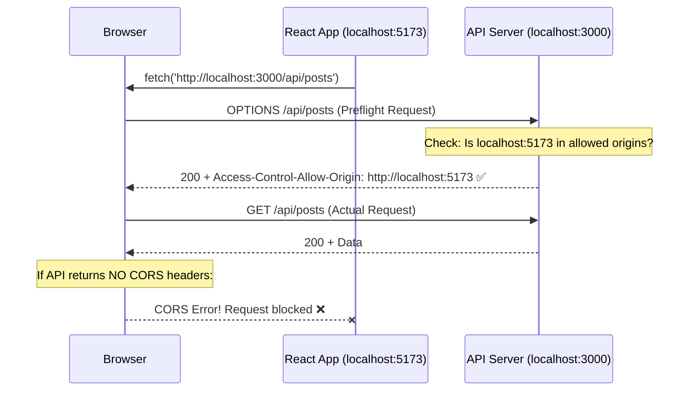

## 🌐 1. RESTful Endpoint Conventions

```
Base URL: https://api.myapp.com/v1

Resource: /posts

GET    /posts          → Get all posts (list)
GET    /posts/:id      → Get single post
POST   /posts          → Create new post
PUT    /posts/:id      → Replace entire post
PATCH  /posts/:id      → Update partial fields
DELETE /posts/:id      → Delete post

Nested resources:
GET    /posts/:id/comments    → Get comments for a post
POST   /posts/:id/comments    → Add comment to a post

Query params:
GET    /posts?page=1&limit=10&category=react&sort=newest
```

---

## 📊 2. HTTP Status Code Reference

| Code | Name | When to Use |
|------|------|-------------|
| **200** | OK | Successful GET, PUT, PATCH |
| **201** | Created | Successful POST (resource created) |
| **204** | No Content | Successful DELETE (no body) |
| **400** | Bad Request | Invalid input, validation error |
| **401** | Unauthorized | Not logged in / token expired |
| **403** | Forbidden | Logged in but insufficient permissions |
| **404** | Not Found | Resource doesn't exist |
| **422** | Unprocessable Entity | Valid request but semantic errors |
| **429** | Too Many Requests | Rate limit exceeded |
| **500** | Internal Server Error | Server bug (check server logs) |

---

## 🚫 3. CORS — Cross-Origin Resource Sharing



**Fix on Node/Express backend:**
```js
import cors from 'cors';

app.use(cors({
  origin: ['http://localhost:5173', 'https://myapp.vercel.app'],
  methods: ['GET', 'POST', 'PUT', 'PATCH', 'DELETE'],
  allowedHeaders: ['Content-Type', 'Authorization'],
}));
```

> **⚠️ Important:** CORS is enforced by the **Browser** — you cannot fix CORS from the React side. The backend server must send the correct `Access-Control-Allow-Origin` header.

---

## 🛠️ 4. React + API Pattern Checklist

```jsx
// ✅ Always follow this pattern when calling any API:
const createPost = async (payload) => {
  const res = await fetch('/api/posts', {
    method: 'POST',
    headers: {
      'Content-Type': 'application/json',
      'Authorization': `Bearer ${token}`,    // Auth header
    },
    body: JSON.stringify(payload),            // Serialize body
  });

  if (!res.ok) {
    const error = await res.json();
    throw new Error(error.message || `HTTP ${res.status}`);
  }

  return res.json();                          // Parse response
};
```
