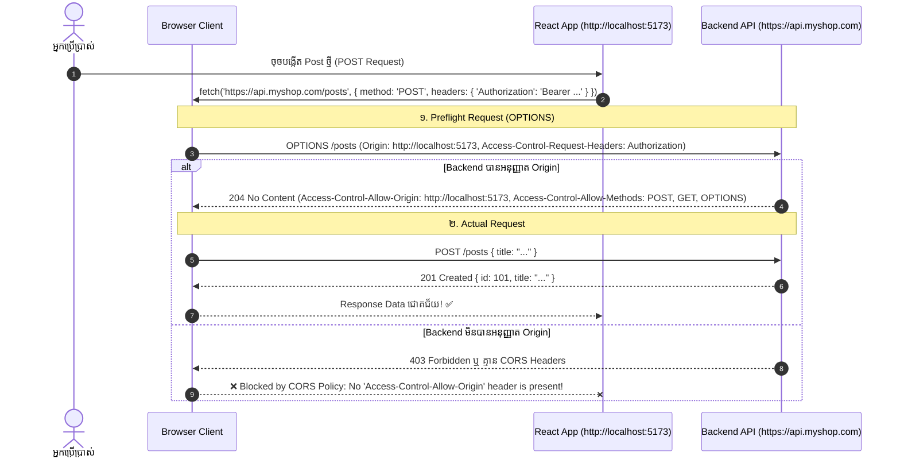

## 🌐 ១. គោលការណ៍ RESTful URI Conventions

REST (Representational State Transfer) ប្រើប្រាស់ **Nouns (នាម)** សម្រាប់សម្គាល់ Resource និង **HTTP Methods (កិរិយាស័ព្ទ)** សម្រាប់បញ្ជាក់ពីសកម្មភាព៖

```
Base URL: https://api.myshop.com/v1

Resource: /products

GET    /products          → ទាញយកបញ្ជី Products ទាំងអស់ (List)
GET    /products/:id      → ទាញយក Product មួយតាម ID
POST   /products          → បង្កើត Product ថ្មី
PUT    /products/:id      → ជំនួស Product ចាស់ទាំងស្រុង (Full Replace)
PATCH  /products/:id      → កែប្រែតែ Field ខ្លះ (Partial Update ឧ. កែតែ price)
DELETE /products/:id      → លុប Product នោះចោល

Nested Resources (ទំនាក់ទំនងមេកូន):
GET    /products/:id/reviews     → ទាញយក Reviews នៃ Product នោះ
POST   /products/:id/reviews     → បង្កើត Review ថ្មីលើ Product នោះ

Query Parameters (Filtering, Sorting, Pagination):
GET    /products?category=electronics&min_price=100&page=2&limit=10&sort=-createdAt
```

---

## 📊 ២. តារាងយោង HTTP Status Codes សំខាន់ៗ

| Status Code | ឈ្មោះបច្ចេកទេស | អត្ថន័យ | សកម្មភាពដែល Frontend ត្រូវធ្វើ |
| :--- | :--- | :--- | :--- |
| **`200 OK`** | Success | សំណើជោគជ័យ (GET, PUT, PATCH) | Render ទិន្នន័យលើ UI |
| **`201 Created`** | Created | បង្កើត Resource ថ្មីបានសម្រេច (POST) | បង្ហាញ Success Toast & បិទ Modal |
| **`204 No Content`** | No Content | ប្រតិបត្តិការជោគជ័យ តែគ្មាន Data ត្រឡប់មកវិញ (DELETE) | ដក Item ចេញពី State/Cache |
| **`400 Bad Request`** | Bad Request | ទិន្នន័យដែលផ្ញើទៅខុសទម្រង់ (Client validation fail) | បង្ហាញ Error Messages លើ Form Fields |
| **`401 Unauthorized`** | Unauthorized | មិនទាន់ Login ឬ Token Expired | បញ្ជូន User ទៅ Login Page |
| **`403 Forbidden`** | Forbidden | បាន Login ហើយ តែគ្មានសិទ្ធិ (Role មិនគ្រប់) | បង្ហាញទំព័រ 403 Access Denied |
| **`404 Not Found`** | Not Found | រក Resource មិនឃើញតាម ID | បង្ហាញ 404 Empty State / Not Found UI |
| **`422 Unprocessable`**| Validation Error | ទិន្នន័យមាន Syntax ត្រូវតែខុស Business Rules | បង្ហាញ Validation Errors ជាក់លាក់ |
| **`429 Rate Limit`** | Too Many Requests | User បាញ់ Request ច្រើនហួសកំណត់ | បង្ហាញសារ «សូមរង់ចាំបន្តិចសិន» |
| **`500 Server Error`** | Internal Server Error| Server មាន Bug ឬ Crash | បង្ហាញ Fallback «សូមព្យាយាមម្តងទៀត» |

---

## 🚫 ៣. ស្វែងយល់ស៊ីជម្រៅពី Browser CORS Policy

CORS (Cross-Origin Resource Sharing) គឺជាយន្តការសុវត្ថិភាពរបស់ Browser ដើម្បីការពារមិនឱ្យ Website មួយ (Origin A) លួចអានទិន្នន័យពី API របស់ Website មួយទៀត (Origin B) ដោយគ្មានការអនុញ្ញាត។



> [!IMPORTANT]
> **ច្បាប់ដាច់ខាត ៖** CORS ត្រូវបាន Enforce ដោយ **Browser** តែប៉ុណ្ណោះ (Postman ឬ Node.js គ្មាន CORS ទេ)។ អ្នកមិនអាចដោះស្រាយ CORS Error ដោយគ្រាន់តែកែប្រែកូដ React ឡើយ — ដំណោះស្រាយត្រឹមត្រូវគឺត្រូវបើក CORS លើ **Backend Server** (ឬប្រើ Vite Proxy អំឡុងពេល Development)។

---

## 💻 ៤. Production-Grade Fetch API Pattern

ខាងក្រោមនេះជា Utility Function សម្រាប់ Fetch Data ដែលមាន Timeout, Token Injection, និង JSON Error Parsing៖

```javascript
// src/api/fetchClient.js

const API_BASE_URL = import.meta.env.VITE_API_URL || 'https://api.myshop.com/v1';
const REQUEST_TIMEOUT_MS = 8000;

export async function request(endpoint, options = {}) {
  const { body, headers = {}, token, timeout = REQUEST_TIMEOUT_MS, ...customConfig } = options;

  // ១. Controller សម្រាប់ Handle Timeout
  const controller = new AbortController();
  const timeoutId = setTimeout(() => controller.abort(), timeout);

  // ២. កំណត់ Default Headers
  const defaultHeaders = {
    'Content-Type': 'application/json',
    Accept: 'application/json',
  };

  // ៣. Inject Authorization Token ប្រសិនបើមាន
  if (token) {
    defaultHeaders['Authorization'] = `Bearer ${token}`;
  }

  const config = {
    ...customConfig,
    headers: {
      ...defaultHeaders,
      ...headers,
    },
    signal: controller.signal,
  };

  if (body) {
    config.body = typeof body === 'string' ? body : JSON.stringify(body);
  }

  try {
    const response = await fetch(`${API_BASE_URL}${endpoint}`, config);
    clearTimeout(timeoutId);

    // ៤. Handle 204 No Content (គ្មាន Body)
    if (response.status === 204) {
      return null;
    }

    // ៥. Parse Response JSON
    const data = await response.json().catch(() => ({}));

    // ៦. Handle HTTP Errors (4xx, 5xx)
    if (!response.ok) {
      const error = new Error(data.message || `HTTP Error ${response.status}: ${response.statusText}`);
      error.status = response.status;
      error.data = data;
      throw error;
    }

    return data;
  } catch (error) {
    clearTimeout(timeoutId);
    if (error.name === 'AbortError') {
      throw new Error(`សំណើត្រូវបានកាត់ផ្តាច់ ដោយសារចំណាយពេលយូរជាង ${timeout / 1000}s (Timeout)`);
    }
    throw error;
  }
}
```

---

## 🔍 ៥. ការពន្យល់កូដមួយជួរៗ (Line-by-Line Breakdown)

1. `const controller = new AbortController();`
   - បង្កើត Controller សម្រាប់ Cancel ឬ Abort Request នៅពេល Network ជាប់គាំងយូរជាងពេលវេលាកំណត់ (`timeoutId`)។
2. `if (token) defaultHeaders['Authorization'] = \`Bearer ${token}\`;`
   - បញ្ចូល Bearer Token ស្វ័យប្រវត្តិកាត់បន្ថយការសរសេរ Duplicate Headers គ្រប់កន្លែង។
3. `if (response.status === 204) return null;`
   - ចៀសវាង Error `Unexpected end of JSON input` ពេល Server ឆ្លើយតប status 204 (ដូចជា DELETE Request)។
4. `error.status = response.status; error.data = data;`
   - ភ្ជាប់ Status Code និង Response Body ទៅក្នុង Error Object ដើម្បីឱ្យ UI Components អាចដឹងពីមូលហេតុកំហុសពិតប្រាកដ (ឧ. 401 vs 422)។

---

## 💡 ៦. Developer Checklist ពេលធ្វើការជាមួយ APIs

- [x] ពិនិត្យ API Documentation (Swagger / Postman) មុននឹងចាប់ផ្តើមកូដ
- [x] ប្រើ Semantic HTTP Methods ត្រឹមត្រូវ (`GET` សម្រាប់អាន, `POST` សម្រាប់បង្កើត, `PATCH` សម្រាប់កែប្រែ, `DELETE` សម្រាប់លុប)
- [x] ដោះស្រាយគ្រប់ HTTP Error Status Codes ឱ្យត្រូវតាមលក្ខខណ្ឌ UX
- [x] ដាក់ Request Timeout ជានិច្ចដើម្បីកុំឱ្យ UI ជាប់គាំងរហូត
- [x] កុំព្យាយាមបិទ Browser Security ពេលជួប CORS — ត្រូវ Configure Backend ឬប្រើ Dev Proxy ឱ្យបានត្រឹមត្រូវ
