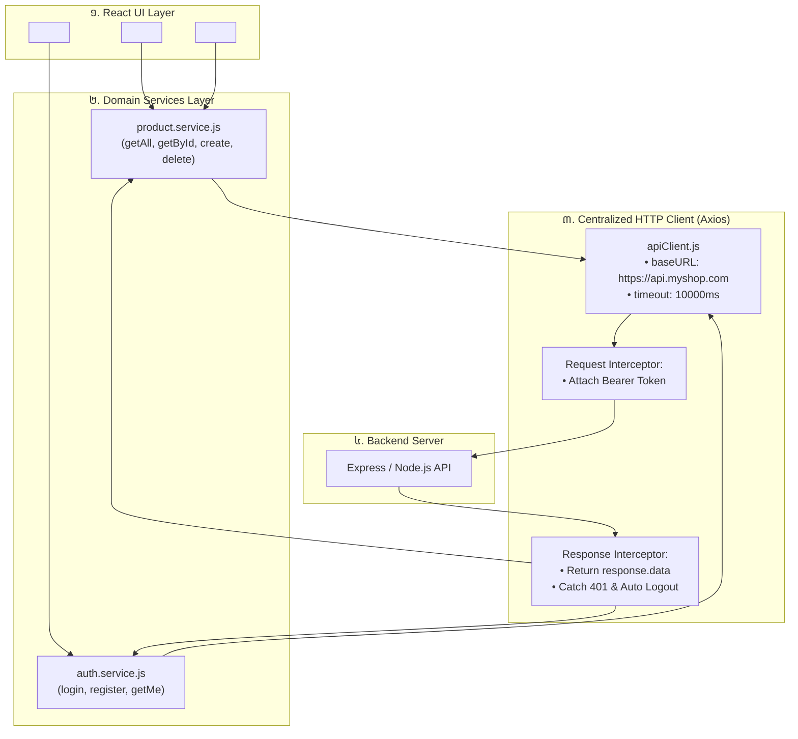

## 🏗️ ១. ស្ថាបត្យកម្ម Service Layer Pattern



---

## 💻 ២. ការបង្កើត Centralized Axios Client (`apiClient.js`)

ខាងក្រោមនេះជាកូដនៃ Axios Client ដែលមាន Base URL, Timeout, Request Interceptor សម្រាប់ Token, និង Response Interceptor សម្រាប់ Error Handling៖

```javascript
// src/api/apiClient.js
import axios from 'axios';

// ១. បង្កើត Axios Custom Instance
const apiClient = axios.create({
  baseURL: import.meta.env.VITE_API_BASE_URL || 'https://api.myshop.com/v1',
  timeout: 10000, // 10 វិនាទី Timeout
  headers: {
    'Content-Type': 'application/json',
    Accept: 'application/json',
  },
});

// ២. Request Interceptor: បញ្ចូល Token ស្វ័យប្រវត្តិតាមរាល់ Request
apiClient.interceptors.request.use(
  (config) => {
    const token = localStorage.getItem('edu_auth_token');
    if (token) {
      config.headers.Authorization = `Bearer ${token}`;
    }
    return config;
  },
  (error) => {
    return Promise.reject(error);
  }
);

// ៣. Response Interceptor: ស្រង់យកទិន្នន័យ និងដោះស្រាយកំហុស 401 Global
apiClient.interceptors.response.use(
  (response) => {
    // ស្រង់យកតែ response.data ផ្ទាល់ ដើម្បីកុំឱ្យ Component ត្រូវសរសេរ .data ច្រើនដង
    return response.data;
  },
  (error) => {
    // ដោះស្រាយបញ្ហា Network ឬ Timeout
    if (!error.response) {
      return Promise.reject(new Error('មិនអាចភ្ជាប់ទៅកាន់ Server បានឡើយ! សូមពិនិត្យមើលអ៊ីនធឺណិតរបស់អ្នក។'));
    }

    const { status, data } = error.response;

    // Handle 401: Token Expired -> Auto Logout
    if (status === 401) {
      localStorage.removeItem('edu_auth_token');
      localStorage.removeItem('edu_auth_user');
      // បញ្ជូនទៅកាន់ Login Page ប្រសិនបើមិនទាន់នៅទីនោះ
      if (window.location.pathname !== '/login') {
        window.location.href = '/login?expired=true';
      }
    }

    // បម្លែង Error Message ឱ្យកាន់តែច្បាស់លាស់
    const customMessage = data?.message || `Server Error (Code: ${status})`;
    const customError = new Error(customMessage);
    customError.status = status;
    customError.data = data;

    return Promise.reject(customError);
  }
);

export default apiClient;
```

---

## 📦 ៣. ការបង្កើត Domain Services Modules

### ១. `src/services/product.service.js`

```javascript
// src/services/product.service.js
import apiClient from '../api/apiClient';

export const productService = {
  // ទាញយកបញ្ជី Products (គាំទ្រ Pagination & Filtering)
  getAll: async (params = {}) => {
    return apiClient.get('/products', { params });
  },

  // ទាញយក Product មួយតាម ID
  getById: async (id) => {
    return apiClient.get(`/products/${id}`);
  },

  // បង្កើត Product ថ្មី
  create: async (productData) => {
    return apiClient.post('/products', productData);
  },

  // កែប្រែ Product (Partial Update)
  update: async (id, updatedData) => {
    return apiClient.patch(`/products/${id}`, updatedData);
  },

  // លុប Product
  delete: async (id) => {
    return apiClient.delete(`/products/${id}`);
  },
};
```

---

## 🛠️ ៤. ការប្រើប្រាស់ Service Layer ក្នុង UI Component

Component នឹងមានកូដស្អាត គ្មាន syntax ស្មុគស្មាញរបស់ Axios ឬ URLs ឡើយ៖

```jsx
// src/components/ProductList.jsx
import React, { useState, useEffect } from 'react';
import { productService } from '../services/product.service';

export default function ProductList() {
  const [products, setProducts] = useState([]);
  const [isLoading, setIsLoading] = useState(true);
  const [errorMessage, setErrorMessage] = useState('');

  useEffect(() => {
    loadProducts();
  }, []);

  const loadProducts = async () => {
    setIsLoading(true);
    setErrorMessage('');
    try {
      const data = await productService.getAll({ limit: 10 });
      setProducts(data);
    } catch (err) {
      setErrorMessage(err.message);
    } finally {
      setIsLoading(false);
    }
  };

  const handleDelete = async (id) => {
    if (!window.confirm('តើអ្នកពិតជាចង់លុបទំនិញនេះមែនទេ?')) return;

    try {
      await productService.delete(id);
      // Update UI ភ្លាមៗ
      setProducts((prev) => prev.filter((item) => item.id !== id));
    } catch (err) {
      alert(`បរាជ័យក្នុងការលុប៖ ${err.message}`);
    }
  };

  if (isLoading) {
    return (
      <div className="p-8 text-center text-slate-500">
        <div className="w-8 h-8 border-4 border-blue-500/20 border-t-blue-500 rounded-full animate-spin mx-auto mb-2" />
        <p>កំពុងផ្ទុកទំនិញ...</p>
      </div>
    );
  }

  if (errorMessage) {
    return (
      <div className="p-6 bg-rose-50 border border-rose-200 rounded-2xl text-rose-600 text-sm text-center">
        ⚠️ {errorMessage}
        <button onClick={loadProducts} className="block mx-auto mt-2 font-bold underline">
          ព្យាយាមម្តងទៀត
        </button>
      </div>
    );
  }

  return (
    <div className="grid grid-cols-1 md:grid-cols-2 lg:grid-cols-3 gap-4">
      {products.map((item) => (
        <div key={item.id} className="p-5 bg-white dark:bg-slate-900 border rounded-2xl shadow-sm flex flex-col justify-between">
          <div>
            <h3 className="font-bold text-slate-800 dark:text-white text-base">{item.name}</h3>
            <p className="text-blue-600 font-extrabold text-sm mt-1">${item.price}</p>
          </div>
          <button
            onClick={() => handleDelete(item.id)}
            className="mt-4 px-3 py-1.5 bg-rose-50 text-rose-600 hover:bg-rose-100 rounded-xl text-xs font-bold transition self-end"
          >
            🗑️ លុប
          </button>
        </div>
      ))}
    </div>
  );
}
```

---

## 🔍 ៥. ការពន្យល់កូដមួយជួរៗ (Line-by-Line Breakdown)

1. `axios.create({ baseURL, timeout })`
   - បង្កើត HTTP Client ផ្តាច់មុខសម្រាប់ App ទាំងមូល ដែលកំណត់ Base URL និង Timeout 10s តែមួយកន្លែង។
2. `apiClient.interceptors.request.use((config) => { ... })`
   - ស្ទាក់ចាប់ Request មុននឹងចាកចេញពី Browser ដើម្បីបញ្ចូល Bearer Token ទៅក្នុង HTTP Headers។
3. `apiClient.interceptors.response.use((response) => response.data, ...)`
   - Auto unwrap `response.data` ធ្វើឱ្យ Components មិនបាច់សរសេរ `res.data.data` ច្រើនជាន់។
4. `if (status === 401) { ... window.location.href = '/login'; }`
   - ចាប់ Error 401 នៅកម្រិត Global — បើ Token អស់សុពលភាព ប្រព័ន្ធនឹងសម្អាត Storage និងនាំ User ទៅ Login ភ្លាមៗ។
5. `export const productService = { ... }`
   - ប្រមូលផ្តុំ API Endpoints ទាំងអស់នៃ Module Product ក្នុង Object តែមួយ ដែលធ្វើឱ្យងាយស្រួល Refactor និង Unit Test (Mocking)។

---

## 💡 ៦. គុណសម្បត្តិសំខាន់ៗនៃ Service Layer

- **Maintainability:** ពេល Backend ប្តូរ Path ពី `/products` ទៅ `/api/v2/items` យើងកែប្រែតែ 1 បន្ទាត់ក្នុង `product.service.js`។
- **Testability:** ងាយស្រួលសរសេរ Unit Test ដោយគ្រាន់តែ Mock `productService.getAll = jest.fn()`។
- **Clean UI:** Components ផ្តោតតែលើការបង្ហាញ UI និង Events ដោយគ្មានកូដ HTTP ស្មុគស្មាញឡើយ។
