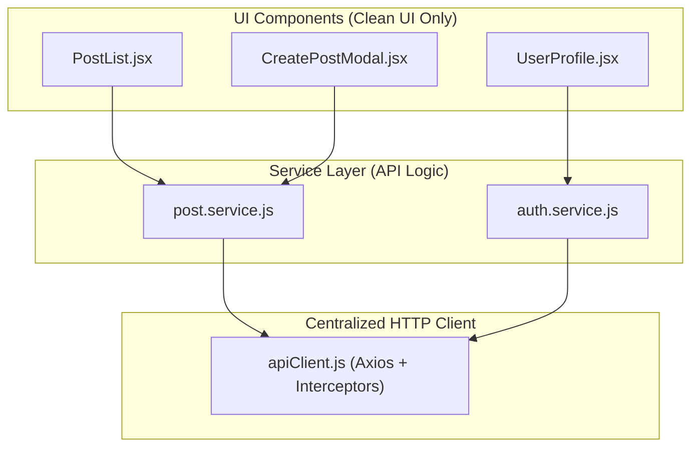

## 🏗️ 1. Service Layer Architecture



---

## 💻 2. Building `post.service.js`

### 💻 Code សម្រាប់តែ Post Service Module:

```javascript
// src/services/post.service.js
import apiClient from '../api/apiClient';

export const postService = {
  // 1. GET: ទាញយកបញ្ជី Posts ទាំងអស់
  getAll: async (params = {}) => {
    const response = await apiClient.get('/posts', { params });
    return response.data;
  },

  // 2. GET: ទាញយក Post មួយតាម ID
  getById: async (id) => {
    const response = await apiClient.get(`/posts/${id}`);
    return response.data;
  },

  // 3. POST: បង្កើត Post ថ្មី
  create: async (postData) => {
    const response = await apiClient.post('/posts', postData);
    return response.data;
  },

  // 4. PUT / PATCH: កែប្រែ Post
  update: async (id, updatedData) => {
    const response = await apiClient.patch(`/posts/${id}`, updatedData);
    return response.data;
  },

  // 5. DELETE: លុប Post
  delete: async (id) => {
    const response = await apiClient.delete(`/posts/${id}`);
    return response.data;
  },
};
```

### 🔍 ការពន្យល់មួយជួរៗ (Line-by-Line Explanation):

1. `import apiClient from '../api/apiClient';`
   - Import Base Axios instance ដែលបាន configure headers, timeout, និង interceptors រួចរាល់។
2. `getAll: async (params = {}) => { ... }`
   - Function ទទួល `params` (ដូចជា pagination `page=1&limit=10` ឬ filter) រួច return តែ `response.data` ជូន caller។
3. `create: async (postData) => { ... }`
   - Encapsulate HTTP `POST` method និង endpoint `/posts`។
4. `delete: async (id) => { ... }`
   - Encapsulate HTTP `DELETE` method។

---

## 🛠️ 3. Using Service Layer in UI Component

### 💻 Code សម្រាប់ UI Component:

```jsx
// src/components/PostList.jsx
import { useState, useEffect } from 'react';
import { postService } from '../services/post.service';

export default function PostList() {
  const [posts, setPosts] = useState([]);
  const [isLoading, setIsLoading] = useState(true);

  useEffect(() => {
    // ហៅ Service យ៉ាងស្អាត ដោយគ្មាន axios syntax ក្នុង Component ឡើយ!
    postService
      .getAll({ _limit: 5 })
      .then((data) => setPosts(data))
      .catch((err) => console.error(err))
      .finally(() => setIsLoading(false));
  }, []);

  const handleDelete = async (id) => {
    try {
      await postService.delete(id);
      setPosts((prev) => prev.filter((p) => p.id !== id));
    } catch (err) {
      alert('លុបមិនបានសម្រេច!');
    }
  };

  if (isLoading) return <p>⏳ កំពុងផ្ទុក Posts...</p>;

  return (
    <ul className="space-y-2">
      {posts.map((post) => (
        <li key={post.id} className="flex justify-between p-3 border rounded-xl">
          <span className="font-semibold text-sm">{post.title}</span>
          <button
            onClick={() => handleDelete(post.id)}
            className="text-red-500 text-xs font-bold"
          >
            លុប
          </button>
        </li>
      ))}
    </ul>
  );
}
```

### 🔍 ការពន្យល់មួយជួរៗ (Line-by-Line Explanation):

1. `postService.getAll({ _limit: 5 })`
   - Component មើលទៅសាមញ្ញ និងងាយយល់ — វាគ្រាន់តែស្នើសុំ "Get All Posts" ពី Service។
2. `await postService.delete(id)`
   - Delete action ត្រូវធ្វើឡើងតាមរយៈ method របស់ Service។ ប្រសិនបើថ្ងៃក្រោយ Backend ប្តូរ Endpoint ពី `/posts/${id}` ទៅ `/api/v2/articles/${id}` យើងគ្រាន់តែកែតែក្នុង file `post.service.js` មួយគត់ គ្រប់ Components នឹងដំណើរការធម្មតា!
