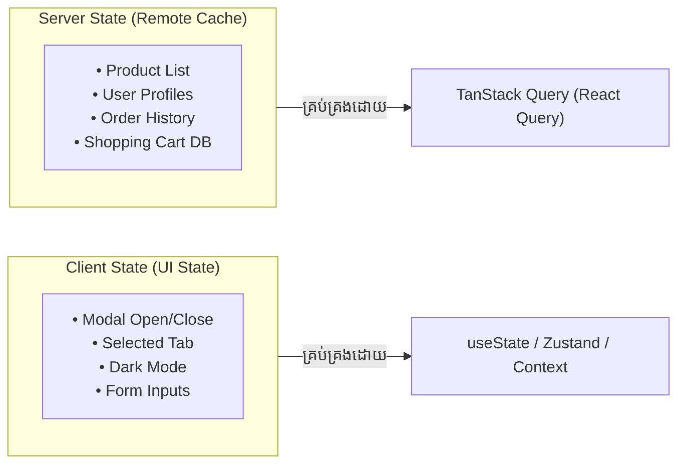

## 🧠 ១. Server State vs Client State Mental Model



> [!NOTE]
> **Server State** គឺជាទិន្នន័យដែលជាកម្មសិទ្ធិរបស់ Server មិនមែនរបស់ Frontend ឡើយ។ Frontend គ្រាន់តែជា **Cache Snapshot** នៃទិន្នន័យនោះប៉ុណ្ណោះ។ TanStack Query ជួយគ្រប់គ្រង Caching, Deduplication, និង Synchronization ដោយស្វ័យប្រវត្តិ។

---

## ⚙️ ២. Installation & Provider Setup

```bash
npm install @tanstack/react-query @tanstack/react-query-devtools
```

### 💻 Setup ក្នុង Root Component (`src/main.jsx` ឬ `App.jsx`):

```jsx
// src/main.jsx
import React from 'react';
import ReactDOM from 'react-dom/client';
import { QueryClient, QueryClientProvider } from '@tanstack/react-query';
import { ReactQueryDevtools } from '@tanstack/react-query-devtools';
import App from './App';

// ១. បង្កើត QueryClient ជាមួយ Configuration ស្តង់ដារ Production
const queryClient = new QueryClient({
  defaultOptions: {
    queries: {
      staleTime: 1000 * 60 * 2, // ២ នាទី (ទិន្នន័យនៅ Fresh មិនចាំបាច់បាញ់ Request ស្ទួន)
      gcTime: 1000 * 60 * 10,   // ១០ នាទី (រក្សាទុកក្នុង Cache Memory)
      retry: 2,                 // បើ Error ព្យាយាមសាកល្បង Fetch ២ ដងទៀត
      refetchOnWindowFocus: true, // ពេល User ចុចត្រឡប់មក Tab វិញ វានឹង Sync ទិន្នន័យថ្មី
    },
  },
});

ReactDOM.createRoot(document.getElementById('root')).render(
  <React.StrictMode>
    <QueryClientProvider client={queryClient}>
      <App />
      {/* Devtools ជួយ Inspect Cache ក្នុង Browser អំឡុងពេល Development */}
      <ReactQueryDevtools initialIsOpen={false} />
    </QueryClientProvider>
  </React.StrictMode>
);
```

---

## 🔍 ៣. ការទាញយកទិន្នន័យដោយប្រើ `useQuery`

លែងត្រូវការសរសេរ `useEffect` + `useState(data)` + `useState(loading)` + `useState(error)` ទៀតហើយ!

```jsx
// src/components/ProductCatalog.jsx
import React, { useState } from 'react';
import { useQuery } from '@tanstack/react-query';
import { productService } from '../services/product.service';

export default function ProductCatalog() {
  const [category, setCategory] = useState('all');
  const [page, setPage] = useState(1);

  // useQuery នឹង Auto-fetch រាល់ពេល category ឬ page ផ្លាស់ប្តូរ!
  const {
    data: products,
    isLoading,   // true តែពេល Fetch លើកដំបូងដែលគ្មាន Cache សោះ
    isFetching,  // true រាល់ពេលកំពុង Fetch ក្នុង Background
    isError,
    error,
    refetch,
  } = useQuery({
    queryKey: ['products', { category, page }], // Cache Key តាមលក្ខខណ្ឌ
    queryFn: () => productService.getAll({ category, page }),
  });

  if (isLoading) {
    return <div className="p-8 text-center text-slate-400">⏳ កំពុងទាញយកទិន្នន័យពី Cache/Server...</div>;
  }

  if (isError) {
    return (
      <div className="p-6 bg-rose-500/10 text-rose-500 rounded-2xl text-center">
        <p>⚠️ មានបញ្ហា៖ {error.message}</p>
        <button onClick={() => refetch()} className="mt-3 px-4 py-2 bg-rose-600 text-white rounded-xl text-xs font-bold">
          ព្យាយាមម្តងទៀត
        </button>
      </div>
    );
  }

  return (
    <div className="space-y-6">
      {/* Background Fetching Indicator */}
      {isFetching && !isLoading && (
        <div className="text-xs text-blue-500 font-bold animate-pulse">
          🔄 កំពុង Sync ទិន្នន័យថ្មីក្នុង Background...
        </div>
      )}

      {/* Products Grid */}
      <div className="grid grid-cols-1 md:grid-cols-3 gap-4">
        {products?.map((item) => (
          <div key={item.id} className="p-5 bg-white dark:bg-slate-900 border rounded-2xl shadow-sm">
            <h3 className="font-bold text-slate-800 dark:text-white">{item.name}</h3>
            <p className="text-blue-600 font-black text-sm mt-1">${item.price}</p>
          </div>
        ))}
      </div>
    </div>
  );
}
```

---

## ✏️ ៤. ការកែប្រែទិន្នន័យដោយប្រើ `useMutation`

`useMutation` ប្រើសម្រាប់ Create, Update, ឬ Delete (CUD) និងបញ្ជាឱ្យ Invalidate Cache ក្រោយពេលជោគជ័យ៖

```jsx
// src/components/CreateProductForm.jsx
import React, { useState } from 'react';
import { useMutation, useQueryClient } from '@tanstack/react-query';
import { productService } from '../services/product.service';

export default function CreateProductForm() {
  const queryClient = useQueryClient();
  const [name, setName] = useState('');
  const [price, setPrice] = useState('');

  // បង្កើត Mutation
  const createProductMutation = useMutation({
    mutationFn: (newProduct) => productService.create(newProduct),

    // ពេលបង្កើតជោគជ័យ ៖
    onSuccess: (createdProduct) => {
      // ១. Invalidate Cache ['products'] ដើម្បីឱ្យ ProductCatalog Auto-refetch ទិន្នន័យថ្មីភ្លាមៗ!
      queryClient.invalidateQueries({ queryKey: ['products'] });

      // ២. សម្អាត Form
      setName('');
      setPrice('');
    },

    onError: (error) => {
      alert(`បរាជ័យក្នុងការបង្កើត៖ ${error.message}`);
    },
  });

  const handleSubmit = (e) => {
    e.preventDefault();
    if (!name || !price) return;

    createProductMutation.mutate({
      name,
      price: parseFloat(price),
    });
  };

  return (
    <form onSubmit={handleSubmit} className="p-6 bg-white dark:bg-slate-900 border rounded-2xl space-y-4 max-w-md">
      <h2 className="text-lg font-black text-slate-800 dark:text-white">➕ បន្ថែមទំនិញថ្មី</h2>

      <input
        type="text"
        placeholder="ឈ្មោះទំនិញ..."
        value={name}
        onChange={(e) => setName(e.target.value)}
        className="w-full px-4 py-2.5 border rounded-xl dark:bg-slate-800 dark:text-white text-sm"
      />

      <input
        type="number"
        placeholder="តម្លៃ ($)..."
        value={price}
        onChange={(e) => setPrice(e.target.value)}
        className="w-full px-4 py-2.5 border rounded-xl dark:bg-slate-800 dark:text-white text-sm"
      />

      <button
        type="submit"
        disabled={createProductMutation.isPending}
        className="w-full py-3 bg-blue-600 hover:bg-blue-700 disabled:opacity-50 text-white font-bold rounded-xl text-sm transition flex items-center justify-center gap-2"
      >
        {createProductMutation.isPending ? 'កំពុងរក្សាទុក...' : 'រក្សាទុកទំនិញ →'}
      </button>
    </form>
  );
}
```

---

## 🔍 ៥. ការពន្យល់កូដមួយជួរៗ (Line-by-Line Breakdown)

1. `queryKey: ['products', { category, page }]`
   - រាល់ពេលដែល State `category` ឬ `page` ផ្លាស់ប្តូរ TanStack Query នឹង Generate Key ថ្មី ហើយស្វែងរកទិន្នន័យក្នុង Cache ឬ Fetch ពី Server ដោយស្វ័យប្រវត្តិ។
2. `isLoading` vs `isFetching`
   - `isLoading`: ជា `true` តែម្តងគត់នៅពេល App មិនទាន់មានទិន្នន័យ Cache ទាល់តែសោះ (Initial Loading UI)។
   - `isFetching`: ជា `true` រាល់ពេលមាន Network Request (រួមទាំង Background Sync)។
3. `queryClient.invalidateQueries({ queryKey: ['products'] })`
   - សម្គាល់ Cache `['products']` ថា Stale (ហួសសម័យ) — គ្រប់ UI Component ណាដែលកំពុងបង្ហាញបញ្ជីទំនិញ នឹងធ្វើបច្ចុប្បន្នភាពទិន្នន័យស្រស់ស្វ័យប្រវត្តិ។
4. `createProductMutation.isPending`
   - ផ្តល់ Boolean State ដើម្បី Disable ប៊ូតុង និងបង្ហាញ Loading Indicator អំឡុងពេល Mutation កំពុងដំណើរការ។

---

## 💡 ៦. Best Practices ជាមួយ TanStack Query

> [!TIP]
> 1. **Encapsulate Queries in Custom Hooks:** ជំនួសឱ្យការសរសេរ `useQuery` ដោយផ្ទាល់ក្នុង Component ច្រើនដង ចូរ Encapsulate វាជា Custom Hook ដូចជា `useProducts(category)` និង `useCreateProduct()`។
> 2. **Never Mutate in `queryFn`:** `queryFn` ត្រូវតែជា Pure Fetch Function (គ្មាន Side Effects ដូចជាកែប្រែ State ក្រៅ)។
> 3. **Use Devtools:** បើកប្រើ `ReactQueryDevtools` ជានិច្ចអំឡុងពេលអភិវឌ្ឍន៍ ដើម្បីមើលឃើញ Cache Keys, Data Expiration, និង Network State យ៉ាងច្បាស់។
