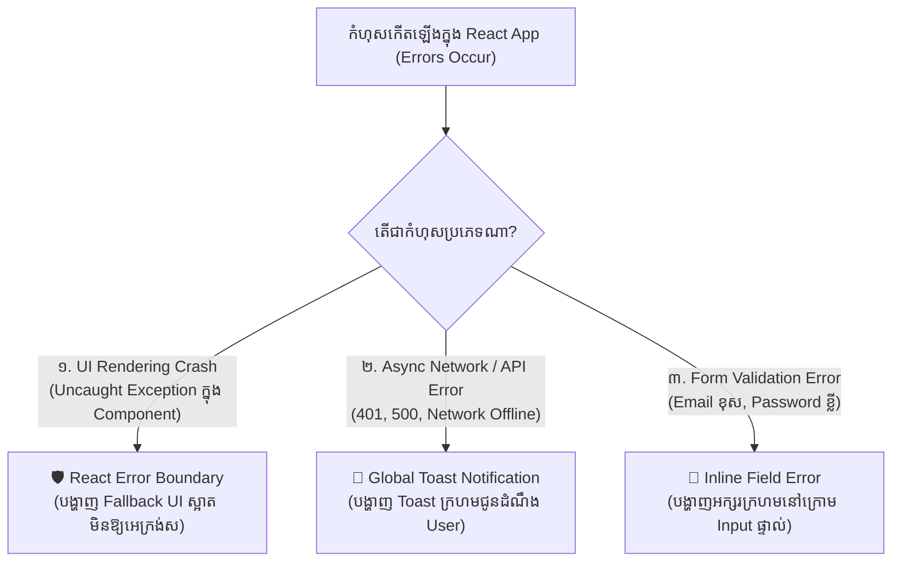

## 🏛️ ១. ឋានានុក្រមនៃ Error Handling ក្នុង Frontend (Error Hierarchy)



---

## 🛡️ ២. ការបង្កើត React Error Boundary Component

ខាងក្រោមនេះជាកូដ Production Error Boundary ដែលមាន Fallback UI, Reset Handler, និង Error Reporting៖

```jsx
// src/components/ErrorBoundary.jsx
import React, { Component } from 'react';

export class ErrorBoundary extends Component {
  constructor(props) {
    super(props);
    this.state = { hasError: false, error: null, errorInfo: null };
  }

  // ១. ចាប់យក Error និង Update State ដើម្បី Render Fallback UI
  static getDerivedStateFromError(error) {
    return { hasError: true, error };
  }

  // ២. កត់ត្រា Error ទៅកាន់ Monitoring Service (ឧ. Sentry, Datadog)
  componentDidCatch(error, errorInfo) {
    this.setState({ errorInfo });
    console.error('[ErrorBoundary Caught]:', error, errorInfo);
    // window.Sentry?.captureException(error);
  }

  // ៣. Handler សម្រាប់ឱ្យ User ចុចសាកល្បង Render ម្តងទៀត (Retry)
  handleReset = () => {
    this.setState({ hasError: false, error: null, errorInfo: null });
    if (this.props.onReset) {
      this.props.onReset();
    }
  };

  render() {
    if (this.state.hasError) {
      // Fallback UI ដ៏ស្រស់ស្អាតជំនួសផ្ទាំងស (White Screen of Death)
      return (
        <div className="min-h-[400px] flex items-center justify-center p-6">
          <div className="max-w-md w-full bg-white dark:bg-slate-900 rounded-3xl p-8 border border-rose-200 dark:border-rose-900/50 shadow-xl text-center">
            <div className="w-16 h-16 bg-rose-500/10 text-rose-600 dark:text-rose-400 rounded-2xl flex items-center justify-center text-3xl mx-auto mb-4">
              💥
            </div>
            <h2 className="text-xl font-black text-slate-900 dark:text-white mb-2">
              សូមអភ័យទោស! មានបញ្ហាបច្ចេកទេស
            </h2>
            <p className="text-sm text-slate-500 dark:text-slate-400 mb-6">
              ផ្នែកនេះនៃកម្មវិធីបានជួបប្រទះបញ្ហាមិនរំពឹងទុក។ ក្រុមការងារយើងត្រូវបានជូនដំណឹងរួចរាល់ហើយ។
            </p>

            {/* Error Detail Snippet */}
            <div className="p-3 bg-slate-100 dark:bg-slate-950 rounded-xl text-left mb-6 overflow-x-auto text-xs font-mono text-rose-500">
              {this.state.error?.toString()}
            </div>

            <div className="flex items-center justify-center gap-3">
              <button
                onClick={this.handleReset}
                className="px-5 py-2.5 bg-blue-600 hover:bg-blue-700 text-white rounded-xl text-sm font-bold transition shadow-sm"
              >
                🔄 ព្យាយាមម្តងទៀត
              </button>
              <button
                onClick={() => window.location.reload()}
                className="px-5 py-2.5 bg-slate-200 dark:bg-slate-800 text-slate-700 dark:text-slate-300 rounded-xl text-sm font-bold hover:bg-slate-300 transition"
              >
                Reload ទំព័រ
              </button>
            </div>
          </div>
        </div>
      );
    }

    return this.props.children;
  }
}
```

---

## 🍞 ៣. Global Toast Notification System

ប្រព័ន្ធ Toast អនុញ្ញាតឱ្យគ្រប់ Component ឬ Service អាចបាញ់ Notification ទៅកាន់ជ្រុងអេក្រង់បានយ៉ាងងាយស្រួល៖

```jsx
// src/context/ToastContext.jsx
import React, { createContext, useContext, useState, useCallback } from 'react';

const ToastContext = createContext(null);

export function ToastProvider({ children }) {
  const [toasts, setToasts] = useState([]);

  // បន្ថែម Toast ថ្មីជាមួយ Auto-dismiss Timer
  const addToast = useCallback((message, type = 'info', duration = 4000) => {
    const id = Date.now() + Math.random();
    setToasts((prev) => [...prev, { id, message, type }]);

    if (duration > 0) {
      setTimeout(() => {
        removeToast(id);
      }, duration);
    }
  }, []);

  const removeToast = useCallback((id) => {
    setToasts((prev) => prev.filter((t) => t.id !== id));
  }, []);

  // UI Styles តាមប្រភេទ
  const TOAST_STYLES = {
    success: 'bg-emerald-600 text-white shadow-emerald-500/20',
    error: 'bg-rose-600 text-white shadow-rose-500/20',
    warning: 'bg-amber-500 text-white shadow-amber-500/20',
    info: 'bg-blue-600 text-white shadow-blue-500/20',
  };

  const TOAST_ICONS = {
    success: '✅',
    error: '❌',
    warning: '⚠️',
    info: 'ℹ️',
  };

  return (
    <ToastContext.Provider value={{ addToast, removeToast }}>
      {children}

      {/* Fixed Toast Container */}
      <div className="fixed bottom-5 right-5 z-50 flex flex-col gap-2.5 max-w-sm w-full pointer-events-none px-4">
        {toasts.map((toast) => (
          <div
            key={toast.id}
            className={`${TOAST_STYLES[toast.type]} pointer-events-auto px-4 py-3.5 rounded-2xl shadow-xl flex items-center justify-between gap-3 text-sm font-semibold transition-all animate-in slide-in-from-bottom-5`}
          >
            <div className="flex items-center gap-2.5">
              <span className="text-base">{TOAST_ICONS[toast.type]}</span>
              <p className="leading-snug">{toast.message}</p>
            </div>
            <button
              onClick={() => removeToast(toast.id)}
              className="opacity-70 hover:opacity-100 text-xs font-black p-1"
            >
              ✕
            </button>
          </div>
        ))}
      </div>
    </ToastContext.Provider>
  );
}

export function useToast() {
  const context = useContext(ToastContext);
  if (!context) throw new Error('useToast must be used within a ToastProvider');
  return context;
}
```

---

## 🔁 ៤. Exponential Backoff Retry Logic

ខាងក្រោមនេះជា Utility Function ដែលសាកល្បង Fetch ឡើងវិញដោយស្វ័យប្រវត្តិតាមរូបមន្ត `2^attempt * 1000ms`៖

```javascript
// src/utils/retryFetch.js

export async function fetchWithRetry(fn, maxRetries = 3, baseDelay = 1000) {
  let lastError;

  for (let attempt = 0; attempt <= maxRetries; attempt++) {
    try {
      return await fn();
    } catch (error) {
      lastError = error;

      // ប្រសិនបើជា Error ដែលមិនគួរ Retry (ដូចជា 400 Bad Request ឬ 401 Unauthorized)
      if (error.status === 400 || error.status === 401 || error.status === 403 || error.status === 404) {
        throw error;
      }

      if (attempt < maxRetries) {
        // រូបមន្ត Exponential Backoff: 1s -> 2s -> 4s
        const delay = baseDelay * Math.pow(2, attempt);
        console.warn(`[Retry Attempt ${attempt + 1}/${maxRetries}] Retrying in ${delay}ms...`);
        await new Promise((resolve) => setTimeout(resolve, delay));
      }
    }
  }

  throw lastError;
}
```

---

## 🔍 ៥. ការពន្យល់កូដមួយជួរៗ (Line-by-Line Breakdown)

1. `static getDerivedStateFromError(error)`
   - Method ពិសេសរបស់ React Class Component ដែលដំណើរការភ្លាមៗពេលមាន Render Error ដើម្បី return state ថ្មី `{ hasError: true }`។
2. `componentDidCatch(error, errorInfo)`
   - ដំណើរការបន្ទាប់ពី Fallback UI ត្រូវបាន Render សម្រាប់ផ្ញើ Error Stack Trace ទៅកាន់ Monitoring Server។
3. `const addToast = useCallback((message, type, duration) => { ... }, []);`
   - Memoize Function ជាមួយ `useCallback` ដើម្បីការពារកុំឱ្យកើត Function ថ្មីរាល់ពេល Provider Re-render។
   - ប្រើ `setTimeout` ដក Toast ចេញស្វ័យប្រវត្តិតាម `duration` (4 វិនាទី)។
4. `baseDelay * Math.pow(2, attempt)`
   - គណនាពេលវេលាពន្យារពេលកាន់តែយូរឡើងៗ (Exponential Backoff) ដើម្បីការពារ Server កុំឱ្យរងសម្ពាធខ្លាំងពេលមានបញ្ហា Network។

---

## 💡 ៦. Best Practices ក្នុងការគ្រប់គ្រង Error

- [x] ស្រោប `<ErrorBoundary>` នៅលើ Root App និងជុំវិញ Dynamic Widgets សំខាន់ៗ
- [x] កុំបង្ហាញ Raw Technical Errors ទៅកាន់អ្នកប្រើប្រាស់ទូទៅ — ត្រូវបកប្រែជាភាសាសាមញ្ញ និងងាយយល់
- [x] ផ្តល់ប៊ូតុង "Retry" ឬ "Reload" ជានិច្ចដើម្បីឱ្យ User អាចដោះស្រាយបញ្ហាដោយខ្លួនឯង
- [x] ប្រើ Global Toast សម្រាប់ async API notifications
