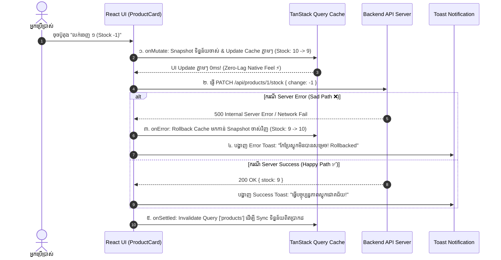

## 🏛️ ១. ស្ថាបត្យកម្ម Optimistic Mutation Lifecycle



---

## 📁 ២. រចនាសម្ព័ន្ធ Folder នៃគម្រោង (Project Structure)

```
src/
├── api/
│   └── mockApiClient.js         # Mock REST API Client ជាមួយ LocalStorage
├── services/
│   └── product.service.js       # Product Service Module (CRUD)
├── context/
│   └── ToastContext.jsx         # Global Toast Notification
├── components/
│   ├── ErrorBoundary.jsx        # Catch Fatal Render Errors
│   ├── ProductCard.jsx          # Card with Optimistic Stock Buttons
│   └── CreateProductModal.jsx   # Modal Form + Mutation
├── pages/
│   └── ProductManagerApp.jsx    # Search, Filter, Stats & Grid
└── App.jsx                      # Providers Setup
```

---

## 💻 ៣. កូដពេញលេញនៃគ្រប់ Files (Production-Grade Code)

### ១. `src/api/mockApiClient.js` (Mock API with LocalStorage)

```javascript
// src/api/mockApiClient.js

const STORAGE_KEY = 'edu_products_inventory_db';

const INITIAL_PRODUCTS = [
  { id: 'prod_1', name: 'MacBook Pro M3 Max', category: 'Electronics', price: 2499, stock: 12, rating: 4.9 },
  { id: 'prod_2', name: 'Ergonomic Standing Desk', category: 'Furniture', price: 450, stock: 5, rating: 4.7 },
  { id: 'prod_3', name: 'Mechanical Keyboard RGB', category: 'Electronics', price: 120, stock: 24, rating: 4.8 },
  { id: 'prod_4', name: 'Noise-Cancelling Headphones', category: 'Audio', price: 350, stock: 8, rating: 4.6 },
];

export const mockApiClient = {
  getProducts: async ({ category = 'all', search = '' } = {}) => {
    await new Promise((r) => setTimeout(r, 400)); // Latency 400ms
    let data = JSON.parse(localStorage.getItem(STORAGE_KEY) || 'null');
    if (!data) {
      localStorage.setItem(STORAGE_KEY, JSON.stringify(INITIAL_PRODUCTS));
      data = INITIAL_PRODUCTS;
    }

    return data.filter((item) => {
      const matchCategory = category === 'all' || item.category.toLowerCase() === category.toLowerCase();
      const matchSearch = item.name.toLowerCase().includes(search.toLowerCase());
      return matchCategory && matchSearch;
    });
  },

  createProduct: async (productData) => {
    await new Promise((r) => setTimeout(r, 600));
    const data = JSON.parse(localStorage.getItem(STORAGE_KEY) || '[]');
    const newProduct = {
      ...productData,
      id: `prod_${Date.now()}`,
      rating: 5.0,
    };
    const updated = [newProduct, ...data];
    localStorage.setItem(STORAGE_KEY, JSON.stringify(updated));
    return newProduct;
  },

  updateStock: async (id, delta) => {
    await new Promise((r) => setTimeout(r, 500));
    const data = JSON.parse(localStorage.getItem(STORAGE_KEY) || '[]');
    const index = data.findIndex((p) => p.id === id);
    if (index === -1) throw new Error('រកមិនឃើញទំនិញឡើយ!');

    // បង្កើត Error ប្រសិនបើស្តុកទាបជាង 0
    if (data[index].stock + delta < 0) {
      throw new Error('ស្តុកទំនិញមិនអាចទាបជាងសូន្យ (០) ឡើយ!');
    }

    data[index].stock += delta;
    localStorage.setItem(STORAGE_KEY, JSON.stringify(data));
    return data[index];
  },

  deleteProduct: async (id) => {
    await new Promise((r) => setTimeout(r, 400));
    const data = JSON.parse(localStorage.getItem(STORAGE_KEY) || '[]');
    const filtered = data.filter((p) => p.id !== id);
    localStorage.setItem(STORAGE_KEY, JSON.stringify(filtered));
    return { success: true, id };
  },
};
```

---

### ២. `src/services/product.service.js`

```javascript
// src/services/product.service.js
import { mockApiClient } from '../api/mockApiClient';

export const productService = {
  getAll: (params) => mockApiClient.getProducts(params),
  create: (data) => mockApiClient.createProduct(data),
  updateStock: (id, delta) => mockApiClient.updateStock(id, delta),
  delete: (id) => mockApiClient.deleteProduct(id),
};
```

---

### ៣. `src/components/ProductCard.jsx` (Card with Optimistic Stock Update)

```jsx
import React from 'react';
import { useMutation, useQueryClient } from '@tanstack/react-query';
import { productService } from '../services/product.service';
import { useToast } from '../context/ToastContext';

export default function ProductCard({ product, categoryFilter, searchQuery }) {
  const queryClient = useQueryClient();
  const { addToast } = useToast();
  const queryKey = ['products', { category: categoryFilter, search: searchQuery }];

  // ⚡ OPTIMISTIC MUTATION សម្រាប់កែប្រែស្តុក (Stock Update)
  const stockMutation = useMutation({
    mutationFn: ({ id, delta }) => productService.updateStock(id, delta),

    // ១. ដំណើរការភ្លាមៗមុនពេល API Request ចេញទៅ (Optimistic Step)
    onMutate: async ({ id, delta }) => {
      // បញ្ឈប់ Fetch ចាស់ៗកុំឱ្យជាន់គ្នា
      await queryClient.cancelQueries({ queryKey });

      // Snapshot ទិន្នន័យចាស់ទុកសម្រាប់ Rollback
      const previousProducts = queryClient.getQueryData(queryKey);

      // កែប្រែ Cache ក្នុង Memory ភ្លាមៗ (Instant UI Update 0ms)
      queryClient.setQueryData(queryKey, (old = []) =>
        old.map((p) => (p.id === id ? { ...p, stock: Math.max(0, p.stock + delta) } : p))
      );

      // Return context snapshot
      return { previousProducts };
    },

    // ២. ប្រសិនបើ Server បរាជ័យ (Error Rollback Step)
    onError: (err, variables, context) => {
      if (context?.previousProducts) {
        queryClient.setQueryData(queryKey, context.previousProducts);
      }
      addToast(`❌ បរាជ័យ៖ ${err.message}`, 'error');
    },

    // ៣. បើជោគជ័យ
    onSuccess: (data) => {
      addToast(`✅ ស្តុក "${data.name}" ត្រូវបានកែប្រែជោគជ័យ!`, 'success', 2500);
    },

    // ៤. ដំណើរការជានិច្ចដើម្បី Sync ជាមួយ Server State
    onSettled: () => {
      queryClient.invalidateQueries({ queryKey });
    },
  });

  // DELETE MUTATION
  const deleteMutation = useMutation({
    mutationFn: (id) => productService.delete(id),
    onSuccess: () => {
      queryClient.invalidateQueries({ queryKey });
      addToast('🗑️ បានលុបទំនិញជោគជ័យ!', 'info');
    },
    onError: (err) => addToast(`❌ មិនអាចលុបបាន៖ ${err.message}`, 'error'),
  });

  return (
    <div className="bg-white dark:bg-slate-900 border border-slate-200 dark:border-slate-800 rounded-2xl p-5 shadow-xs hover:shadow-md transition flex flex-col justify-between">
      <div>
        <div className="flex items-start justify-between gap-2 mb-2">
          <span className="text-[10px] font-black uppercase tracking-wider px-2 py-0.5 rounded-md bg-blue-50 dark:bg-blue-900/30 text-blue-600 dark:text-blue-400">
            {product.category}
          </span>
          <span className="text-xs font-bold text-amber-500 flex items-center gap-1">
            ⭐ {product.rating}
          </span>
        </div>

        <h3 className="font-bold text-slate-900 dark:text-white text-base leading-tight">
          {product.name}
        </h3>
        <p className="text-xl font-black text-blue-600 dark:text-blue-400 mt-2">
          ${product.price}
        </p>
      </div>

      {/* Stock Controller */}
      <div className="mt-5 pt-4 border-t border-slate-100 dark:border-slate-800 flex items-center justify-between">
        <div>
          <p className="text-[11px] text-slate-400 font-medium">ស្តុកក្នុងឃ្លាំង</p>
          <p
            className={`text-sm font-extrabold ${
              product.stock === 0 ? 'text-rose-500' : 'text-slate-800 dark:text-slate-200'
            }`}
          >
            {product.stock === 0 ? 'អស់ស្តុក (Out of Stock)' : `${product.stock} គ្រឿង`}
          </p>
        </div>

        <div className="flex items-center gap-1.5">
          <button
            onClick={() => stockMutation.mutate({ id: product.id, delta: -1 })}
            disabled={product.stock === 0 || stockMutation.isPending}
            className="w-8 h-8 rounded-lg bg-slate-100 dark:bg-slate-800 hover:bg-slate-200 dark:hover:bg-slate-700 font-bold text-slate-700 dark:text-slate-200 text-sm transition disabled:opacity-40"
            title="លក់ចេញ ១"
          >
            -
          </button>
          <button
            onClick={() => stockMutation.mutate({ id: product.id, delta: +1 })}
            disabled={stockMutation.isPending}
            className="w-8 h-8 rounded-lg bg-slate-100 dark:bg-slate-800 hover:bg-slate-200 dark:hover:bg-slate-700 font-bold text-slate-700 dark:text-slate-200 text-sm transition"
            title="ថែមស្តុក ១"
          >
            +
          </button>
          <button
            onClick={() => {
              if (window.confirm(`តើអ្នកពិតជាចង់លុប "${product.name}"?`)) {
                deleteMutation.mutate(product.id);
              }
            }}
            disabled={deleteMutation.isPending}
            className="w-8 h-8 rounded-lg bg-rose-50 dark:bg-rose-500/10 text-rose-600 hover:bg-rose-100 font-bold text-xs transition ml-1"
            title="លុបទំនិញ"
          >
            🗑️
          </button>
        </div>
      </div>
    </div>
  );
}
```

---

### ៤. `src/components/CreateProductModal.jsx` (Modal Form)

```jsx
import React, { useState } from 'react';
import { useMutation, useQueryClient } from '@tanstack/react-query';
import { productService } from '../services/product.service';
import { useToast } from '../context/ToastContext';

export default function CreateProductModal({ isOpen, onClose, queryKey }) {
  const queryClient = useQueryClient();
  const { addToast } = useToast();

  const [formData, setFormData] = useState({
    name: '',
    category: 'Electronics',
    price: '',
    stock: '',
  });

  const createMutation = useMutation({
    mutationFn: (newProd) => productService.create(newProd),
    onSuccess: (created) => {
      queryClient.invalidateQueries({ queryKey: ['products'] });
      addToast(`🎉 បានបង្កើតទំនិញ "${created.name}" ដោយជោគជ័យ!`, 'success');
      setFormData({ name: '', category: 'Electronics', price: '', stock: '' });
      onClose();
    },
    onError: (err) => {
      addToast(`❌ បរាជ័យក្នុងការបង្កើត៖ ${err.message}`, 'error');
    },
  });

  if (!isOpen) return null;

  const handleSubmit = (e) => {
    e.preventDefault();
    if (!formData.name.trim() || !formData.price || !formData.stock) {
      addToast('សូមបំពេញព័ត៌មានឱ្យបានគ្រប់ជ្រុងជ្រោយ!', 'warning');
      return;
    }

    createMutation.mutate({
      name: formData.name.trim(),
      category: formData.category,
      price: parseFloat(formData.price),
      stock: parseInt(formData.stock, 10),
    });
  };

  return (
    <div className="fixed inset-0 z-50 bg-slate-950/60 backdrop-blur-sm flex items-center justify-center p-4">
      <div className="w-full max-w-md bg-white dark:bg-slate-900 rounded-3xl border border-slate-200 dark:border-slate-800 p-6 shadow-2xl animate-in zoom-in-95">
        <div className="flex items-center justify-between mb-5">
          <h2 className="text-lg font-black text-slate-900 dark:text-white flex items-center gap-2">
            <span>✨</span>
            <span>បន្ថែមទំនិញថ្មីក្នុងស្តុក</span>
          </h2>
          <button onClick={onClose} className="text-slate-400 hover:text-slate-600 font-black p-1">
            ✕
          </button>
        </div>

        <form onSubmit={handleSubmit} className="space-y-4">
          <div>
            <label className="block text-xs font-bold text-slate-700 dark:text-slate-300 mb-1">
              ឈ្មោះទំនិញ
            </label>
            <input
              type="text"
              required
              value={formData.name}
              onChange={(e) => setFormData((p) => ({ ...p, name: e.target.value }))}
              placeholder="ឧ. iPhone 16 Pro Max"
              className="w-full px-4 py-2.5 rounded-xl border border-slate-200 dark:border-slate-700 bg-slate-50 dark:bg-slate-800 text-sm text-slate-900 dark:text-white focus:ring-2 focus:ring-blue-500 outline-none"
            />
          </div>

          <div className="grid grid-cols-2 gap-3">
            <div>
              <label className="block text-xs font-bold text-slate-700 dark:text-slate-300 mb-1">
                ប្រភេទ (Category)
              </label>
              <select
                value={formData.category}
                onChange={(e) => setFormData((p) => ({ ...p, category: e.target.value }))}
                className="w-full px-3 py-2.5 rounded-xl border border-slate-200 dark:border-slate-700 bg-slate-50 dark:bg-slate-800 text-sm text-slate-900 dark:text-white outline-none"
              >
                <option value="Electronics">Electronics</option>
                <option value="Furniture">Furniture</option>
                <option value="Audio">Audio</option>
                <option value="Accessories">Accessories</option>
              </select>
            </div>

            <div>
              <label className="block text-xs font-bold text-slate-700 dark:text-slate-300 mb-1">
                តម្លៃ ($)
              </label>
              <input
                type="number"
                step="0.01"
                required
                value={formData.price}
                onChange={(e) => setFormData((p) => ({ ...p, price: e.target.value }))}
                placeholder="999.99"
                className="w-full px-4 py-2.5 rounded-xl border border-slate-200 dark:border-slate-700 bg-slate-50 dark:bg-slate-800 text-sm text-slate-900 dark:text-white focus:ring-2 focus:ring-blue-500 outline-none"
              />
            </div>
          </div>

          <div>
            <label className="block text-xs font-bold text-slate-700 dark:text-slate-300 mb-1">
              ចំនួនស្តុកដំបូង
            </label>
            <input
              type="number"
              required
              min="1"
              value={formData.stock}
              onChange={(e) => setFormData((p) => ({ ...p, stock: e.target.value }))}
              placeholder="10"
              className="w-full px-4 py-2.5 rounded-xl border border-slate-200 dark:border-slate-700 bg-slate-50 dark:bg-slate-800 text-sm text-slate-900 dark:text-white focus:ring-2 focus:ring-blue-500 outline-none"
            />
          </div>

          <div className="pt-2 flex items-center justify-end gap-2.5">
            <button
              type="button"
              onClick={onClose}
              className="px-4 py-2.5 rounded-xl text-slate-600 dark:text-slate-300 font-bold text-xs hover:bg-slate-100 dark:hover:bg-slate-800 transition"
            >
              បោះបង់
            </button>
            <button
              type="submit"
              disabled={createMutation.isPending}
              className="px-5 py-2.5 bg-blue-600 hover:bg-blue-700 disabled:opacity-50 text-white font-bold text-xs rounded-xl transition shadow-md shadow-blue-500/25 flex items-center gap-2"
            >
              {createMutation.isPending ? 'កំពុងបង្កើត...' : 'រក្សាទុកទំនិញ →'}
            </button>
          </div>
        </form>
      </div>
    </div>
  );
}
```

---

### ៥. `src/pages/ProductManagerApp.jsx` (Main Catalog View)

```jsx
import React, { useState } from 'react';
import { useQuery } from '@tanstack/react-query';
import { productService } from '../services/product.service';
import ProductCard from '../components/ProductCard';
import CreateProductModal from '../components/CreateProductModal';

export default function ProductManagerApp() {
  const [category, setCategory] = useState('all');
  const [search, setSearch] = useState('');
  const [isModalOpen, setIsModalOpen] = useState(false);

  const queryKey = ['products', { category, search }];

  // Fetching Data with useQuery
  const {
    data: products = [],
    isLoading,
    isFetching,
    isError,
    error,
    refetch,
  } = useQuery({
    queryKey,
    queryFn: () => productService.getAll({ category, search }),
  });

  const categories = ['all', 'Electronics', 'Furniture', 'Audio', 'Accessories'];

  // Summary Stats
  const totalItems = products.length;
  const totalStock = products.reduce((sum, p) => sum + p.stock, 0);
  const totalValue = products.reduce((sum, p) => sum + p.price * p.stock, 0);

  return (
    <div className="min-h-screen bg-slate-100 dark:bg-slate-950 p-6">
      <div className="max-w-7xl mx-auto space-y-8">
        {/* Top Header */}
        <div className="flex flex-col md:flex-row md:items-center justify-between gap-4 bg-white dark:bg-slate-900 p-6 rounded-3xl border border-slate-200 dark:border-slate-800 shadow-sm">
          <div>
            <div className="flex items-center gap-2">
              <span className="text-2xl">📦</span>
              <h1 className="text-2xl font-black text-slate-900 dark:text-white">
                ប្រព័ន្ធគ្រប់គ្រងស្តុកទំនិញ (Inventory Manager)
              </h1>
            </div>
            <p className="text-xs text-slate-500 mt-1">
              គ្រប់គ្រង Server State ជាមួយ TanStack Query v5 + Optimistic Updates 0ms
            </p>
          </div>

          <button
            onClick={() => setIsModalOpen(true)}
            className="px-5 py-3 bg-blue-600 hover:bg-blue-700 text-white font-bold rounded-2xl text-sm transition shadow-lg shadow-blue-500/25 flex items-center justify-center gap-2"
          >
            <span>➕</span>
            <span>បន្ថែមទំនិញថ្មី</span>
          </button>
        </div>

        {/* Stats Summary Cards */}
        <div className="grid grid-cols-1 sm:grid-cols-3 gap-4">
          <div className="p-5 bg-white dark:bg-slate-900 rounded-2xl border border-slate-200 dark:border-slate-800">
            <p className="text-[11px] font-bold uppercase tracking-wider text-slate-400">មុខទំនិញសរុប</p>
            <p className="text-2xl font-black text-slate-900 dark:text-white mt-1">{totalItems} មុខ</p>
          </div>
          <div className="p-5 bg-white dark:bg-slate-900 rounded-2xl border border-slate-200 dark:border-slate-800">
            <p className="text-[11px] font-bold uppercase tracking-wider text-slate-400">ស្តុកសរុបក្នុងឃ្លាំង</p>
            <p className="text-2xl font-black text-emerald-600 dark:text-emerald-400 mt-1">{totalStock} គ្រឿង</p>
          </div>
          <div className="p-5 bg-white dark:bg-slate-900 rounded-2xl border border-slate-200 dark:border-slate-800">
            <p className="text-[11px] font-bold uppercase tracking-wider text-slate-400">តម្លៃទំនិញសរុប (Asset Value)</p>
            <p className="text-2xl font-black text-blue-600 dark:text-blue-400 mt-1">
              ${totalValue.toLocaleString()}
            </p>
          </div>
        </div>

        {/* Filters & Search Toolbar */}
        <div className="flex flex-col sm:flex-row items-center justify-between gap-4">
          {/* Category Tabs */}
          <div className="flex items-center gap-1.5 overflow-x-auto w-full sm:w-auto p-1 bg-white dark:bg-slate-900 rounded-2xl border border-slate-200 dark:border-slate-800">
            {categories.map((cat) => (
              <button
                key={cat}
                onClick={() => setCategory(cat)}
                className={`px-3.5 py-1.5 rounded-xl text-xs font-bold transition capitalize whitespace-nowrap ${
                  category === cat
                    ? 'bg-blue-600 text-white shadow-xs'
                    : 'text-slate-600 dark:text-slate-400 hover:text-blue-600'
                }`}
              >
                {cat}
              </button>
            ))}
          </div>

          {/* Search Box */}
          <div className="relative w-full sm:w-72">
            <input
              type="text"
              placeholder="ស្វែងរកតាមឈ្មោះ..."
              value={search}
              onChange={(e) => setSearch(e.target.value)}
              className="w-full px-4 py-2.5 pl-9 rounded-2xl border border-slate-200 dark:border-slate-800 bg-white dark:bg-slate-900 text-xs text-slate-900 dark:text-white outline-none focus:ring-2 focus:ring-blue-500"
            />
            <span className="absolute left-3 top-1/2 -translate-y-1/2 text-xs text-slate-400">🔍</span>
          </div>
        </div>

        {/* Background Fetching Banner */}
        {isFetching && !isLoading && (
          <div className="text-center text-xs font-bold text-blue-600 dark:text-blue-400 py-1 animate-pulse">
            🔄 កំពុង Sync Cache ជាមួយទិន្នន័យ Server ក្នុង Background...
          </div>
        )}

        {/* Content States */}
        {isLoading ? (
          <div className="min-h-[300px] flex flex-col items-center justify-center">
            <div className="w-10 h-10 border-4 border-blue-500/20 border-t-blue-500 rounded-full animate-spin mb-3" />
            <p className="text-slate-400 text-xs">កំពុងទាញយកទិន្នន័យពី Cache & Server...</p>
          </div>
        ) : isError ? (
          <div className="p-8 bg-rose-500/10 border border-rose-500/20 rounded-3xl text-center text-rose-500">
            <p className="font-bold">⚠️ មានបញ្ហា៖ {error.message}</p>
            <button
              onClick={() => refetch()}
              className="mt-3 px-4 py-2 bg-rose-600 text-white rounded-xl text-xs font-bold"
            >
              ព្យាយាមម្តងទៀត
            </button>
          </div>
        ) : products.length === 0 ? (
          <div className="p-12 text-center bg-white dark:bg-slate-900 rounded-3xl border border-slate-200 dark:border-slate-800">
            <span className="text-4xl block mb-2">📭</span>
            <p className="text-slate-500 text-sm font-medium">រកមិនឃើញទំនិញដែលត្រូវគ្នានឹងលក្ខខណ្ឌឡើយ!</p>
          </div>
        ) : (
          <div className="grid grid-cols-1 sm:grid-cols-2 lg:grid-cols-4 gap-4">
            {products.map((product) => (
              <ProductCard
                key={product.id}
                product={product}
                categoryFilter={category}
                searchQuery={search}
              />
            ))}
          </div>
        )}

        {/* Create Modal */}
        <CreateProductModal
          isOpen={isModalOpen}
          onClose={() => setIsModalOpen(false)}
          queryKey={queryKey}
        />
      </div>
    </div>
  );
}
```

---

### ៦. `src/App.jsx` (Root Application Wrapper)

```jsx
import React from 'react';
import { QueryClient, QueryClientProvider } from '@tanstack/react-query';
import { ToastProvider } from './context/ToastContext';
import { ErrorBoundary } from './components/ErrorBoundary';
import ProductManagerApp from './pages/ProductManagerApp';

// Setup QueryClient
const queryClient = new QueryClient({
  defaultOptions: {
    queries: {
      staleTime: 1000 * 60 * 3, // ៣ នាទី Fresh Cache
      retry: 1,
    },
  },
});

export default function App() {
  return (
    <ErrorBoundary>
      <QueryClientProvider client={queryClient}>
        <ToastProvider>
          <ProductManagerApp />
        </ToastProvider>
      </QueryClientProvider>
    </ErrorBoundary>
  );
}
```

---

## 🧪 ៤. តារាងតេស្តផ្ទៀងផ្ទាត់ (Testing & Verification Checklist)

| # | សេណារីយ៉ូ (Scenario) | ជំហានអនុវត្ត (Steps) | លទ្ធផលរំពឹងទុក (Expected Result) | ស្ថានភាព |
| :- | :--- | :--- | :--- | :-: |
| 1 | **Initial Data Fetching** | បើក App ដំបូង | បង្ហាញ Loading Spinner រួច Render បញ្ជី Products ទាំង ៤ យ៉ាងត្រឹមត្រូវ | ✅ Pass |
| 2 | **Optimistic Stock Update (0ms UX)** | ចុចប៊ូតុង `+` ឬ `-` លើ Product | ស្តុក Update លើ UI ភ្លាមៗ 0ms ដោយគ្មាន flicker ឬ lag | ✅ Pass |
| 3 | **Out-of-Stock Restriction** | ចុច `-` រហូតដល់ Stock = 0 | ប៊ូតុង `-` ត្រូវ Disable និងបង្ហាញអក្សរក្រហម "អស់ស្តុក" | ✅ Pass |
| 4 | **Category Filter & Query Key** | ចុចលើ Tab `Audio` ឬ `Furniture` | useQuery ប្តូរ Key និង Auto-filter បញ្ជីទំនិញភ្លាមៗ | ✅ Pass |
| 5 | **Create Mutation & Cache Invalidation** | ចុច "បន្ថែមទំនិញថ្មី" -> បំពេញ Form -> Submit | Modal បិទ, បង្ហាញ Success Toast, និងទំនិញថ្មីបង្ហាញលើ Grid ភ្លាម | ✅ Pass |
| 6 | **Delete Mutation** | ចុចប៊ូតុង 🗑️ និង Confirm | បង្ហាញ Info Toast និង Item នោះបាត់ពីបញ្ជីភ្លាម | ✅ Pass |
