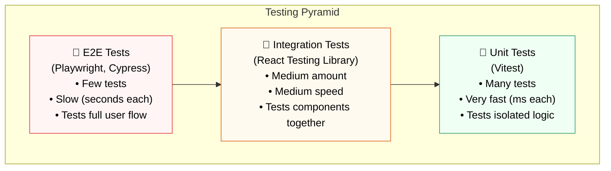

## 🏗️ 1. Testing Pyramid



---

## 📦 2. Setup Vitest + React Testing Library

```bash
npm install -D vitest @testing-library/react @testing-library/user-event @testing-library/jest-dom jsdom
```

```js
// vite.config.js — Add test config
import { defineConfig } from 'vite';
import react from '@vitejs/plugin-react';

export default defineConfig({
  plugins: [react()],
  test: {
    globals: true,          // Use describe/it/expect globally (no import needed)
    environment: 'jsdom',   // Simulate browser DOM
    setupFiles: './src/test/setup.js',
  },
});
```

```js
// src/test/setup.js
import '@testing-library/jest-dom'; // Adds matchers: toBeInTheDocument, toHaveClass, etc.
```

```json
// package.json — Add test scripts
{
  "scripts": {
    "test": "vitest",
    "test:ui": "vitest --ui",
    "test:coverage": "vitest --coverage"
  }
}
```

---

## 🧪 3. Writing Your First Tests

```js
// src/utils/math.js
export function add(a, b) { return a + b; }
export function formatPrice(price) { return `$${price.toFixed(2)}`; }
export function validateEmail(email) { return /^[^\s@]+@[^\s@]+\.[^\s@]+$/.test(email); }
```

```js
// src/utils/math.test.js
import { describe, it, expect } from 'vitest';
import { add, formatPrice, validateEmail } from './math';

describe('add()', () => {
  it('adds two positive numbers', () => {
    expect(add(2, 3)).toBe(5);
  });

  it('handles negative numbers', () => {
    expect(add(-1, 1)).toBe(0);
  });
});

describe('formatPrice()', () => {
  it('formats with $ and 2 decimal places', () => {
    expect(formatPrice(9.9)).toBe('$9.90');
    expect(formatPrice(100)).toBe('$100.00');
  });
});

describe('validateEmail()', () => {
  it('returns true for valid emails', () => {
    expect(validateEmail('test@example.com')).toBe(true);
  });

  it('returns false for invalid emails', () => {
    expect(validateEmail('notanemail')).toBe(false);
    expect(validateEmail('@nodomain.com')).toBe(false);
  });
});
```

```bash
# Run tests
npm test

# Expected output:
# ✓ src/utils/math.test.js (5)
#   ✓ add() (2)
#   ✓ formatPrice() (2)
#   ✓ validateEmail() (2)
# Test Files: 1 passed | Duration: 342ms
```

---

## 📁 4. Test File Convention

```
src/
├── components/
│   ├── Button.jsx
│   └── Button.test.jsx    ← Co-located (recommended)
├── utils/
│   ├── math.js
│   └── math.test.js
└── __tests__/             ← Or centralized (alternative)
    └── integration.test.jsx
```

> **💡 Naming:** Test files use `.test.jsx` or `.spec.jsx`. Vitest automatically discovers all files matching `*.test.*` or `*.spec.*`.
