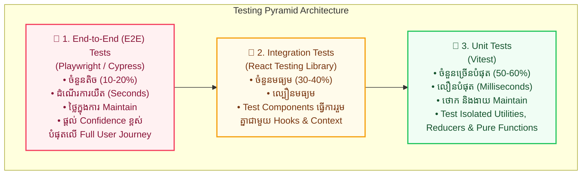

## 🏛️ ១. ស្ថាបត្យកម្ម Testing Pyramid & Return on Investment (ROI)



---

## ⚙️ ២. ការដំឡើង និង Configure Vitest + Jest-DOM

```bash
npm install -D vitest @testing-library/react @testing-library/jest-dom @testing-library/user-event jsdom
```

### ១. `vite.config.js` (Test Environment Setup)

```javascript
// vite.config.js
import { defineConfig } from 'vite';
import react from '@vitejs/plugin-react';

export default defineConfig({
  plugins: [react()],
  test: {
    globals: true,                // អនុញ្ញាតឱ្យប្រើ describe, it, expect ដោយមិនបាច់ import
    environment: 'jsdom',         // ក្លែងធ្វើ Browser DOM ក្នុង Node.js
    setupFiles: './src/test/setup.js', // File Setup Matchers ដំបូង
    css: true,                    // Parse CSS Classes ក្នុង Tests
  },
});
```

### ២. `src/test/setup.js` (Custom Matchers Injection)

```javascript
// src/test/setup.js
import '@testing-library/jest-dom'; // ផ្តល់ Matchers ដូចជា toBeInTheDocument(), toHaveValue()
import { afterEach } from 'vitest';
import { cleanup } from '@testing-library/react';

// សម្អាត Virtual DOM ក្រោយ Test នីមួយៗបញ្ចប់
afterEach(() => {
  cleanup();
});
```

### ៣. `package.json` (Scripts)

```json
{
  "scripts": {
    "test": "vitest",
    "test:run": "vitest run",
    "test:coverage": "vitest run --coverage"
  }
}
```

---

## 🧪 ៣. ការសរសេរ Unit Tests សម្រាប់ Pure Business Logic

ខាងក្រោមនេះជា Module គណនាប្រាក់ និងបញ្ចុះតម្លៃក្នុង E-Commerce Cart៖

### 💻 `src/utils/cart.js` (Source Code)

```javascript
// src/utils/cart.js

// ១. គណនាតម្លៃសរុបនៃទំនិញក្នុងកន្ត្រក
export function calculateSubtotal(items = []) {
  return items.reduce((total, item) => {
    if (item.price < 0 || item.quantity < 0) {
      throw new Error('តម្លៃ ឬចំនួនទំនិញមិនអាចអវិជ្ជមានបានឡើយ!');
    }
    return total + item.price * item.quantity;
  }, 0);
}

// ២. អនុវត្តគូប៉ុងបញ្ចុះតម្លៃ (Voucher Discount)
export function applyDiscount(subtotal, discountPercent = 0) {
  if (discountPercent < 0 || discountPercent > 100) {
    throw new Error('ភាគរយបញ្ចុះតម្លៃត្រូវតែនៅចន្លោះ ០ ដល់ ១០០%');
  }
  const discountAmount = (subtotal * discountPercent) / 100;
  return Math.max(0, subtotal - discountAmount);
}

// ៣. ផ្ទៀងផ្ទាត់ទម្រង់លេខទូរស័ព្ទកម្ពុជា
export function validateKhmerPhone(phone) {
  const regex = /^(0\d{8,9}|\+855\d{8,9})$/;
  return regex.test(phone?.trim());
}
```

---

### 💻 `src/utils/cart.test.js` (Comprehensive Test Suite)

```javascript
// src/utils/cart.test.js
import { describe, it, expect } from 'vitest';
import { calculateSubtotal, applyDiscount, validateKhmerPhone } from './cart';

describe('Cart Utility Functions', () => {
  // ── 1. Testing calculateSubtotal ──────────────────────────
  describe('calculateSubtotal()', () => {
    it('returns 0 when cart is empty', () => {
      const result = calculateSubtotal([]);
      expect(result).toBe(0);
    });

    it('correctly calculates total for multiple valid items', () => {
      const items = [
        { price: 10, quantity: 2 }, // 20
        { price: 15.5, quantity: 2 }, // 31
      ];
      expect(calculateSubtotal(items)).toBe(51);
    });

    it('throws error when item price or quantity is negative', () => {
      const badItems = [{ price: -5, quantity: 1 }];
      expect(() => calculateSubtotal(badItems)).toThrow('តម្លៃ ឬចំនួនទំនិញមិនអាចអវិជ្ជមានបានឡើយ!');
    });
  });

  // ── 2. Testing applyDiscount ──────────────────────────────
  describe('applyDiscount()', () => {
    it('applies 20% discount correctly', () => {
      const finalPrice = applyDiscount(100, 20);
      expect(finalPrice).toBe(80);
    });

    it('handles float values with precision using toBeCloseTo', () => {
      const finalPrice = applyDiscount(33.33, 10);
      expect(finalPrice).toBeCloseTo(29.997, 2);
    });

    it('throws error when discount is greater than 100 or less than 0', () => {
      expect(() => applyDiscount(100, 150)).toThrow(/០ ដល់ ១០០%/);
      expect(() => applyDiscount(100, -10)).toThrow(/០ ដល់ ១០០%/);
    });
  });

  // ── 3. Testing validateKhmerPhone ─────────────────────────
  describe('validateKhmerPhone()', () => {
    it('returns true for valid local numbers (012, 093)', () => {
      expect(validateKhmerPhone('012345678')).toBe(true);
      expect(validateKhmerPhone('093123456')).toBe(true);
    });

    it('returns true for international +855 prefix', () => {
      expect(validateKhmerPhone('+85512345678')).toBe(true);
    });

    it('returns false for invalid numbers', () => {
      expect(validateKhmerPhone('12345')).toBe(false);
      expect(validateKhmerPhone('abcdefghij')).toBe(false);
      expect(validateKhmerPhone('')).toBe(false);
    });
  });
});
```

---

## 🔍 ៤. ការពន្យល់កូដមួយជួរៗ (Line-by-Line Breakdown)

1. `describe('Cart Utility Functions', () => { ... })`
   - បង្កើត Test Suite ធំមួយសម្រាប់ប្រមូលផ្តុំ Test Cases ដែលពាក់ព័ន្ធនឹងមុខងារ Cart។
2. `it('returns 0 when cart is empty', () => { ... })`
   - កំណត់លក្ខខណ្ឌតេស្តទោល (Single Test Case) ជាមួយឈ្មោះដែលបញ្ជាក់ពីលទ្ធផលរំពឹងទុកយ៉ាងច្បាស់លាស់ (Self-Documenting Code)។
3. `expect(calculateSubtotal([])).toBe(0);`
   - **Assertion:** ផ្ទៀងផ្ទាត់ថាតម្លៃដែលបានមកពី Function ពិតជាស្មើនឹង `0` មែន។
4. `expect(() => calculateSubtotal(badItems)).toThrow(...)`
   - ត្រូវរុំ Function Call ក្នុង Anonymous Function `() => fn()` នៅពេលតេស្ត `toThrow()` ដើម្បីកុំឱ្យ Error ធ្វើឱ្យ Test Runner គាំង។
5. `expect(finalPrice).toBeCloseTo(29.997, 2)`
   - ប្រើ `toBeCloseTo` សម្រាប់ Floating Point Numbers ក្នុង JavaScript ដើម្បីការពារបញ្ហា `0.1 + 0.2 !== 0.3`។

---

## 💡 ៥. Best Practices ក្នុងការសរសេរ Tests

> [!TIP]
> 1. **AAA Pattern (Arrange - Act - Assert):**
>    - **Arrange:** រៀបចំទិន្នន័យ Input (Mock Data, Props)
>    - **Act:** ដំណើរការ Function ឬ Click Event
>    - **Assert:** ផ្ទៀងផ្ទាត់លទ្ធផលរំពឹងទុក
> 2. **Descriptive Test Names:** សរសេរឈ្មោះ `it('should return...')` ឱ្យងាយយល់ ដើម្បីពេល Test Fail យើងដឹងភ្លាមថាខុសត្រង់ណា។
> 3. **Fast Execution:** Unit Tests មិនគួរមាន Async Delays យូរៗឡើយ — ត្រូវរក្សាវាឱ្យដំណើរការក្រោម 10ms ក្នុងមួយ Test។
