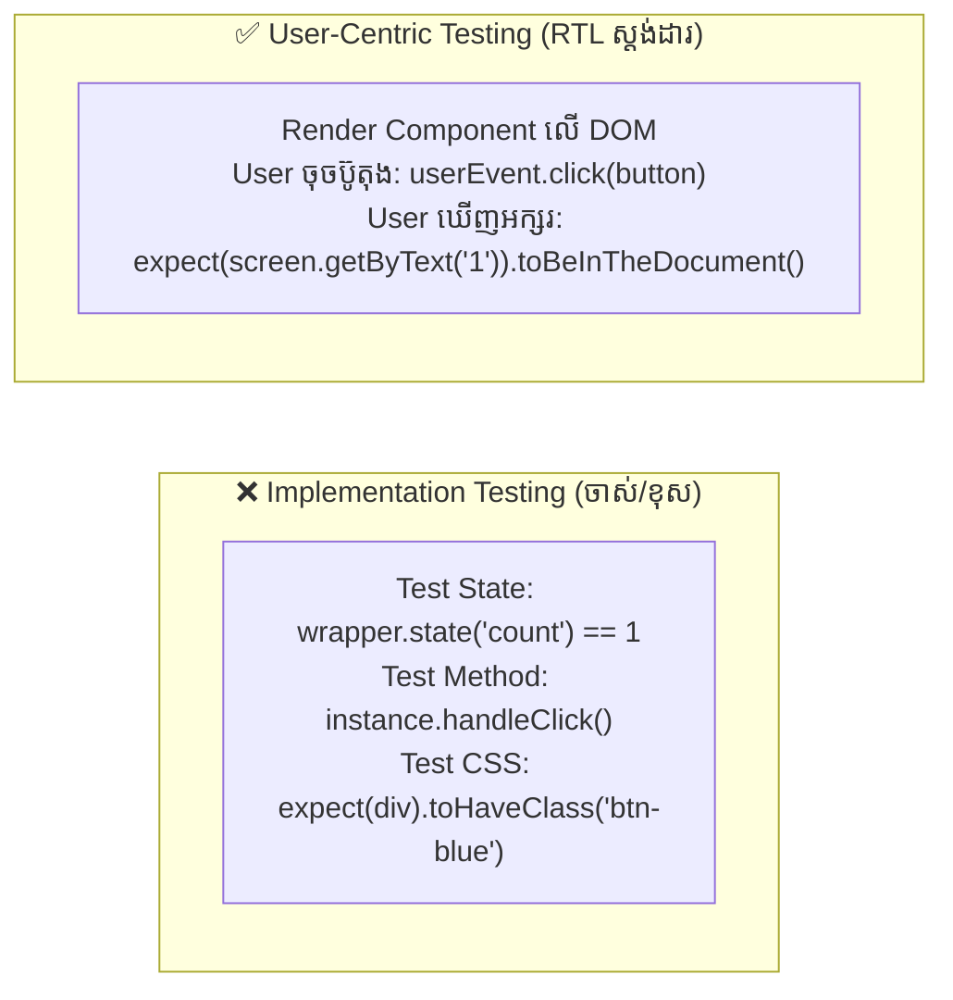

## 🎯 ១. ទស្សនវិជ្ជារបស់ React Testing Library (Guiding Principles)

> *"The more your tests resemble the way your software is used, the more confidence they can give you."*  
> — **Kent C. Dodds** (Creator of RTL)



---

## 🔍 ២. ឋានានុក្រម Query Priority ក្នុង RTL

| អាទិភាព | Query Method | ពេលណាត្រូវប្រើ? | ឧទាហរណ៍កូដ |
| :---: | :--- | :--- | :--- |
| **១** | **`getByRole`** | គ្រប់ Interactive Elements (`button`, `textbox`, `heading`, `checkbox`) | `screen.getByRole('button', { name: /រក្សាទុក/i })` |
| **២** | **`getByLabelText`** | Form Inputs ដែលមាន `<label for="...">` ត្រឹមត្រូវ | `screen.getByLabelText(/អ៊ីម៉ែល/i)` |
| **៣** | **`getByPlaceholderText`**| Form Inputs ដែលគ្មាន Label តែមាន Placeholder | `screen.getByPlaceholderText(/user@edu.kh/i)` |
| **៤** | **`getByText`** | Paragraphs, Spans, Static Text Headers | `screen.getByText(/សូមស្វាគមន៍/i)` |
| **៥** | **`getByDisplayValue`** | Input/Select ដែលមាន Value បច្ចុប្បន្នជាក់លាក់ | `screen.getByDisplayValue('Sok Dara')` |
| **៦** | **`getByTestId`** | ជម្រើសចុងក្រោយបំផុត ប្រសិនបើ Element គ្មាន Semantic Role | `screen.getByTestId('custom-svg-canvas')` |

---

## 💻 ៣. ឧទាហរណ៍ជាក់ស្តែង ៖ Component Testing

ខាងក្រោមនេះជា Counter Component ដែលមាន Min/Max Limits, Step Configuration, និង Reset Action៖

### 💻 `src/components/Counter.jsx` (Source Code)

```jsx
// src/components/Counter.jsx
import React, { useState } from 'react';

export function Counter({ initialValue = 0, min = 0, max = 10, step = 1, onCountChange }) {
  const [count, setCount] = useState(initialValue);

  const handleIncrement = () => {
    if (count + step <= max) {
      const next = count + step;
      setCount(next);
      onCountChange?.(next);
    }
  };

  const handleDecrement = () => {
    if (count - step >= min) {
      const next = count - step;
      setCount(next);
      onCountChange?.(next);
    }
  };

  const handleReset = () => {
    setCount(initialValue);
    onCountChange?.(initialValue);
  };

  return (
    <div className="p-6 bg-white dark:bg-slate-900 rounded-2xl border border-slate-200 dark:border-slate-800 shadow-sm max-w-xs text-center space-y-4">
      <h2 className="text-xs font-bold uppercase tracking-wider text-slate-400">ចំនួនរាប់ (Counter)</h2>

      {/* Output Display */}
      <div
        role="status"
        aria-label="current-count"
        className="text-4xl font-black text-blue-600 dark:text-blue-400"
      >
        {count}
      </div>

      {/* Buttons Controls */}
      <div className="flex items-center justify-center gap-2">
        <button
          onClick={handleDecrement}
          disabled={count <= min}
          aria-label="decrement"
          className="w-10 h-10 rounded-xl bg-slate-100 dark:bg-slate-800 hover:bg-slate-200 text-lg font-bold disabled:opacity-40"
        >
          -
        </button>

        <button
          onClick={handleReset}
          className="px-3 py-2 rounded-xl text-xs font-bold text-slate-500 hover:bg-slate-100 transition"
        >
          Reset
        </button>

        <button
          onClick={handleIncrement}
          disabled={count >= max}
          aria-label="increment"
          className="w-10 h-10 rounded-xl bg-blue-600 hover:bg-blue-700 text-white text-lg font-bold disabled:opacity-40"
        >
          +
        </button>
      </div>

      {/* Boundary Alert */}
      {count >= max && (
        <p className="text-xs text-amber-500 font-medium">⚠️ ដល់កម្រិតអតិបរមាហើយ!</p>
      )}
    </div>
  );
}
```

---

### 💻 `src/components/Counter.test.jsx` (Complete Test Suite)

```jsx
// src/components/Counter.test.jsx
import { describe, it, expect, vi } from 'vitest';
import { render, screen } from '@testing-library/react';
import userEvent from '@testing-library/user-event';
import { Counter } from './Counter';

describe('Counter Component', () => {
  // ១. Testing Initial Render
  it('renders initial count correctly and displays buttons', () => {
    render(<Counter initialValue={5} />);

    // ស្វែងរក Element តាម Accessible Role & Name
    expect(screen.getByRole('status', { name: /current-count/i })).toHaveTextContent('5');
    expect(screen.getByRole('button', { name: /increment/i })).toBeInTheDocument();
    expect(screen.getByRole('button', { name: /decrement/i })).toBeInTheDocument();
  });

  // ២. Testing User Interaction (Increment)
  it('increments count when plus button is clicked and triggers callback', async () => {
    const user = userEvent.setup();
    const handleCountChange = vi.fn();

    render(<Counter initialValue={0} step={2} onCountChange={handleCountChange} />);

    const plusBtn = screen.getByRole('button', { name: /increment/i });
    await user.click(plusBtn);

    // ផ្ទៀងផ្ទាត់ UI Update
    expect(screen.getByRole('status', { name: /current-count/i })).toHaveTextContent('2');
    // ផ្ទៀងផ្ទាត់ Callback
    expect(handleCountChange).toHaveBeenCalledTimes(1);
    expect(handleCountChange).toHaveBeenCalledWith(2);
  });

  // ៣. Testing Boundary Limits & Disabled States
  it('disables decrement button when min limit is reached', async () => {
    const user = userEvent.setup();
    render(<Counter initialValue={1} min={0} />);

    const minusBtn = screen.getByRole('button', { name: /decrement/i });
    expect(minusBtn).not.toBeDisabled();

    await user.click(minusBtn); // count becomes 0 (min)

    expect(screen.getByRole('status', { name: /current-count/i })).toHaveTextContent('0');
    expect(minusBtn).toBeDisabled();
  });

  // ៤. Testing Max Boundary Alert
  it('shows max limit warning when count hits maximum', () => {
    render(<Counter initialValue={10} max={10} />);

    const plusBtn = screen.getByRole('button', { name: /increment/i });
    expect(plusBtn).toBeDisabled();
    expect(screen.getByText(/ដល់កម្រិតអតិបរមាហើយ/i)).toBeInTheDocument();
  });

  // ៥. Testing Reset Action
  it('resets count to initialValue when Reset button is clicked', async () => {
    const user = userEvent.setup();
    render(<Counter initialValue={3} />);

    const plusBtn = screen.getByRole('button', { name: /increment/i });
    const resetBtn = screen.getByRole('button', { name: /reset/i });

    await user.click(plusBtn); // 3 -> 4
    expect(screen.getByRole('status', { name: /current-count/i })).toHaveTextContent('4');

    await user.click(resetBtn); // reset back to 3
    expect(screen.getByRole('status', { name: /current-count/i })).toHaveTextContent('3');
  });
});
```

---

## 🔍 ៤. ការពន្យល់កូដមួយជួរៗ (Line-by-Line Breakdown)

1. `const user = userEvent.setup();`
   - បង្កើត Instance របស់ `userEvent` មុនពេលធ្វើសកម្មភាព Interactions ដែលជាស្តង់ដារ Recommended របស់ RTL v14+។
2. `render(<Counter initialValue={5} />);`
   - Mount Component ចូលទៅក្នុង Virtual DOM (jsdom)។
3. `screen.getByRole('button', { name: /increment/i })`
   - ស្វែងរក Element ដែលមាន Role ជា Button និងមាន `aria-label` ឬ Text ត្រូវគ្នានឹង `increment` (Case-Insensitive Regex)។
4. `await user.click(plusBtn);`
   - Simulate ការចុច Mouse របស់ User (ត្រូវមាន `await` ជានិច្ច ព្រោះ `userEvent` គឺជា asynchronous function)។
5. `expect(minusBtn).toBeDisabled();`
   - Jest-DOM Matcher ផ្ទៀងផ្ទាត់ថា Attribute `disabled` ពិតជាមានលើ Tag `<button>` មែន។
6. `expect(handleCountChange).toHaveBeenCalledWith(2);`
   - ផ្ទៀងផ្ទាត់ថា Mock Function ត្រូវបានហៅជាមួយ Parameter លេខ `2`។

---

## 💡 ៥. តារាង Jest-DOM Matchers ពេញនិយម

- `expect(el).toBeInTheDocument()` — ពិនិត្យវត្តមានលើ DOM
- `expect(el).toBeVisible()` — ពិនិត្យថា Element មិនត្រូវបានលាក់ដោយ `display: none` ឬ `visibility: hidden`
- `expect(el).toBeDisabled()` / `toBeEnabled()` — ពិនិត្យស្ថានភាព Disabled
- `expect(el).toHaveValue('admin@edu.kh')` — ពិនិត្យតម្លៃក្នុង Form Input
- `expect(el).toHaveTextContent(/សូមស្វាគមន៍/i)` — ពិនិត្យអត្ថបទខាងក្នុង
- `expect(el).toHaveAttribute('type', 'email')` — ពិនិត្យ Attribute HTML
