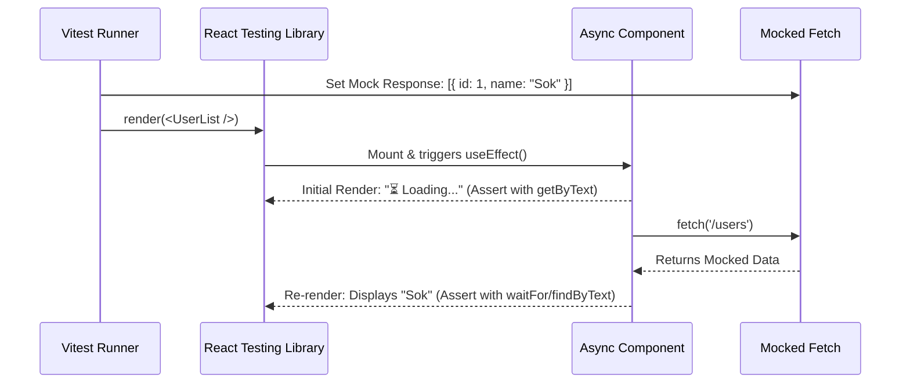

## 🎭 1. Testing Async Lifecycle



---

## 💻 2. Async Component Code (`UserList.jsx`)

```jsx
// src/components/UserList.jsx
import { useState, useEffect } from 'react';

export function UserList() {
  const [users, setUsers] = useState([]);
  const [loading, setLoading] = useState(true);
  const [error, setError] = useState(null);

  useEffect(() => {
    fetch('https://api.example.com/users')
      .then((res) => {
        if (!res.ok) throw new Error('Failed to load users');
        return res.json();
      })
      .then((data) => setUsers(data))
      .catch((err) => setError(err.message))
      .finally(() => setLoading(false));
  }, []);

  if (loading) return <p>⏳ Loading users...</p>;
  if (error) return <p role="alert">⚠️ {error}</p>;

  return (
    <ul>
      {users.map((u) => (
        <li key={u.id}>{u.name}</li>
      ))}
    </ul>
  );
}
```

---

## 🧪 3. Writing the Async Test Suite

### 💻 Code សម្រាប់ Test File (`UserList.test.jsx`):

```jsx
// src/components/UserList.test.jsx
import { describe, it, expect, vi, beforeEach } from 'vitest';
import { render, screen, waitFor } from '@testing-library/react';
import { UserList } from './UserList';

describe('UserList Async Component', () => {
  beforeEach(() => {
    // Reset Mocks មុន Test នីមួយៗ
    vi.restoreAllMocks();
  });

  it('displays loading state initially', () => {
    // 1. Mock fetch ឱ្យនៅ Pending (មិនទាន់ return)
    vi.stubGlobal('fetch', vi.fn(() => new Promise(() => {})));

    render(<UserList />);

    // 2. ផ្ទៀងផ្ទាត់ថា Loading Text បង្ហាញលើ Screen
    expect(screen.getByText(/loading users/i)).toBeInTheDocument();
  });

  it('renders user list on successful API call', async () => {
    const mockUsers = [
      { id: 1, name: 'Sok Dara' },
      { id: 2, name: 'Chan Bopha' },
    ];

    // 1. Mock fetch ឱ្យ resolve ជាមួយ mockUsers
    vi.stubGlobal(
      'fetch',
      vi.fn().mockResolvedValue({
        ok: true,
        json: async () => mockUsers,
      })
    );

    render(<UserList />);

    // 2. ប្រើ findBy* (Async Query) ឬ waitFor()
    const user1 = await screen.findByText('Sok Dara');
    const user2 = await screen.findByText('Chan Bopha');

    expect(user1).toBeInTheDocument();
    expect(user2).toBeInTheDocument();
  });

  it('renders error message when API call fails', async () => {
    // 1. Mock fetch ឱ្យ Return Error Status 500
    vi.stubGlobal(
      'fetch',
      vi.fn().mockResolvedValue({
        ok: false,
        status: 500,
      })
    );

    render(<UserList />);

    // 2. រង់ចាំ Error Alert លេចឡើង
    const errorAlert = await screen.findByRole('alert');
    expect(errorAlert).toHaveTextContent(/failed to load users/i);
  });
});
```

### 🔍 ការពន្យល់មួយជួរៗ (Line-by-Line Explanation):

1. `vi.stubGlobal('fetch', ...)`
   - ជំនួស Web Global `fetch()` ដោយ Mock Function របស់ Vitest ដើម្បីគ្រប់គ្រង Response។
2. `mockResolvedValue({ ok: true, json: async () => mockUsers })`
   - កំណត់ទិន្នន័យ Response ក្លែងក្លាយដែលយើងចង់ទទួលបាន។
3. `await screen.findByText('Sok Dara')`
   - **ចំណុចខុសគ្នា:** `getByText` ស្វែងរកភ្លាមៗ (Synchronous) បើគ្មាននឹងបោះ Error។ ចំណែក `findByText` នឹងរង់ចាំ (Returns a Promise) រហូតដល់ Async State update រួចរាល់ទើប Return Element។
4. `await screen.findByRole('alert')`
   - ស្វែងរក Element ដែលមាន role accessibility ជា `alert` ដើម្បី verify error message។
