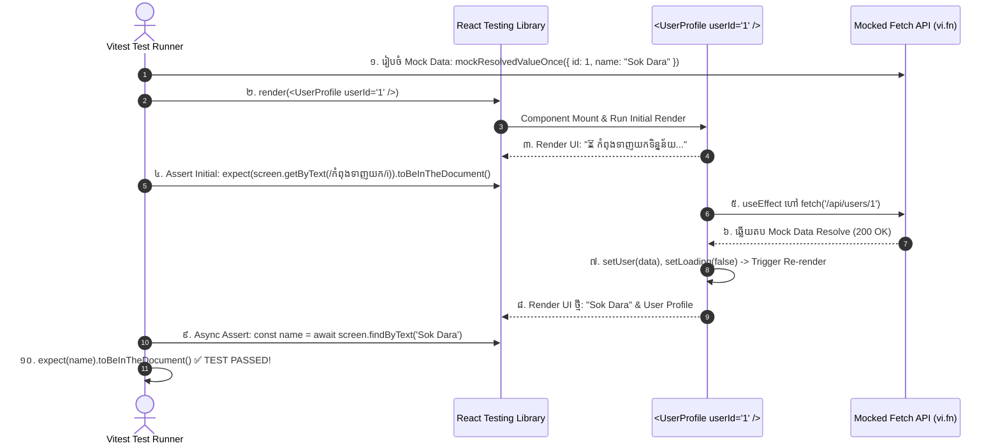

## 🎭 ១. ស្ថាបត្យកម្ម Async Testing Lifecycle



---

## 📊 ២. តារាងប្រៀបធៀប Query Types ក្នុង RTL

| ប្រភេទ Query | Element រកឃើញ | Element រកមិនឃើញ | ប្រើសម្រាប់ Asynchronous? | សេណារីយ៉ូដែលត្រូវប្រើ |
| :--- | :--- | :--- | :---: | :--- |
| **`getBy*`** | Return Element | **Throws Error ❌** | ❌ ទេ (Synchronous) | ពិនិត្យ Element ដែលមានវត្តមានលើ DOM ស្រាប់ |
| **`queryBy*`** | Return Element | **Return `null` ✅** | ❌ ទេ (Synchronous) | **ពិនិត្យ Element ដែលមិនត្រូវមាន** (`.not.toBeInTheDocument()`) |
| **`findBy*`** | Return Promise | **Throws Error (timeout) ❌** | **✅ ត្រូវ (Async/Await)** | **ទាញយកទិន្នន័យពី API / រង់ចាំ Async UI** |

---

## 💻 ៣. ការសរសេរ Test សម្រាប់ Async Component

ខាងក្រោមនេះជា `UserProfile` Component ដែលមាន Async Fetching, Error Alert, និង Retry Mechanism៖

### 💻 `src/components/UserProfile.jsx` (Source Code)

```jsx
// src/components/UserProfile.jsx
import React, { useState, useEffect } from 'react';

export function UserProfile({ userId }) {
  const [user, setUser] = useState(null);
  const [isLoading, setIsLoading] = useState(true);
  const [error, setError] = useState(null);

  const fetchUserData = async () => {
    setIsLoading(true);
    setError(null);
    try {
      const res = await fetch(`https://api.edu.kh/users/${userId}`);
      if (!res.ok) {
        throw new Error('មិនអាចទាញយកទិន្នន័យអ្នកប្រើប្រាស់បានឡើយ (HTTP Error)');
      }
      const data = await res.json();
      setUser(data);
    } catch (err) {
      setError(err.message);
    } finally {
      setIsLoading(false);
    }
  };

  useEffect(() => {
    if (userId) {
      fetchUserData();
    }
  }, [userId]);

  if (isLoading) {
    return (
      <div role="status" className="p-6 text-slate-500 animate-pulse text-sm">
        ⏳ កំពុងទាញយកទិន្នន័យគណនី...
      </div>
    );
  }

  if (error) {
    return (
      <div role="alert" className="p-4 bg-rose-50 border border-rose-200 rounded-xl text-rose-600 text-sm">
        <p className="font-bold">⚠️ មានបញ្ហា៖ {error}</p>
        <button
          onClick={fetchUserData}
          className="mt-2 px-3 py-1 bg-rose-600 text-white rounded-lg text-xs font-bold"
        >
          ព្យាយាមម្តងទៀត
        </button>
      </div>
    );
  }

  return (
    <div className="p-6 bg-white dark:bg-slate-900 rounded-2xl border border-slate-200 dark:border-slate-800 shadow-sm">
      <h2 className="text-xl font-black text-slate-900 dark:text-white">{user.name}</h2>
      <p className="text-xs text-slate-500 mt-0.5">{user.email}</p>
      <span className="inline-block mt-3 px-2.5 py-1 bg-blue-50 text-blue-600 rounded-full text-xs font-bold uppercase">
        {user.role}
      </span>
    </div>
  );
}
```

---

### 💻 `src/components/UserProfile.test.jsx` (Complete Test Suite)

```jsx
// src/components/UserProfile.test.jsx
import { describe, it, expect, vi, beforeEach, afterEach } from 'vitest';
import { render, screen, waitFor } from '@testing-library/react';
import userEvent from '@testing-library/user-event';
import { UserProfile } from './UserProfile';

describe('UserProfile Async Component', () => {
  beforeEach(() => {
    // Clear mocks មុន Test នីមួយៗ
    vi.restoreAllMocks();
  });

  // ១. Test Initial Loading State
  it('displays loading indicator initially while fetching', () => {
    // Mock fetch ឱ្យនៅ Pending
    vi.stubGlobal('fetch', vi.fn(() => new Promise(() => {})));

    render(<UserProfile userId="1" />);

    // ពិនិត្យឃើញ Loading Status
    expect(screen.getByRole('status')).toHaveTextContent(/កំពុងទាញយកទិន្នន័យ/i);
    // ផ្ទៀងផ្ទាត់ថា User Card មិនទាន់មានវត្តមានឡើយ
    expect(screen.queryByRole('heading')).not.toBeInTheDocument();
  });

  // ២. Test Successful Data Fetching (Happy Path)
  it('renders user information upon successful API response', async () => {
    const mockUserData = {
      id: 'usr_1',
      name: 'សុខ ដារ៉ា',
      email: 'dara@edu.kh',
      role: 'admin',
    };

    // Mock fetch ឱ្យ Return ជោគជ័យ
    vi.stubGlobal(
      'fetch',
      vi.fn().mockResolvedValueOnce({
        ok: true,
        json: async () => mockUserData,
      })
    );

    render(<UserProfile userId="usr_1" />);

    // ប្រើ findBy* ដើម្បីរង់ចាំ Async Data បង្ហាញលើ Screen
    const userName = await screen.findByRole('heading', { name: 'សុខ ដារ៉ា' });
    const userEmail = await screen.findByText('dara@edu.kh');
    const userRole = await screen.findByText(/admin/i);

    expect(userName).toBeInTheDocument();
    expect(userEmail).toBeInTheDocument();
    expect(userRole).toBeInTheDocument();

    // ផ្ទៀងផ្ទាត់ថា Loading Spinner បាត់ចេញពី Screen វិញ
    expect(screen.queryByRole('status')).not.toBeInTheDocument();
  });

  // ៣. Test Network/Server Error Handling (Failure Path)
  it('displays error alert when API call fails and allows retry', async () => {
    const user = userEvent.setup();

    // Mock លើកទី ១: បរាជ័យ (500 Error)
    const mockFetch = vi
      .fn()
      .mockResolvedValueOnce({
        ok: false,
        status: 500,
      })
      // Mock លើកទី ២ (ពេលចុច Retry): ជោគជ័យ
      .mockResolvedValueOnce({
        ok: true,
        json: async () => ({ id: 'usr_1', name: 'សុខ ដារ៉ា', email: 'dara@edu.kh', role: 'student' }),
      });

    vi.stubGlobal('fetch', mockFetch);

    render(<UserProfile userId="usr_1" />);

    // ១. រង់ចាំ Error Alert បង្ហាញ
    const errorAlert = await screen.findByRole('alert');
    expect(errorAlert).toHaveTextContent(/មិនអាចទាញយកទិន្នន័យ/i);

    // ២. ចុចប៊ូតុង "ព្យាយាមម្តងទៀត" (Retry)
    const retryBtn = screen.getByRole('button', { name: /ព្យាយាមម្តងទៀត/i });
    await user.click(retryBtn);

    // ៣. ផ្ទៀងផ្ទាត់ថាទិន្នន័យថ្មីត្រូវបានទាញយកជោគជ័យ
    const userName = await screen.findByRole('heading', { name: 'សុខ ដារ៉ា' });
    expect(userName).toBeInTheDocument();
    expect(mockFetch).toHaveBeenCalledTimes(2);
  });
});
```

---

## 🪝 ៤. ការសរសេរ Test សម្រាប់ Custom Hooks ជាមួយ `renderHook`

យើងប្រើ `renderHook()` និង `act()` ពី `@testing-library/react` ដើម្បី Test Custom Hooks ដោយមិនបាច់បង្កើត UI Component ក្លែងក្លាយឡើយ៖

```javascript
// src/hooks/useToggle.test.js
import { describe, it, expect } from 'vitest';
import { renderHook, act } from '@testing-library/react';
import { useState } from 'react';

// Custom Hook ឧទាហរណ៍
function useToggle(initial = false) {
  const [state, setState] = useState(initial);
  const toggle = () => setState((p) => !p);
  return [state, toggle];
}

describe('useToggle Custom Hook', () => {
  it('initializes with default value and toggles state correctly', () => {
    const { result } = renderHook(() => useToggle(false));

    // Initial Assertion
    expect(result.current[0]).toBe(false);

    // Trigger Action ក្នុង act() Block
    act(() => {
      result.current[1](); // Call toggle function
    });

    // Assertion ក្រោយ Toggle
    expect(result.current[0]).toBe(true);
  });
});
```

---

## 🔍 ៥. ការពន្យល់កូដមួយជួរៗ (Line-by-Line Breakdown)

1. `vi.stubGlobal('fetch', vi.fn().mockResolvedValueOnce({ ... }))`
   - ចាប់បន្លំ (Stub) Global Variable `fetch` របស់ Window ដោយជំនួសដោយ Mock Function ដែលផ្តល់ Resolved Promise តែមួយដងគត់។
2. `await screen.findByRole('heading', { name: 'សុខ ដារ៉ា' })`
   - Asynchronous Query ដែលរង់ចាំរហូតដល់ Component re-render និងបង្ហាញ Heading `សុខ ដារ៉ា` លើ DOM។
3. `expect(screen.queryByRole('status')).not.toBeInTheDocument();`
   - ប្រើ `queryByRole` ដើម្បី assert ថា Loading Spinner បានរលាយបាត់ពី DOM ដោយសុវត្ថិភាព។
4. `renderHook(() => useToggle(false))`
   - Mount Custom Hook ចូលទៅក្នុង Virtual Test Wrapper និង return `result` ដែលអាចអាន `result.current` បានរាល់ពេល state ផ្លាស់ប្តូរ។
5. `act(() => { ... })`
   - ធានាថា State Updates និង Effects ទាំងអស់ត្រូវបានដំណើរការ និង Flush ចប់សព្វគ្រប់មុនពេលធ្វើ Assertion បន្ទាប់។
