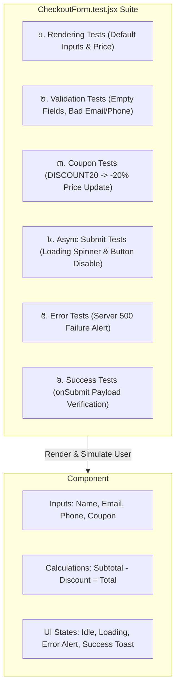

## 🏛️ ១. ស្ថាបត្យកម្មប្រព័ន្ធ Checkout & Test Boundaries



---

## 📁 ២. រចនាសម្ព័ន្ធ Folder នៃគម្រោង (Project Structure)

```
src/
├── components/
│   ├── CheckoutForm.jsx          # Source Component
│   └── CheckoutForm.test.jsx     # Comprehensive Test Suite (We write this!)
├── utils/
│   └── cart.js                   # Pure Math & Validation Utilities
└── test/
    └── setup.js                  # Jest-DOM Matchers Setup
```

---

## 💻 ៣. កូដនៃ Source Component (`CheckoutForm.jsx`)

```jsx
// src/components/CheckoutForm.jsx
import React, { useState } from 'react';

export default function CheckoutForm({ initialSubtotal = 100, onSubmitOrder }) {
  const [formData, setFormData] = useState({
    name: '',
    email: '',
    phone: '',
    coupon: '',
  });

  const [errors, setErrors] = useState({});
  const [discount, setDiscount] = useState(0);
  const [couponApplied, setCouponApplied] = useState(false);
  const [isSubmitting, setIsSubmitting] = useState(false);
  const [serverError, setServerError] = useState('');

  // ១. ផ្ទៀងផ្ទាត់ Form Validation
  const validate = () => {
    const errs = {};
    const emailRegex = /^[^\s@]+@[^\s@]+\.[^\s@]+$/;
    const phoneRegex = /^(0\d{8,9}|\+855\d{8,9})$/;

    if (!formData.name.trim()) errs.name = 'សូមបញ្ចូលឈ្មោះរបស់អ្នក!';
    if (!formData.email.trim()) {
      errs.email = 'សូមបញ្ចូលអ៊ីម៉ែល!';
    } else if (!emailRegex.test(formData.email)) {
      errs.email = 'ទម្រង់អ៊ីម៉ែលមិនត្រឹមត្រូវ!';
    }

    if (!formData.phone.trim()) {
      errs.phone = 'សូមបញ្ចូលលេខទូរស័ព្ទ!';
    } else if (!phoneRegex.test(formData.phone)) {
      errs.phone = 'លេខទូរស័ព្ទកម្ពុជាមិនត្រឹមត្រូវ (ឧ. 012345678)!';
    }

    setErrors(errs);
    return Object.keys(errs).length === 0;
  };

  // ២. Apply Coupon Logic
  const handleApplyCoupon = () => {
    if (formData.coupon.trim().toUpperCase() === 'DISCOUNT20') {
      setDiscount(20);
      setCouponApplied(true);
      setServerError('');
    } else {
      setServerError('កូដគូប៉ុងមិនត្រឹមត្រូវឡើយ!');
      setDiscount(0);
      setCouponApplied(false);
    }
  };

  // ៣. Submit Order Logic
  const handleSubmit = async (e) => {
    e.preventDefault();
    if (!validate()) return;

    setIsSubmitting(true);
    setServerError('');

    const finalTotal = initialSubtotal - (initialSubtotal * discount) / 100;

    try {
      await onSubmitOrder({
        ...formData,
        subtotal: initialSubtotal,
        discountPercent: discount,
        total: finalTotal,
      });
    } catch (err) {
      setServerError(err.message || 'ការបញ្ជាទិញបរាជ័យ!');
    } finally {
      setIsSubmitting(false);
    }
  };

  const finalTotal = initialSubtotal - (initialSubtotal * discount) / 100;

  return (
    <div className="max-w-md mx-auto p-6 bg-white dark:bg-slate-900 rounded-3xl border border-slate-200 dark:border-slate-800 shadow-xl">
      <h2 className="text-xl font-black text-slate-900 dark:text-white mb-4">
        🛒 បង់ប្រាក់ និងបញ្ជាក់ការទិញ
      </h2>

      {/* Server Error Alert */}
      {serverError && (
        <div role="alert" className="mb-4 p-3.5 bg-rose-50 border border-rose-200 rounded-xl text-xs font-bold text-rose-600">
          ⚠️ {serverError}
        </div>
      )}

      <form onSubmit={handleSubmit} noValidate className="space-y-4">
        {/* Name Field */}
        <div>
          <label htmlFor="name" className="block text-xs font-bold text-slate-700 dark:text-slate-300 mb-1">
            ឈ្មោះពេញ
          </label>
          <input
            id="name"
            type="text"
            value={formData.name}
            onChange={(e) => setFormData((p) => ({ ...p, name: e.target.value }))}
            className="w-full px-3.5 py-2.5 rounded-xl border border-slate-200 dark:border-slate-700 text-sm bg-slate-50 dark:bg-slate-800 text-slate-900 dark:text-white outline-none"
          />
          {errors.name && <p className="text-xs text-rose-500 mt-1">{errors.name}</p>}
        </div>

        {/* Email Field */}
        <div>
          <label htmlFor="email" className="block text-xs font-bold text-slate-700 dark:text-slate-300 mb-1">
            អ៊ីម៉ែល
          </label>
          <input
            id="email"
            type="email"
            value={formData.email}
            onChange={(e) => setFormData((p) => ({ ...p, email: e.target.value }))}
            className="w-full px-3.5 py-2.5 rounded-xl border border-slate-200 dark:border-slate-700 text-sm bg-slate-50 dark:bg-slate-800 text-slate-900 dark:text-white outline-none"
          />
          {errors.email && <p className="text-xs text-rose-500 mt-1">{errors.email}</p>}
        </div>

        {/* Phone Field */}
        <div>
          <label htmlFor="phone" className="block text-xs font-bold text-slate-700 dark:text-slate-300 mb-1">
            លេខទូរស័ព្ទ
          </label>
          <input
            id="phone"
            type="tel"
            value={formData.phone}
            onChange={(e) => setFormData((p) => ({ ...p, phone: e.target.value }))}
            className="w-full px-3.5 py-2.5 rounded-xl border border-slate-200 dark:border-slate-700 text-sm bg-slate-50 dark:bg-slate-800 text-slate-900 dark:text-white outline-none"
          />
          {errors.phone && <p className="text-xs text-rose-500 mt-1">{errors.phone}</p>}
        </div>

        {/* Coupon Code Field */}
        <div>
          <label htmlFor="coupon" className="block text-xs font-bold text-slate-700 dark:text-slate-300 mb-1">
            កូដបញ្ចុះតម្លៃ (Coupon Code)
          </label>
          <div className="flex gap-2">
            <input
              id="coupon"
              type="text"
              placeholder="DISCOUNT20"
              value={formData.coupon}
              onChange={(e) => setFormData((p) => ({ ...p, coupon: e.target.value }))}
              className="flex-1 px-3.5 py-2 rounded-xl border border-slate-200 dark:border-slate-700 text-sm bg-slate-50 dark:bg-slate-800 text-slate-900 dark:text-white outline-none"
            />
            <button
              type="button"
              onClick={handleApplyCoupon}
              className="px-4 py-2 bg-slate-200 dark:bg-slate-700 hover:bg-slate-300 text-slate-800 dark:text-white rounded-xl text-xs font-bold transition"
            >
              អនុវត្ត
            </button>
          </div>
          {couponApplied && (
            <p className="text-xs text-emerald-600 font-bold mt-1">🎉 បញ្ចុះតម្លៃ ២០% ត្រូវបានអនុវត្ត!</p>
          )}
        </div>

        {/* Price Breakdown */}
        <div className="p-4 bg-slate-50 dark:bg-slate-800/50 rounded-2xl space-y-1.5 text-xs">
          <div className="flex justify-between text-slate-500">
            <span>តម្លៃដើម (Subtotal)</span>
            <span>${initialSubtotal}</span>
          </div>
          {discount > 0 && (
            <div className="flex justify-between text-emerald-600 font-bold">
              <span>បញ្ចុះតម្លៃ ({discount}%)</span>
              <span>-${(initialSubtotal * discount) / 100}</span>
            </div>
          )}
          <div className="flex justify-between text-base font-black text-slate-900 dark:text-white pt-2 border-t border-slate-200 dark:border-slate-700">
            <span>តម្លៃសរុប (Total)</span>
            <span aria-label="total-amount">${finalTotal}</span>
          </div>
        </div>

        {/* Submit Button */}
        <button
          type="submit"
          disabled={isSubmitting}
          className="w-full py-3 bg-blue-600 hover:bg-blue-700 disabled:opacity-50 text-white font-bold rounded-xl text-sm transition shadow-lg shadow-blue-500/25 flex items-center justify-center gap-2"
        >
          {isSubmitting ? (
            <>
              <span className="w-4 h-4 border-2 border-white/30 border-t-white rounded-full animate-spin" />
              <span>កំពុងបញ្ជាទិញ...</span>
            </>
          ) : (
            <span>បញ្ជាក់ការទិញ (${finalTotal}) →</span>
          )}
        </button>
      </form>
    </div>
  );
}
```

---

## 🧪 ៤. Complete Test Suite (`CheckoutForm.test.jsx`)

ខាងក្រោមនេះជា Test Suite ពេញលេញដែលគ្របដណ្តប់គ្រប់ Scenarios៖

```jsx
// src/components/CheckoutForm.test.jsx
import { describe, it, expect, vi, beforeEach } from 'vitest';
import { render, screen, waitFor } from '@testing-library/react';
import userEvent from '@testing-library/user-event';
import CheckoutForm from './CheckoutForm';

describe('CheckoutForm Component Test Suite', () => {
  let user;

  beforeEach(() => {
    user = userEvent.setup();
    vi.restoreAllMocks();
  });

  // ── 1. RENDERING TESTS ───────────────────────────────────────────
  describe('Initial Rendering', () => {
    it('renders all form inputs and initial total price correctly', () => {
      render(<CheckoutForm initialSubtotal={150} onSubmitOrder={vi.fn()} />);

      expect(screen.getByLabelText(/ឈ្មោះពេញ/i)).toBeInTheDocument();
      expect(screen.getByLabelText(/អ៊ីម៉ែល/i)).toBeInTheDocument();
      expect(screen.getByLabelText(/លេខទូរស័ព្ទ/i)).toBeInTheDocument();
      expect(screen.getByLabelText(/កូដបញ្ចុះតម្លៃ/i)).toBeInTheDocument();
      expect(screen.getByLabelText('total-amount')).toHaveTextContent('$150');
      expect(screen.getByRole('button', { name: /បញ្ជាក់ការទិញ/i })).toBeEnabled();
    });
  });

  // ── 2. FORM VALIDATION TESTS ─────────────────────────────────────
  describe('Form Validation', () => {
    it('displays error messages when submitting empty required fields', async () => {
      render(<CheckoutForm onSubmitOrder={vi.fn()} />);

      const submitBtn = screen.getByRole('button', { name: /បញ្ជាក់ការទិញ/i });
      await user.click(submitBtn);

      expect(screen.getByText(/សូមបញ្ចូលឈ្មោះ/i)).toBeInTheDocument();
      expect(screen.getByText(/សូមបញ្ចូលអ៊ីម៉ែល/i)).toBeInTheDocument();
      expect(screen.getByText(/សូមបញ្ចូលលេខទូរស័ព្ទ/i)).toBeInTheDocument();
    });

    it('shows error when invalid email format is entered', async () => {
      render(<CheckoutForm onSubmitOrder={vi.fn()} />);

      await user.type(screen.getByLabelText(/ឈ្មោះពេញ/i), 'Sok Dara');
      await user.type(screen.getByLabelText(/អ៊ីម៉ែល/i), 'invalid-email-address');
      await user.type(screen.getByLabelText(/លេខទូរស័ព្ទ/i), '012345678');

      await user.click(screen.getByRole('button', { name: /បញ្ជាក់ការទិញ/i }));

      expect(screen.getByText(/ទម្រង់អ៊ីម៉ែលមិនត្រឹមត្រូវ/i)).toBeInTheDocument();
    });
  });

  // ── 3. COUPON CALCULATION TESTS ──────────────────────────────────
  describe('Coupon Calculation', () => {
    it('applies 20% discount correctly when entering DISCOUNT20', async () => {
      render(<CheckoutForm initialSubtotal={100} onSubmitOrder={vi.fn()} />);

      const couponInput = screen.getByLabelText(/កូដបញ្ចុះតម្លៃ/i);
      const applyBtn = screen.getByRole('button', { name: /អនុវត្ត/i });

      await user.type(couponInput, 'discount20');
      await user.click(applyBtn);

      // Total គួរថយពី $100 មកនៅ $80
      expect(screen.getByLabelText('total-amount')).toHaveTextContent('$80');
      expect(screen.getByText(/បញ្ចុះតម្លៃ ២០%/i)).toBeInTheDocument();
    });

    it('shows error message when entering an invalid coupon code', async () => {
      render(<CheckoutForm onSubmitOrder={vi.fn()} />);

      await user.type(screen.getByLabelText(/កូដបញ្ចុះតម្លៃ/i), 'WRONGCODE');
      await user.click(screen.getByRole('button', { name: /អនុវត្ត/i }));

      const alertBox = screen.getByRole('alert');
      expect(alertBox).toHaveTextContent(/កូដគូប៉ុងមិនត្រឹមត្រូវ/i);
    });
  });

  // ── 4. ASYNC SUBMISSION & ERROR HANDLING ─────────────────────────
  describe('Async Submission', () => {
    it('disables submit button and shows loading spinner while submitting', async () => {
      // Mock never-resolving Promise to inspect loading state
      const mockSubmit = vi.fn(() => new Promise(() => {}));

      render(<CheckoutForm initialSubtotal={100} onSubmitOrder={mockSubmit} />);

      await user.type(screen.getByLabelText(/ឈ្មោះពេញ/i), 'Sok Dara');
      await user.type(screen.getByLabelText(/អ៊ីម៉ែល/i), 'dara@edu.kh');
      await user.type(screen.getByLabelText(/លេខទូរស័ព្ទ/i), '012345678');

      const submitBtn = screen.getByRole('button', { name: /បញ្ជាក់ការទិញ/i });
      await user.click(submitBtn);

      expect(screen.getByText(/កំពុងបញ្ជាទិញ/i)).toBeInTheDocument();
      expect(submitBtn).toBeDisabled();
    });

    it('submits correct payload on successful form submission (Happy Path)', async () => {
      const mockSubmit = vi.fn().mockResolvedValueOnce({ orderId: 'ord_123' });

      render(<CheckoutForm initialSubtotal={200} onSubmitOrder={mockSubmit} />);

      await user.type(screen.getByLabelText(/ឈ្មោះពេញ/i), 'សុខ ចាន់ថន');
      await user.type(screen.getByLabelText(/អ៊ីម៉ែល/i), 'chanthorn@edu.kh');
      await user.type(screen.getByLabelText(/លេខទូរស័ព្ទ/i), '093888999');

      await user.click(screen.getByRole('button', { name: /បញ្ជាក់ការទិញ/i }));

      await waitFor(() => {
        expect(mockSubmit).toHaveBeenCalledTimes(1);
        expect(mockSubmit).toHaveBeenCalledWith({
          name: 'សុខ ចាន់ថន',
          email: 'chanthorn@edu.kh',
          phone: '093888999',
          coupon: '',
          subtotal: 200,
          discountPercent: 0,
          total: 200,
        });
      });
    });

    it('displays server error message when API call fails (Sad Path)', async () => {
      const mockSubmit = vi.fn().mockRejectedValueOnce(new Error('ប្រព័ន្ធធនាគារមានបញ្ហា!'));

      render(<CheckoutForm onSubmitOrder={mockSubmit} />);

      await user.type(screen.getByLabelText(/ឈ្មោះពេញ/i), 'សុខ ចាន់ថន');
      await user.type(screen.getByLabelText(/អ៊ីម៉ែល/i), 'chanthorn@edu.kh');
      await user.type(screen.getByLabelText(/លេខទូរស័ព្ទ/i), '093888999');

      await user.click(screen.getByRole('button', { name: /បញ្ជាក់ការទិញ/i }));

      const alertBox = await screen.findByRole('alert');
      expect(alertBox).toHaveTextContent(/ប្រព័ន្ធធនាគារមានបញ្ហា/i);
    });
  });
});
```

---

## 🔍 ៥. ការពន្យល់កូដមួយជួរៗ (Line-by-Line Breakdown)

1. `let user; beforeEach(() => { user = userEvent.setup(); });`
   - រៀបចំ User Event Instance ថ្មីស្អាតជានិច្ច មុនពេល Test Case នីមួយៗចាប់ផ្តើមដំណើរការ។
2. `await user.type(screen.getByLabelText(/ឈ្មោះពេញ/i), 'Sok Dara');`
   - ស្វែងរក Input តាម Label Text "ឈ្មោះពេញ" និង Simulate ការវាយអក្សរជាក់ស្តែង។
3. `const mockSubmit = vi.fn().mockResolvedValueOnce({ orderId: 'ord_123' });`
   - បង្កើត Mock Function ដែលត្រៀម Resolve ទិន្នន័យ Order ID ពេល Component ហៅ Submit។
4. `await waitFor(() => expect(mockSubmit).toHaveBeenCalledWith({ ... }));`
   - រង់ចាំ Async Operation បញ្ចប់ និងផ្ទៀងផ្ទាត់យ៉ាងហ្មត់ចត់ថា Object Payload ដែលបានផ្ញើទៅកាន់ API មានតម្លៃ fields ត្រឹមត្រូវ ១០០%។
5. `const alertBox = await screen.findByRole('alert');`
   - រង់ចាំ Component បង្ហាញ Server Error Box ក្រោយពេល API Reject។

---

## 📈 ៦. ការដំណើរការ Test & ពិនិត្យ Coverage

```bash
# ដំណើរការ Tests ទាំងអស់
npm test

# ដំណើរការ Coverage Report
npm run test:coverage
```

លទ្ធផលរំពឹងទុកលើ Terminal៖
```
 ✓ src/components/CheckoutForm.test.jsx (7 tests passed)
 ---------------------|---------|----------|---------|---------|-------------------
 File                 | % Stmts | % Branch | % Funcs | % Lines | Uncovered Line #s 
 ---------------------|---------|----------|---------|---------|-------------------
 CheckoutForm.jsx     |     100 |      100 |     100 |     100 |                   
 ---------------------|---------|----------|---------|---------|-------------------
 Test Files  1 passed (1)
 Tests       7 passed (7)
 Duration    420ms
```
