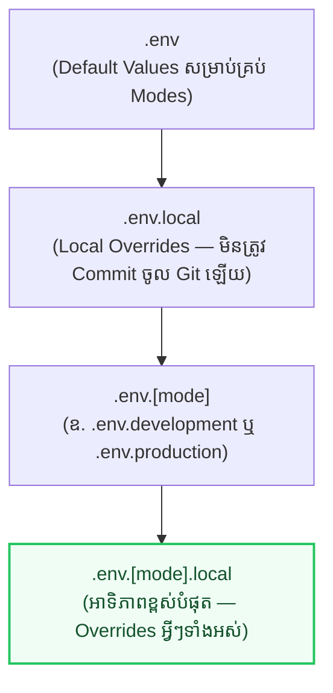

## 📁 ១. ឋានានុក្រមនៃ `.env` Files (Resolution Precedence)

Vite ផ្ទុក Environment Variables តាមលំដាប់លំដោយអាទិភាពដូចខាងក្រោម (ខាងក្រោម Overwrite ខាងលើ)៖



---

## 🔒 ២. ការរៀបចំ `.env` Files ប្រកបដោយសុវត្ថិភាព

### ១. `.env.example` (Commit ចូល Git ជាគំរូសម្រាប់ក្រុមការងារ)

```bash
# .env.example - ឯកសារគំរូ (កុំដាក់ Secret ពិតប្រាកដនៅទីនេះ!)
VITE_API_BASE_URL=https://api.example.com/v1
VITE_APP_NAME="EduPortal Enterprise"
VITE_ENABLE_ANALYTICS=false
VITE_SUPPORT_EMAIL=support@example.com
```

### ២. `.env.development` (ប្រើពេល run `npm run dev`)

```bash
# .env.development
VITE_API_BASE_URL=http://localhost:5000/api/v1
VITE_APP_NAME="EduPortal (Dev Mode)"
VITE_ENABLE_ANALYTICS=false

# ❌ អថេរគ្មាន VITE_ នឹងមិនត្រូវបាន Export ទៅ Browser ឡើយ (មានសុវត្ថិភាពលើ Server)
DATABASE_PASSWORD=super_secret_db_pass_123
```

### ៣. `.env.production` (ប្រើពេល run `npm run build`)

```bash
# .env.production
VITE_API_BASE_URL=https://api.eduportal.kh/v1
VITE_APP_NAME="EduPortal Pro"
VITE_ENABLE_ANALYTICS=true
```

---

## 🛡️ ៣. ការបង្កើត Safe Runtime Env Validation Module

ដើម្បីចៀសវាងបញ្ហា App Crash ដោយសារភ្លេចកំណត់ Environment Variables យើងបង្កើត Module ផ្ទៀងផ្ទាត់នៅពេល App ចាប់ផ្តើមដំណើរការដំបូង៖

```javascript
// src/config/env.js

/**
 * ត្រួតពិនិត្យ និង Validate Environment Variables ទាំងអស់
 */
function validateEnv() {
  const requiredVariables = [
    { key: 'VITE_API_BASE_URL', example: 'https://api.domain.com/v1' },
    { key: 'VITE_APP_NAME', example: 'My React App' },
  ];

  const missing = [];

  for (const { key, example } of requiredVariables) {
    if (!import.meta.env[key]) {
      missing.push(`  • ${key} (ឧទាហរណ៍: ${example})`);
    }
  }

  if (missing.length > 0) {
    const errorMessage =
      `🚨 [Environment Config Error] ខ្វះអថេរចាំបាច់ដូចខាងក្រោម ៖\n` +
      missing.join('\n') +
      `\n\n👉 សូមបង្កើត file .env.local រួចកំណត់តម្លៃទាំងនេះមុនពេលបន្ត!`;

    // បង្ហាញ Error ច្បាស់ៗលើ Console
    console.error(errorMessage);
    if (import.meta.env.DEV) {
      alert(errorMessage);
    }
    throw new Error(errorMessage);
  }
}

// ដំណើរការ Validation ភ្លាមៗពេល Module ត្រូវបាន Load
validateEnv();

// Export Object ដែលមាន Type-safe & Fallback Values
export const ENV = {
  API_BASE_URL: import.meta.env.VITE_API_BASE_URL,
  APP_NAME: import.meta.env.VITE_APP_NAME || 'React Course App',
  ENABLE_ANALYTICS: import.meta.env.VITE_ENABLE_ANALYTICS === 'true',
  SUPPORT_EMAIL: import.meta.env.VITE_SUPPORT_EMAIL || 'support@edu.kh',

  // Vite Built-in Helpers
  IS_DEV: import.meta.env.DEV,
  IS_PROD: import.meta.env.PROD,
  MODE: import.meta.env.MODE,
};
```

---

## 💻 ៤. ការប្រើប្រាស់ `ENV` ក្នុង React Components & Services

```jsx
// src/components/Header.jsx
import React from 'react';
import { ENV } from '../config/env';

export default function Header() {
  return (
    <header className="px-6 py-4 bg-white dark:bg-slate-900 border-b flex items-center justify-between">
      <div className="flex items-center gap-2">
        <span className="text-xl font-black text-blue-600">{ENV.APP_NAME}</span>
        {ENV.IS_DEV && (
          <span className="px-2 py-0.5 rounded-md bg-amber-500/10 text-amber-600 text-[10px] font-black uppercase">
            Development Mode
          </span>
        )}
      </div>

      <div className="text-xs text-slate-500">
        API: <code className="font-mono">{ENV.API_BASE_URL}</code>
      </div>
    </header>
  );
}
```

---

## 🔍 ៥. ការពន្យល់កូដមួយជួរៗ (Line-by-Line Breakdown)

1. `import.meta.env.VITE_API_BASE_URL`
   - ES Module Standard Syntax របស់ Vite សម្រាប់អានអថេរ (ជំនួសឱ្យ `process.env` ចាស់របស់ Node.js/Webpack)។
2. `ENABLE_ANALYTICS: import.meta.env.VITE_ENABLE_ANALYTICS === 'true'`
   - គ្រប់ Environment Variables ក្នុង `.env` គឺសុទ្ធតែជា **String**។ ដូច្នេះដើម្បីទទួលបានតម្លៃ Boolean ពិតប្រាកដ យើងត្រូវប្រៀបធៀបជាមួយ String `'true'`។
3. `validateEnv()`
   - ត្រួតពិនិត្យភ្លាមៗនៅ Runtime — ប្រសិនបើ Developer ភ្លេច config អថេរ វានឹង Throw Error ប្រាប់ពីដំណោះស្រាយភ្លាមៗ មិនឱ្យកើតមាន Silent Bugs។
4. `DATABASE_PASSWORD=...` (គ្មាន Prefix `VITE_`)
   - មិនត្រូវបាន bundle ចូលក្នុង `dist/` ឡើយ — ធានាសុវត្ថិភាព ១០០% ប្រឆាំងការលួចមើលកូដតាម Browser DevTools។

---

## 💡 ៦. Production Security Checklist

- [x] បន្ថែម `.env.local` និង `.env.*.local` ទៅក្នុង `.gitignore` ជានិច្ច
- [x] ហាមដាច់ខាតមិនឱ្យដាក់ Secret Keys (DB Password, Stripe Secret, AWS Private Key) ជាមួយ Prefix `VITE_`
- [x] បង្កើត `.env.example` សម្រាប់ឱ្យ Developer ផ្សេងទៀតក្នុងក្រុមកូពីទៅប្រើ
- [x] កំណត់ Production Environment Variables តាមរយៈ Dashboard របស់ Hosting Platform (Vercel, Netlify, Cloudflare)
