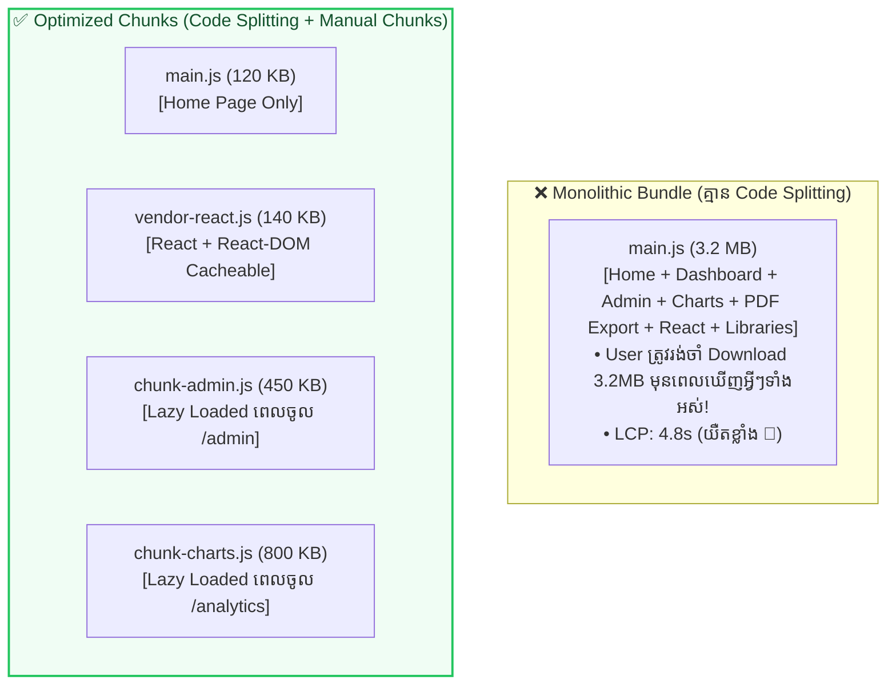

## ⚡ ១. ស្ថាបត្យកម្ម Monolithic Bundle vs Optimized Split Chunks



---

## ✂️ ២. Route-Based Code Splitting ជាមួយ `React.lazy` & `Suspense`

```jsx
// src/App.jsx
import React, { lazy, Suspense } from 'react';
import { BrowserRouter, Routes, Route, Link } from 'react-router-dom';

// ១. Eager Loading សម្រាប់ Home Page (ទំព័រដំបូងដែលត្រូវការល្បឿនលឿនបំផុត)
import HomePage from './pages/HomePage';

// ២. Lazy Loading សម្រាប់ទំព័រធំៗផ្សេងទៀត (Download តែពេល User ចុចចូល)
const DashboardPage = lazy(() => import('./pages/DashboardPage'));
const AnalyticsPage = lazy(() => import('./pages/AnalyticsPage'));
const AdminSettingsPage = lazy(() => import('./pages/AdminSettingsPage'));

// Fallback Loading UI ដ៏ស្រស់ស្អាត
function PageLoadingFallback() {
  return (
    <div className="min-h-[60vh] flex flex-col items-center justify-center gap-3">
      <div className="w-10 h-10 border-4 border-blue-500/20 border-t-blue-600 rounded-full animate-spin" />
      <p className="text-slate-400 text-xs font-bold animate-pulse">កំពុងទាញយកទំព័រ...</p>
    </div>
  );
}

export default function App() {
  return (
    <BrowserRouter>
      {/* ៣. ស្រោប Suspense ពីលើ Routes ទាំងអស់ */}
      <Suspense fallback={<PageLoadingFallback />}>
        <Routes>
          <Route path="/" element={<HomePage />} />
          <Route path="/dashboard" element={<DashboardPage />} />
          <Route path="/analytics" element={<AnalyticsPage />} />
          <Route path="/admin" element={<AdminSettingsPage />} />
        </Routes>
      </Suspense>
    </BrowserRouter>
  );
}
```

---

## ⚙️ ៣. Advanced Rollup Chunking ក្នុង `vite.config.js`

ខាងក្រោមនេះជា Configuration ស្តង់ដារ Production សម្រាប់បំបែក Vendor Libraries ធំៗ និងបង្កើត Visualizer Report៖

```javascript
// vite.config.js
import { defineConfig } from 'vite';
import react from '@vitejs/plugin-react';
import { visualizer } from 'rollup-plugin-visualizer';

export default defineConfig({
  plugins: [
    react(),
    // បង្កើត Interactive HTML Visualizer Report បន្ទាប់ពី build រួច
    visualizer({
      open: false, // កំណត់ true បើចង់ឱ្យបើក browser ស្វ័យប្រវត្តិ
      filename: 'dist/stats.html',
      gzipSize: true,
      brotliSize: true,
    }),
  ],
  build: {
    target: 'esnext',
    minify: 'esbuild', // Minification លឿនបំផុត
    sourcemap: false,  // បិទ sourcemap ក្នុង production ដើម្បីកាត់បន្ថយទំហំ
    chunkSizeWarningLimit: 600, // កំណត់ Limit Warning (600 KB)

    rollupOptions: {
      output: {
        // បំបែក Vendor Libraries ធំៗទៅជា Chunks ដាច់ដោយឡែក
        manualChunks: {
          'vendor-react': ['react', 'react-dom', 'react-router-dom'],
          'vendor-query': ['@tanstack/react-query'],
        },
        // រៀបចំឈ្មោះឯកសារ Output ឱ្យមាន Hash សម្រាប់ Cache Busting
        entryFileNames: 'assets/js/[name]-[hash].js',
        chunkFileNames: 'assets/js/[name]-[hash].js',
        assetFileNames: 'assets/[ext]/[name]-[hash].[ext]',
      },
    },
  },
});
```

---

## 🌳 ៤. គន្លឹះ Tree Shaking & Import Optimizations

### ❌ ចៀសវាងការ Import ទាំងមូល (Bloated Bundle):
```javascript
// ❌ នាំចូល Icon រាប់ពាន់ដែលមិនបានប្រើ (Bundle ឡើង 1MB+)
import * as Icons from 'lucide-react';
import _ from 'lodash';
```

### ✅ ប្រើប្រាស់ Named Direct Imports (Tree Shakeable):
```javascript
// ✅ នាំចូលតែ Icon ដែលប្រើប្រាស់ពិតប្រាកដ (ទំហំត្រឹមតែ 2KB)
import { CheckCircle, AlertTriangle, ArrowRight } from 'lucide-react';
import debounce from 'lodash/debounce';
```

---

## 🔍 ៥. ការពន្យល់កូដមួយជួរៗ (Line-by-Line Breakdown)

1. `const DashboardPage = lazy(() => import('./pages/DashboardPage'));`
   - បំប្លែង Static Import ទៅជា Dynamic Import — Vite/Rollup នឹងបង្កើត File Chunk ថ្មីមួយដាច់ដោយឡែកភ្លាមៗ។
2. `<Suspense fallback={<PageLoadingFallback />}>`
   - ចាប់យក Promise នៃការ Download Chunk និងបង្ហាញ Fallback UI រហូតដល់កូដ JavaScript នៃទំព័រនោះបាន Download និង Parse រួចរាល់។
3. `manualChunks: { 'vendor-react': ['react', ...] }`
   - បង្កើត File `vendor-react-[hash].js` ដាច់ដោយឡែក។ នៅពេលអ្នកកែប្រែកូដ App Browser របស់ User មិនបាច់ Download React ម្តងទៀតឡើយ ដោយសារវាត្រូវបាន Cached រួចជាស្រេច។
4. `entryFileNames: 'assets/js/[name]-[hash].js'`
   - ប្រើ Content Hash (ឧ. `main-a8f9b2.js`) ដើម្បីធ្វើ **Cache Busting** — ពេលមាន Build ថ្មី Browser នឹង Download តែ Files ណាដែលមាន Hash ផ្លាស់ប្តូរប៉ុណ្ណោះ។

---

## 💡 ៦. Production Build Verification Checklist

```bash
# 1. ដំណើរការ Production Build
npm run build

# 2. ពិនិត្យមើល Preview លើ Localhost:4173 ដូច Production ពិតប្រាកដ
npm run preview
```

- [x] Main JS Chunk មានទំហំតូចជាង 300 KB (Gzipped)
- [x] គ្រប់ Lazy Routes បំបែកចេញជា Chunks ត្រឹមត្រូវក្នុង `dist/assets/js/`
- [x] បើក `dist/stats.html` ដើម្បីពិនិត្យមើលថាតើគ្មាន Library ណាធំខុសប្រក្រតី
- [x] ដំណើរការ `npm run preview` ហើយធ្វើតេស្តចុចគ្រប់ Routes ថាគ្មានកំហុស 404
