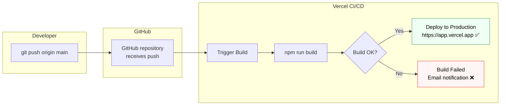

## 🚀 1. Deploying to Vercel (Recommended)

### Method 1: Vercel CLI

```bash
# Install Vercel CLI
npm install -g vercel

# Deploy from project root
vercel

# Follow prompts:
# ? Set up and deploy? Yes
# ? Which scope? your-username
# ? Link to existing project? No
# ? Project name: my-react-app
# ? Directory: ./
# ✓ Deployed to https://my-react-app.vercel.app
```

### Method 2: GitHub Integration (Best for CI/CD)

1. Push your project to GitHub
2. Go to [vercel.com](https://vercel.com) → **New Project**
3. Import your GitHub repository
4. Vercel auto-detects Vite → Click **Deploy**
5. Every `git push main` → Auto-deploys to Production ✅
6. Every Pull Request → Creates Preview URL ✅

---

## ⚙️ 2. Production Environment Variables

```
Vercel Dashboard → Project → Settings → Environment Variables

Add:
VITE_API_URL = https://api.myapp.com
VITE_APP_NAME = MyApp

Select environments: ✅ Production  ✅ Preview  ✅ Development
```

```
Netlify Dashboard → Site → Site Configuration → Environment Variables

Same process — add VITE_* variables
```

> **🔴 Never** commit secrets to `.env.production` in your repo. Always set them via the hosting platform's dashboard/secrets.

---

## 🌐 3. Netlify Deployment

```bash
# Install Netlify CLI
npm install -g netlify-cli

# Build and deploy
npm run build
netlify deploy --prod --dir=dist
```

**SPA Routing Fix** — Create `public/_redirects`:
```
/*    /index.html    200
```

Or in `netlify.toml`:
```toml
[[redirects]]
  from = "/*"
  to = "/index.html"
  status = 200
```

---

## 🔄 4. CI/CD Pipeline Overview



---

## ✅ 5. Pre-Deploy Checklist

```bash
# Run BEFORE every deployment:
npm run build         # No TypeScript/JSX errors
npm test -- --run     # All tests pass
npm run preview       # Check production build locally

# Verify:
# [ ] All VITE_* env vars set in hosting dashboard
# [ ] API CORS allows production domain
# [ ] No hardcoded localhost URLs in code
# [ ] /public/_redirects or netlify.toml for SPA routing
# [ ] Custom domain configured (optional)
```

---

## 📌 6. Deployment Comparison

| Feature | Vercel | Netlify |
|---------|--------|---------|
| Vite Auto-detect | ✅ | ✅ |
| Preview Deployments | ✅ | ✅ |
| Serverless Functions | ✅ | ✅ |
| SPA Redirect | ✅ Auto | ⚠️ Need `_redirects` |
| Free Tier | Generous | Generous |
| Best for | React/Next.js | Static Sites/SPA |
