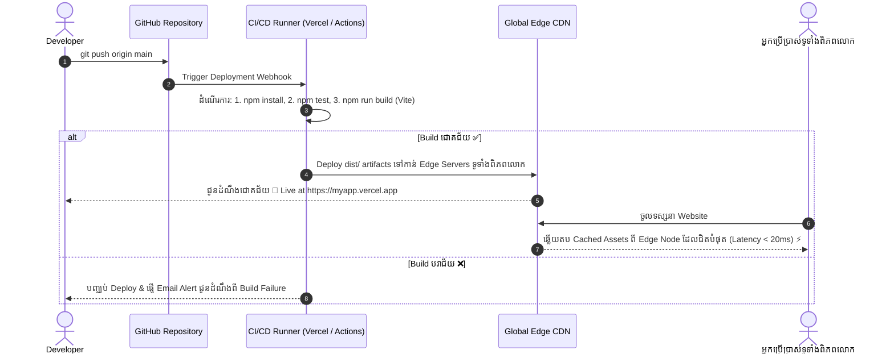

## 🚀 ១. ស្ថាបត្យកម្ម Modern CI/CD Pipeline & Edge Delivery



---

## 🛠️ ២. ដំណោះស្រាយបញ្ហា SPA 404 Error ពេល Refresh

### ១. សម្រាប់ Vercel ៖ បង្កើត `vercel.json` ក្នុង Root Directory

```json
{
  "rewrites": [
    {
      "source": "/(.*)",
      "destination": "/index.html"
    }
  ],
  "headers": [
    {
      "source": "/assets/(.*)",
      "headers": [
        {
          "key": "Cache-Control",
          "value": "public, max-age=31536000, immutable"
        }
      ]
    }
  ]
}
```

### ២. សម្រាប់ Netlify ៖ បង្កើត `public/_redirects`

```
/*    /index.html   200
```

ឬក្នុង `netlify.toml`:
```toml
[[redirects]]
  from = "/*"
  to = "/index.html"
  status = 200
```

### ៣. សម្រាប់ Nginx Server (Self-Hosted VPS):

```nginx
location / {
    root /var/www/my-react-app/dist;
    index index.html;
    try_files $uri $uri/ /index.html;
}
```

---

## 🔒 ៣. ការគ្រប់គ្រង Security Headers ក្នុង Production

ការបន្ថែម Security Headers ជួយការពារ Web App របស់អ្នកពីការវាយប្រហារ Clickjacking, XSS, និង MIME Sniffing៖

```json
// vercel.json (Security Headers Configuration)
{
  "headers": [
    {
      "source": "/(.*)",
      "headers": [
        {
          "key": "X-Frame-Options",
          "value": "DENY"
        },
        {
          "key": "X-Content-Type-Options",
          "value": "nosniff"
        },
        {
          "key": "Referrer-Policy",
          "value": "strict-origin-when-cross-origin"
        },
        {
          "key": "Permissions-Policy",
          "value": "camera=(), microphone=(), geolocation=()"
        }
      ]
    }
  ]
}
```

---

## ⚙️ ៤. ការកំណត់ Production Environment Variables ក្នុង Dashboard

```
Vercel Dashboard
  └── Project Settings
        └── Environment Variables
              ├── VITE_API_BASE_URL = https://api.eduportal.kh/v1
              ├── VITE_APP_NAME = EduPortal Enterprise
              └── (ជ្រើសរើស Environments: Production, Preview)
```

> [!IMPORTANT]
> **ចងចាំជានិច្ច ៖** បន្ទាប់ពីបន្ថែម ឬកែប្រែ Environment Variable ក្នុង Vercel/Netlify Dashboard អ្នកត្រូវតែចុច **Redeploy** ដើម្បីឱ្យ Build Runner ចាប់យកតម្លៃថ្មីទៅបង្កើត Bundle ជាថ្មី។

---

## 🔍 ៥. ការពន្យល់កូដមួយជួរៗ (Line-by-Line Breakdown)

1. `"rewrites": [{ "source": "/(.*)", "destination": "/index.html" }]`
   - ប្រាប់ Static Server ថា រាល់ Path ទាំងអស់ដែល Browser ស្នើសុំ (ឧ. `/dashboard`, `/profile/edit`) ត្រូវឆ្លើយតបឯកសារ `/index.html` វិញជានិច្ច ជាមួយ Status `200 OK`។
2. `"key": "Cache-Control", "value": "public, max-age=31536000, immutable"`
   - បញ្ជាឱ្យ Browser និង CDN Cache ឯកសារ JS/CSS ក្នុង folder `assets/` ទុកបាន ១ ឆ្នាំពេញ ព្រោះឯកសារទាំងនោះមាន Content Hash ស្រាប់ (Cache Busting)។
3. `"key": "X-Frame-Options", "value": "DENY"`
   - ការពារមិនឱ្យ Hacker យក Website របស់អ្នកទៅដាក់ក្នុង `<iframe />` លើ Domain ផ្សេងដើម្បីបោកបញ្ឆោត User (Clickjacking Protection)។
4. `try_files $uri $uri/ /index.html;` (Nginx)
   - ពិនិត្យមើលថាតើ URL ជា File ពិតឬអត់ (`$uri`) បើមិនមែនជា File ឬ Folder ទេ សូមបញ្ជូនទៅ `/index.html` ភ្លាម។

---

## 💡 ៦. Pre-Deployment & Post-Deployment Checklist

### 📋 Pre-Deployment Checklist (មុនពេល Deploy):
- [x] ដំណើរការ `npm run build` និង `npm test` ធានាថាឆ្លងកាត់ដោយជោគជ័យ ១០០%
- [x] ពិនិត្យមើលថាគ្មាន Hardcoded `http://localhost:5000` ក្នុងកូដ
- [x] បង្កើត file `vercel.json` ឬ `public/_redirects` សម្រាប់ SPA routing
- [x] Commit និង Push កូដទាំងអស់ទៅកាន់ GitHub `main` branch

### 📋 Post-Deployment Verification (ក្រោយពេល Deploy ជោគជ័យ):
- [x] បើក Live URL (https://your-app.vercel.app) ពិនិត្យមើលថាមិនចេញអេក្រង់ស (Blank Screen)
- [x] ចុចបើកទំព័រ `/dashboard` រួចចុច Refresh (F5) ធានាថាមិនចេញ 404 Error
- [x] បើក DevTools Network Tab ពិនិត្យមើលថា API Requests បាញ់ទៅកាន់ Production URL ត្រឹមត្រូវ
- [x] ពិនិត្យសោរ HTTPS (SSL Certificate) លើ Address Bar របស់ Browser
