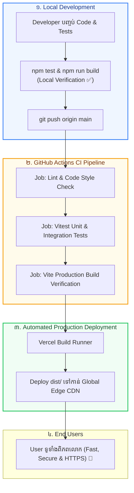

## 🏛️ ១. ស្ថាបត្យកម្មពេញលេញនៃ Production Release Pipeline



---

## 📁 ២. ឯកសារ Production Configuration ពេញលេញ

### ១. `.github/workflows/ci.yml` (Automated CI Pipeline)

```yaml
# .github/workflows/ci.yml
name: React CI/CD Pipeline

on:
  push:
    branches: [main]
  pull_request:
    branches: [main]

jobs:
  test-and-build:
    runs-on: ubuntu-latest

    steps:
      - name: 📥 Checkout Repository
        uses: actions/checkout@v4

      - name: 🟢 Setup Node.js Environment
        uses: actions/setup-node@v4
        with:
          node-version: 20
          cache: 'npm'

      - name: 📦 Install Dependencies
        run: npm ci

      - name: 🧪 Run Automated Tests
        run: npm run test:run

      - name: 🏗️ Execute Production Build
        run: npm run build
        env:
          VITE_API_BASE_URL: 'https://api.eduportal.kh/v1'
          VITE_APP_NAME: 'EduPortal Production'
```

---

### ២. `vercel.json` (SPA Routing & Security Headers)

```json
{
  "rewrites": [
    {
      "source": "/(.*)",
      "destination": "/index.html"
    }
  ],
  "headers": [
    {
      "source": "/assets/(.*)",
      "headers": [
        {
          "key": "Cache-Control",
          "value": "public, max-age=31536000, immutable"
        }
      ]
    },
    {
      "source": "/(.*)",
      "headers": [
        {
          "key": "X-Content-Type-Options",
          "value": "nosniff"
        },
        {
          "key": "X-Frame-Options",
          "value": "DENY"
        },
        {
          "key": "X-XSS-Protection",
          "value": "1; mode=block"
        },
        {
          "key": "Referrer-Policy",
          "value": "strict-origin-when-cross-origin"
        }
      ]
    }
  ]
}
```

---

### ៣. `vite.config.js` (Advanced Rollup Chunking)

```javascript
// vite.config.js
import { defineConfig } from 'vite';
import react from '@vitejs/plugin-react';

export default defineConfig({
  plugins: [react()],
  build: {
    target: 'esnext',
    minify: 'esbuild',
    rollupOptions: {
      output: {
        manualChunks: {
          'vendor-react': ['react', 'react-dom', 'react-router-dom'],
          'vendor-state': ['@tanstack/react-query', 'zustand'],
        },
      },
    },
  },
});
```

---

## 🚀 ៣. ជំហានបញ្ចេញ App ទៅកាន់ Production (Step-by-Step Launch)

```bash
# ជំហានទី ១: ធ្វើ Code Audit ស្វែងរកកូដដែលសល់
grep -rn "http://localhost" src/       # ធានាថាគ្មាន localhost URL
grep -rn "console.log" src/            # សម្អាត debug logs

# ជំហានទី ២: Test និង Build នៅ Local Machine
npm test -- --run                      # ធានា Tests ទាំងអស់ Passed 100%
npm run build                          # ធានា Build បានសម្រេច 0 Errors
npm run preview                        # ធ្វើតេស្តលទ្ធផលលើ http://localhost:4173

# ជំហានទី ៣: Push ទៅកាន់ GitHub
git add .
git commit -m "feat: enterprise production release config"
git push origin main
```

---

## 🐛 ៤. ការដោះស្រាយបញ្ហាជាក់ស្តែងលើ Production (Incident Troubleshooting)

### ១. បញ្ហា ៖ ចេញអេក្រង់ស (Blank Screen of Death)
- **មូលហេតុ ៖** មាន JavaScript Syntax Error ឬភ្លេចកំណត់ `VITE_` Environment Variables។
- **ដំណោះស្រាយ ៖** បើក Browser DevTools Console មើល Error Log រួចបន្ថែមអថេរដែលខ្វះក្នុង **Vercel Project Settings → Environment Variables** រួចចុច **Redeploy**។

### ២. បញ្ហា ៖ ចូលទៅ `/dashboard` ចេញ Error 404 Not Found
- **មូលហេតុ ៖** ខ្វះ SPA Rewrite Rule លើ Static Server។
- **ដំណោះស្រាយ ៖** បង្កើតឯកសារ `vercel.json` ក្នុង Root Folder ជាមួយ `rewrites: [{ "source": "/(.*)", "destination": "/index.html" }]`។

### ៣. បញ្ហា ៖ API Requests ជួប CORS Error លើ Live Domain
- **មូលហេតុ ៖** Backend Server មិនទាន់បាន Whitelist Domain ថ្មី (`https://your-app.vercel.app`)។
- **ដំណោះស្រាយ ៖** កែប្រែ Backend CORS Configuration បញ្ចូល Domain របស់ Vercel ទៅក្នុង `allowedOrigins`។

---

## 🎓 ៥. សេចក្តីអបអរសាទរ! អ្នកបានបញ្ចប់វគ្គ React Full-Stack Mastery ពេញលេញ! 🎉

សូមអបអរសាទរយ៉ាងកក់ក្តៅ! អ្នកបានឆ្លងកាត់ការសិក្សា និងការអនុវត្តជាក់ស្តែងគ្រប់ **១៥ Modules** នៃវគ្គ React Full-Stack Development ៖

```
✅ Module 1:  Vite Setup, JSX Deep Dive & Component Architecture
✅ Module 2:  Props, Lists, Conditional Rendering & Immutability
✅ Module 3:  State Management, Synthetic Events & Form Validation
✅ Module 4:  useEffect Lifecycle, Cleanup & Abort Controllers
✅ Module 5:  Modern Styling & Component Systems (Tailwind CSS)
✅ Module 6:  React Router v6 — SPAs, Dynamic Params & Nested Layouts
✅ Module 7:  Context API & Global State Architecture
✅ Module 8:  Performance Optimization — useMemo, useCallback, React.memo
✅ Module 9:  Data Fetching Patterns — Fetch, Axios & Custom Hooks
✅ Module 10: Advanced Custom Hooks (useFetch, useLocalStorage, useDebounce)
✅ Module 11: Modern State Management with Zustand
✅ Module 12: Authentication & Authorization (JWT, RBAC, Protected Routes)
✅ Module 13: Full-Stack API Integration, Axios Service Layer & React Query v5
✅ Module 14: Automated Testing with Vitest & React Testing Library
✅ Module 15: Production Release, Build Optimization & CI/CD Deployment 🚀
```

> [!TIP]
> **🚀 Roadmap ជំហានបន្ទាប់សម្រាប់អាជីពរបស់អ្នក ៖**
> 1. **Next.js 15+ (App Router):** សិក្សា Server Components (RSC), Server Actions, និង SEO Rendering។
> 2. **TypeScript Mastery:** បំពាក់ TypeScript លើគ្រប់ React Components ដើម្បីការពារ Bugs កម្រិត Enterprise។
> 3. **Backend Integration:** សិក្សា Node.js, Express, PostgreSQL, Prisma ORM, និង Docker។
