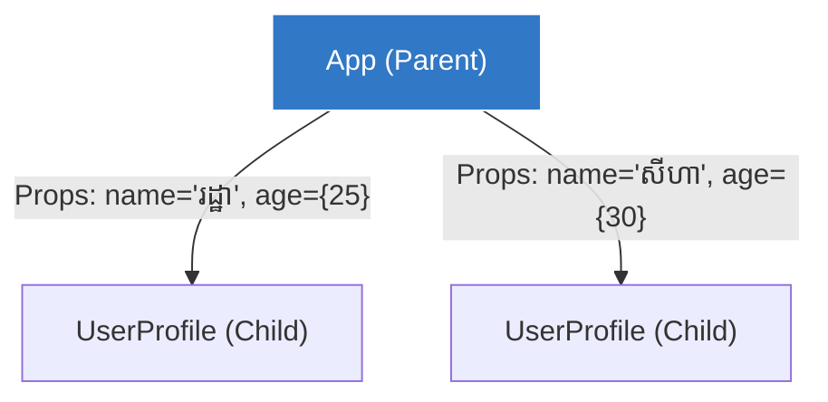

## 🎁 អ្វីទៅជា Props?

យើងទើបតែបានរៀនពីរបៀបបំបែក UI ជា Components។ ប៉ុន្តែចុះបើ Component ទាំងនោះត្រូវការទិន្នន័យផ្សេងៗគ្នា? (ឧទាហរណ៍: UserProfile មួយត្រូវការឈ្មោះ "រដ្ឋា" មួយទៀតត្រូវការឈ្មោះ "សីហា")។

យើងប្រើប្រាស់ **Props (Properties)** ដើម្បីបញ្ជូនទិន្នន័យពី Component មេ ទៅ Component កូន។ វាដំណើរការដូចគ្នាបេះបិទទៅនឹង Attributes របស់ HTML ដែរ (ឧ. `src` និង `alt` របស់ ``)។



### ការសរសេរកូដ និងការហែកយក (Destructuring)

នៅក្នុង Component កូន, React នឹងប្រមូលទិន្នន័យទាំងអស់ដែលមេបានបញ្ជូនមក វេចខ្ចប់វាជា Object មួយឈ្មោះថា `props`។ ជាទូទៅ យើងនិយមប្រើការហែកយក (Object Destructuring) តែម្តងដើម្បីងាយស្រួលសរសេរ។

```jsx
// Component កូន ទទួលបាន Props
// យើងប្រើ Destructuring ដើម្បីទាញយក { name, age } ពីប្រអប់ props
function UserProfile({ name, age }) {
  return (
    <div className="card">
      <h2>ឈ្មោះ: {name}</h2>
      <p>អាយុ: {age} ឆ្នាំ</p>
    </div>
  );
}

// Component មេ ជាអ្នកបញ្ជូនទិន្នន័យ
function App() {
  return (
    <div>
      {/* បញ្ជូនអក្សរ ប្រើ "" ។ ចំណែកឯ លេខ, Object ឫ អថេរ ត្រូវរុំដោយ { } */}
      <UserProfile name="រដ្ឋា" age={25} />
      <UserProfile name="សីហា" age={30} />
    </div>
  );
}
```

> **ច្បាប់លំហូរទិន្នន័យ (One-Way Data Flow):** ក្នុង React ទិន្នន័យតែងតែហូរពី "លើ ចុះ ក្រោម" (ពីឪពុក ទៅ កូន)។ កូនមិនអាចបញ្ជូនទិន្នន័យផ្ទាល់ទៅឪពុកវិញបានទេ។

---

## 👨‍👩‍👧 អាថ៌កំបាំងរបស់ `children` Prop

ចុះបើអ្នកចង់បង្កើត Component មួយ ដែលមានតួនាទីត្រឹមតែជា "សំបកប្រអប់" (Wrapper) ដើម្បីលម្អររូបរាង ប៉ុន្តែមិនដឹងជាមុនថាគេនឹងដាក់អ្វីនៅខាងក្នុងប្រអប់នោះ?

ជាឧទាហរណ៍ Component `<Card>` ដែលមាន Border និងស្រមោលស្អាត ហើយអាចផ្ទុកអ្វីក៏បាន! នៅទីនេះហើយដែល **`children` prop** ចូលខ្លួនមកជួយ។ 

React នឹងចាប់យក **អ្វីៗគ្រប់យ៉ាងដែលស្ថិតនៅចន្លោះ Tag បើក និង Tag បិទ** របស់ Component អ្នក បញ្ជូនទៅក្នុងប្រអប់ Props ក្រោមឈ្មោះពិសេសមួយថា `children`។

```jsx
// 1. បង្កើតសំបកប្រអប់
function Card({ title, children }) {
  return (
    <div style={{ border: '1px solid gray', padding: '10px', borderRadius: '8px' }}>
      <h2>{title}</h2>
      
      {/* នេះជាកន្លែងដែលទិន្នន័យបង្កប់នឹងត្រូវបង្ហាញ */}
      <div className="card-body">
        {children} 
      </div>
    </div>
  );
}

// 2. ប្រើប្រាស់សំបកប្រអប់
function App() {
  return (
    <div>
      <Card title="ពត៌មានលម្អិត">
        {/* អ្វីៗនៅចន្លោះនេះ (ទាំង 2 បន្ទាត់) គឺជា children */}
        <p>សួស្តី នេះគឺជាអត្ថបទនៅខាងក្នុងប្រអប់។</p>
        <button>អានបន្ត</button>
      </Card>
      
      <Card title="រូបភាព">
         {/* លើកនេះ children គឺជារូបភាពវិញម្តង! អាចដាក់អ្វីក៏បាន! */}
        
      </Card>
    </div>
  );
}
```

ការប្រើប្រាស់ `children` គឺជារឿងសំខាន់បំផុតមួយដើម្បីបង្កើត Layout Components និង Component Composition ដែលមានលក្ខណៈទូលំទូលាយ!

```reactdiagram
PropsFlow
```
