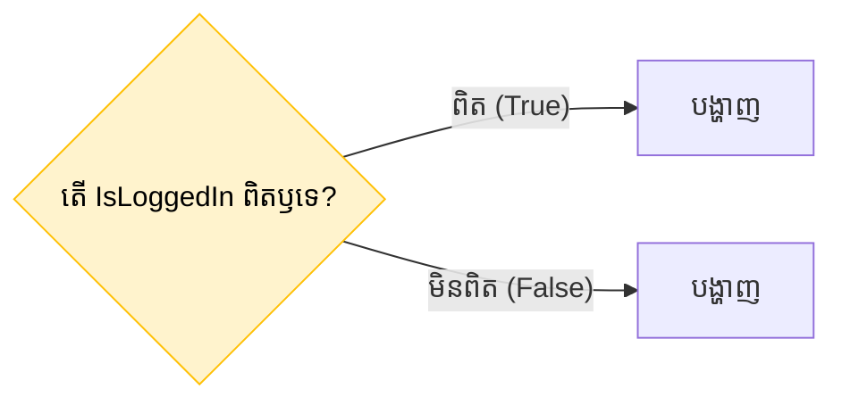

## 🚦 អ្វីទៅជា Conditional Rendering?

នៅក្នុង React យើងមានសេរីភាពពេញលេញក្នុងការប្រើប្រាស់ក្បួនតក្កវិទ្យា (Logic) របស់ JavaScript ទាំងអស់ដើម្បីគ្រប់គ្រងថា តើគួរតែបង្ហាញ UI មួយណា។ 
យើងមានវិធីសាស្រ្ត ៣ យ៉ាងសំខាន់ៗដែលតែងតែប្រើជាប្រចាំ។



---

## 1. ការប្រើប្រាស់ `if / else` (Early Return)

វិធីនេះគឺសាមញ្ញជាងគេ។ ប្រសិនបើលក្ខខណ្ឌណាមួយមិនទាន់ត្រូវ យើងគ្រាន់តែ `return` កូដផ្សេង ឬ `null` មុនពេលទៅដល់កូដមេ។ វាសាកសមសម្រាប់លក្ខខណ្ឌដែលធំៗ។

```jsx
function Profile({ isLoggedIn }) {
  if (!isLoggedIn) {
    return <h1>សូមចុះឈ្មោះចូលគណនីជាមុនសិន!</h1>; // Early return
  }

  // ប្រសិនបើ isLoggedIn = true កូដនឹងបន្តដំណើរការមកដល់ទីនេះ
  return (
    <div>
      <h1>សួស្តី ម្ចាស់គណនី!</h1>
      <button>ចេញពីគណនី (Logout)</button>
    </div>
  );
}
```

---

## 2. ការប្រើប្រាស់ `? :` (Ternary Operator)

នៅពេលអ្នកចង់កែប្រែកូដនៅក្នុង JSX ផ្ទាល់ (Inline) អ្នកមិនអាចសរសេរ `if` នៅក្នុង `{ }` បានទេ។ អ្នកត្រូវប្រើ Ternary Operator ដែលមានទម្រង់៖ `លក្ខខណ្ឌ ? បើពិត : បើមិនពិត`។

```jsx
function Item({ name, isPacked }) {
  return (
    <li>
      {/* បើ isPacked ពិត បង្ហាញសញ្ញា ✅ បើមិនពិត បង្ហាញសញ្ញា ❌ */}
      {name} {isPacked ? "✅" : "❌"}
    </li>
  );
}
```
វិធីនេះសាកសមបំផុតសម្រាប់ការសម្រេចចិត្តប្តូរ ClassName (ពណ៌) ឫអក្សរខ្លីៗ។

---

## 3. ការប្រើប្រាស់ `&&` (Logical AND)

ចុះបើអ្នកចង់បង្ហាញរបស់ណាមួយ **តែក្នុងករណីដែលវាពិតប៉ុណ្ណោះ ហើយបើវាមិនពិត មិនបាច់បង្ហាញអ្វីទាំងអស់**?
យើងប្រើសញ្ញា `&&`។

```jsx
function Mailbox({ unreadMessages }) {
  // បើមានអត្ថបទ (length > 0) វានឹងបង្ហាញ <p>
  // បើគ្មានអត្ថបទ វានឹងមិនបង្ហាញអ្វីទាំងអស់
  
  return (
    <div>
      <h1>ប្រអប់សំបុត្ររបស់អ្នក</h1>
      
      {unreadMessages.length > 0 && (
        <p>អ្នកមានសារថ្មី {unreadMessages.length} មិនទាន់អាន!</p>
      )}
    </div>
  );
}
```

### ⚠️ ការប្រុងប្រយ័ត្នខ្ពស់: គ្រោះថ្នាក់នៃលេខ 0 ជាមួយ `&&`
ដូចក្នុង Quiz ខាងលើ សូមប្រយ័ត្នចំពោះការយក "លេខបញ្ជរ (number)" ទៅធ្វើជាលក្ខខណ្ឌផ្ទាល់៖

```jsx
const count = 0;

// ❌ ខុស: វានឹងបង្ហាញលេខ 0 ដ៏ធំមួយនៅលើអេក្រង់វេបសាយរបស់អ្នក!
{count && <p>មានរបស់ថ្មី</p>}

// ✅ ត្រូវ: បម្លែងវាទៅជា Boolean (True/False) សិន
{count > 0 && <p>មានរបស់ថ្មី</p>}
```
