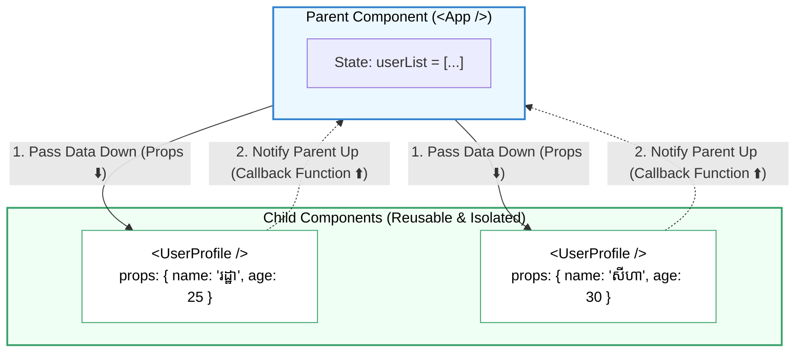

## 🎁 1. Unidirectional Data Flow ជាមួយ Props

នៅក្នុង React ទិន្នន័យធ្វើដំណើរតែមួយទិសដៅប៉ុណ្ណោះ (**One-Way Data Flow**) គឺពី **Parent Component ធ្លាក់ចុះទៅកាន់ Child Components** តាមរយៈ **Props** (Properties)។



---

## 🛠️ 2. ការប្រើប្រាស់ Object Destructuring & Default Props

ជំនួសឱ្យការសរសេរ `props.name`, `props.role`, យើងប្រើ **Object Destructuring** ផ្ទាល់នៅក្នុង function parameters៖

```jsx
// 1. Child Component ជាមួយ Destructuring & Default Value
export function UserBadge({ name, role = "Member", isVerified = false }) {
  return (
    <div className="flex items-center gap-2 p-2 border rounded-lg">
      <span className="font-bold text-gray-800">{name}</span>
      <span className="text-xs bg-gray-100 text-gray-600 px-2 py-0.5 rounded">{role}</span>
      {isVerified && <span className="text-blue-500 text-sm">✓ Verified</span>}
    </div>
  );
}

// 2. Parent Component បញ្ជូន Props
export default function App() {
  return (
    <div className="space-y-3 p-6">
      <UserBadge name="រដ្ឋា" role="Admin" isVerified={true} />
      <UserBadge name="សុខា" /> {/* ប្រើប្រាស់ default role="Member" */}
    </div>
  );
}
```
