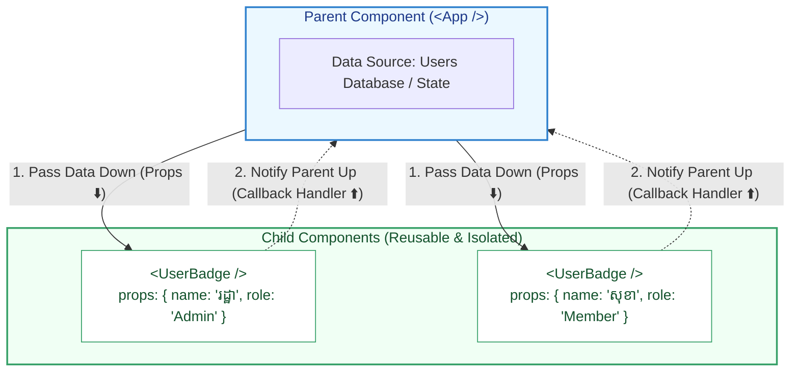

## 🎁 ១. Unidirectional Data Flow with Props

> [!IMPORTANT]
> **និយមន័យ Props (Definition) ៖**  
> យោងតាមគេហទំព័រផ្លូវការរបស់ React (**react.dev**), **Props** (មកពីពាក្យ Properties) គឺជា Arguments ដែលយើងបញ្ជូនទៅកាន់ React Component។ ដូចគ្នានឹង JavaScript Functions ទទួល Arguments ដើម្បីដំណើរការដែរ React Component ទទួល Props ដើម្បីគណនា និង Return នូវ JSX Elements សម្រាប់ Render លើអេក្រង់។  
> 
> Props ដំណើរការតាមគោលការណ៍ **Unidirectional Data Flow (One-Way)** ដោយធ្វើដំណើរពី **Parent Component ចុះទៅកាន់ Child Components** ហើយមានលក្ខណៈ **Read-Only (Immutable)** ជាដាច់ខាត។


```mermaid
flowchart TD
    subgraph Parent["Parent Component (&lt;App /&gt;)"]
        StateData["Data Source: Users Database / State"]
    end

    subgraph Children["Child Components (Reusable & Isolated)"]
        direction LR
        Child1["&lt;UserBadge /&gt;<br/>props: { name: 'រដ្ឋា', role: 'Admin' }"]
        Child2["&lt;UserBadge /&gt;<br/>props: { name: 'សុខា', role: 'Member' }"]
    end

    Parent -->|"1. Pass Data Down (Props ⬇️)"| Child1
    Parent -->|"1. Pass Data Down (Props ⬇️)"| Child2
    Child1 -.->|"2. Notify Parent Up (Callback Handler ⬆️)"| Parent
    Child2 -.->|"2. Notify Parent Up (Callback Handler ⬆️)"| Parent

    style Parent fill:#ebf8ff,stroke:#3182ce,stroke-width:2px,color:#1e3a8a
    style Children fill:#f0fff4,stroke:#38a169,stroke-width:2px,color:#14532d
    style Child1 fill:#ffffff,stroke:#38a169,color:#14532d
    style Child2 fill:#ffffff,stroke:#38a169,color:#14532d
```

---

## 🛠️ ២. Object Destructuring & Default Props

ជំនួសឱ្យការសរសេរ `props.name`, `props.role`, `props.isVerified` រាយប៉ាយពេញកូដ យើងប្រើ **ES6 Object Destructuring** ផ្ទាល់នៅក្នុង Function Parameter ៖

```jsx
// src/components/UserBadge.jsx
import React from 'react';

// 1. Child Component ជាមួយ Destructuring & Default Values
export function UserBadge({ name, role = 'Member', isVerified = false }) {
  return (
    <div className="flex items-center gap-2 p-2.5 bg-white dark:bg-slate-900 border border-slate-200 dark:border-slate-800 rounded-xl shadow-sm">
      <span className="font-bold text-slate-800 dark:text-white text-sm">{name}</span>
      <span className="text-xs bg-slate-100 dark:bg-slate-800 text-slate-600 dark:text-slate-300 px-2 py-0.5 rounded-md font-medium">
        {role}
      </span>
      {isVerified && (
        <span className="text-blue-500 text-xs font-bold flex items-center gap-0.5">
          ✓ Verified
        </span>
      )}
    </div>
  );
}

// 2. Parent Component បញ្ជូន Props ទៅកាន់ Child
export default function App() {
  return (
    <div className="space-y-3 p-6 max-w-sm mx-auto">
      {/* បញ្ជូន Props ពេញលេញ */}
      <UserBadge name="រដ្ឋា" role="Admin" isVerified={true} />

      {/* ប្រើប្រាស់ Default Value សម្រាប់ role ('Member') និង isVerified (false) */}
      <UserBadge name="សុខា" />
    </div>
  );
}
```

---

## 🔍 ៣. ការពន្យល់កូដមួយជួរៗ (Line-by-Line Breakdown)

#### 📋 តារាងពន្យល់បន្ទាត់កូដនៃ `UserBadge.jsx` ៖
| បន្ទាត់ (Line) | កូដ (Code) | ការពន្យល់លម្អិតបច្ចេកទេស |
| :--- | :--- | :--- |
| **Line 4** | `export function UserBadge({ name, role = 'Member', isVerified = false })` | **1. Named Export ៖** នាំចេញ Component ដោយចំឈ្មោះ។<br/>**2. Object Destructuring ៖** ដកស្រង់ props ផ្ទាល់ចេញពី Argument Object។<br/>**3. Default Props ៖** កំណត់តម្លៃលំនាំដើម `role = 'Member'` និង `isVerified = false` ក្នុងករណី Parent មិនបានបញ្ជូន Props ទាំងនេះ។ |
| **Line 5** | `return (` | ចាប់ផ្តើម Return នូវ React Element (JSX) តែមួយគត់ទៅកាន់ Virtual DOM។ |
| **Line 6** | `<div className="flex items-center gap-2 ...">` | Root Element នៃ Badge ដែលប្រើប្រាស់ Flexbox (`flex items-center gap-2`) ដើម្បីតម្រៀប Name, Role, និង Verified status ជាជួរដេកស្អាត។ |
| **Line 7** | `<span className="..."> {name} </span>` | បង្ហាញឈ្មោះដែលទទួលបានពី prop `name`។ |
| **Line 8-10** | `<span className="..."> {role} </span>` | បង្ហាញតួនាទី (Role)។ ប្រសិនបើ Parent មិនបានបញ្ជូន `role` មកទេ វានឹងបង្ហាញអក្សរ `'Member'` ដោយស្វ័យប្រវត្តិតាម Default Value។ |
| **Line 11-15** | `{isVerified && ( <span ...>✓ Verified</span> )}` | **Short-Circuit Conditional Rendering ៖** បង្ហាញ Badge ពណ៌ខៀវ `'✓ Verified'` លុះត្រាតែ `isVerified === true`។ បើ `false` នោះ React នឹង Ignore មិន render ចំណុចនេះឡើយ។ |

#### 📋 តារាងពន្យល់បន្ទាត់កូដនៃ Parent `App.jsx` ៖
| បន្ទាត់ (Line) | កូដ (Code) | ការពន្យល់លម្អិតបច្ចេកទេស |
| :--- | :--- | :--- |
| **Line 21** | `<UserBadge name="រដ្ឋា" role="Admin" isVerified={true} />` | Parent បញ្ជូន Props ចំនួន ៣ ដោយផ្ទាល់។ ចំណាំ៖ តម្លៃ Boolean `true` ត្រូវតែដាក់ក្នុង Curly Braces `{true}`។ |
| **Line 24** | `<UserBadge name="សុខា" />` | Parent បញ្ជូនតែ prop `name` ប៉ុណ្ណោះ។ ដោយសារគ្មាន `role` និង `isVerified` Component នឹងយកតម្លៃ Default មកប្រើ (`role="Member"`, `isVerified=false`) ដោយមិនមាន Error ឡើយ។ |

---

## 📜 ៤. គោលការណ៍ស្នូលទាំង ៣ នៃ Props (react.dev Principles)

> [!IMPORTANT]
> **ច្បាប់កាតព្វកិច្ចក្នុងការប្រើប្រាស់ Props ៖**
> 1. **Props are Read-Only (Pure Functions Rule) ៖** Component របស់អ្នកត្រូវតែជា Pure Function ធៀបនឹង Props របស់វា។ ហាមដាច់ខាតមិនឱ្យសរសេរកូដកែប្រែ Props ដូចជា `props.name = 'ថ្មី'` ឬ `props.items.push(...)` ឡើយ! ប្រសិនបើទិន្នន័យត្រូវផ្លាស់ប្តូរ ចូរប្រើ **State** ជំនួសវិញ។
> 2. **Props can be Any JavaScript Type ៖** អ្នកអាចបញ្ជូន String, Number, Boolean, Array, Object, Callback Functions (`onClick={() => ...}`), ឬសូម្បីតែ React Elements / JSX ចុះទៅតាម Props បានទាំងអស់។
> 3. **Change Props via Parent State ៖** របៀបតែមួយគត់ដែល Child ទទួលបាន Props ថ្មី គឺនៅពេលដែល **Parent Component ផ្លាស់ប្តូរ State របស់ខ្លួន** រួច Re-render បញ្ជូន Props តម្លៃថ្មីចុះមកក្រោម។

---

## 🚀 ៥. បច្ចេកទេសកម្រិតខ្ពស់ ៖ Props Forwarding & The Rest Pattern

នៅពេលបង្កើត Reusable UI Components (ដូចជា Button, Input, Card) យើងច្រើនតែចង់ទទួល Props ជាក់លាក់មួយចំនួន ហើយបញ្ជូន Native HTML Attributes ដែលនៅសល់ (`id`, `aria-label`, `disabled`, `onClick`) ទៅកាន់ HTML element ខាងក្នុងដោយស្វ័យប្រវត្តិ ៖

```jsx
// src/components/Button.jsx
export function Button({ variant = 'primary', children, ...restProps }) {
  const baseStyles = 'px-4 py-2 rounded-xl font-bold text-sm transition';
  const variantStyles = variant === 'primary' 
    ? 'bg-blue-600 text-white hover:bg-blue-700' 
    : 'bg-slate-100 text-slate-700 hover:bg-slate-200';

  return (
    // ...restProps នឹងបញ្ជូន onClick, disabled, type, id ទៅឱ្យ <button> ដោយស្វ័យប្រវត្តិ!
    <button className={`${baseStyles} ${variantStyles}`} {...restProps}>
      {children}
    </button>
  );
}

// ការហៅប្រើប្រាស់
<Button 
  variant="primary" 
  onClick={() => alert('Clicked!')} 
  disabled={false} 
  aria-label="Submit Form"
>
  បញ្ជូនទិន្នន័យ
</Button>
```

---

## 📋 ៦. សង្ខេបចំណុចសំខាន់ៗ (Key Takeaways)

- Props គឺជាយន្តការចម្បងក្នុងការបញ្ជូនទិន្នន័យពី Parent ទៅ Child តាមលំហូរ **Top-down (Unidirectional)**។
- ប្រើ **Object Destructuring** ក្នុង Parameter ដើម្បីឱ្យកូដមានភាពច្បាស់លាស់ និងកំណត់ **Default Values** បានយ៉ាងងាយ។
- Props គឺជា **Read-Only (Immutable)** — មិនត្រូវកែប្រែតម្លៃ Props ក្នុង Child Component ឡើយ។
- ប្រើ **Rest Operator (`...restProps`)** សម្រាប់បញ្ជូន Props បន្តទៅកាន់ HTML Elements ដោយស្វ័យប្រវត្តិ។
