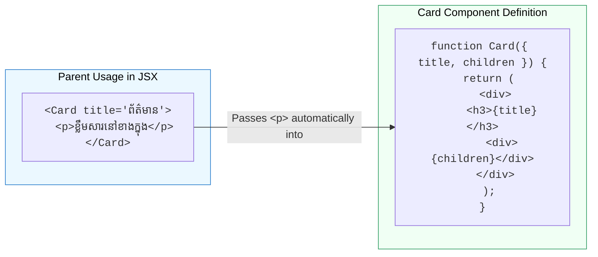

## 📦 1. អ្វីទៅជា `children` Prop?

នៅក្នុង React យើងមិនប្រើប្រាស់ Class Inheritance ទេ ប៉ុន្តែយើងប្រើ **Component Composition** (ផ្គុំ Component មួយចូលក្នុង Component មួយទៀត)។

`children` គឺជា prop ពិសេសមួយដែលតំណាងឱ្យអ្វីៗទាំងអស់ដែលអ្នកសរសេរនៅចន្លោះ `<Wrapper>...</Wrapper>`។



---

## 🛠️ 2. ឧទាហរណ៍ជាក់ស្តែង: Reusable Modal & Card Wrapper

```jsx
// 1. Container Wrapper
export function ModalWrapper({ isOpen, onClose, title, children }) {
  if (!isOpen) return null;

  return (
    <div className="fixed inset-0 bg-black/50 flex items-center justify-center p-4">
      <div className="bg-white rounded-2xl p-6 max-w-lg w-full shadow-2xl">
        <div className="flex justify-between items-center border-b pb-3 mb-4">
          <h3 className="text-xl font-bold text-gray-800">{title}</h3>
          <button onClick={onClose} className="text-gray-400 hover:text-gray-600 font-bold">✕</button>
        </div>

        {/* ទីតាំងដែល children នឹងបង្ហាញ */}
        <div className="modal-content">
          {children}
        </div>
      </div>
    </div>
  );
}

// 2. ប្រើប្រាស់ Modal ជាមួយ Content ខុសៗគ្នា
export default function App() {
  return (
    <ModalWrapper isOpen={true} onClose={() => {}} title="ការបញ្ជាក់ការបញ្ជាទិញ">
      <p className="text-gray-600 mb-4">តើអ្នកពិតជាចង់ទិញផលិតផលនេះមែនទេ?</p>
      <div className="flex justify-end gap-3">
        <button className="px-4 py-2 bg-gray-100 text-gray-700 rounded-lg">បោះបង់</button>
        <button className="px-4 py-2 bg-blue-600 text-white rounded-lg">យល់ព្រម</button>
      </div>
    </ModalWrapper>
  );
}
```
