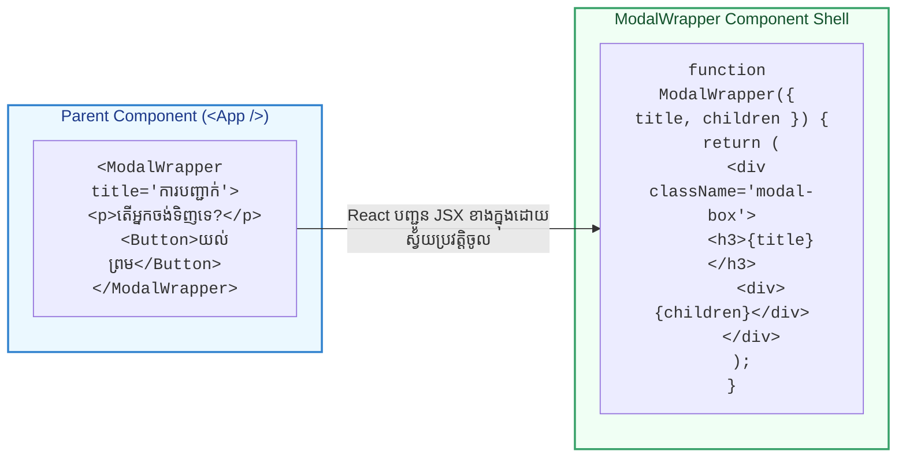

## 📦 ១. អ្វីទៅជា `children` Prop? (The Containment Pattern)

> [!IMPORTANT]
> **និយមន័យ Component Composition & `children` Prop (Definition) ៖**  
> យោងតាមគេហទំព័រផ្លូវការរបស់ React (**react.dev**), **Component Composition** គឺជាទស្សនវិជ្ជារចនា Component ក្នុង React ដែលផ្គុំផ្សំ Components តូចៗបញ្ចូលគ្នាដើម្បីបង្កើតជា UI ស្មុគស្មាញ (**Composition over Inheritance**)។  
> 
> **`children` Prop** គឺជា Prop ពិសេសដែល React បញ្ជូនដោយស្វ័យប្រវត្តិនូវរាល់ JSX Elements, Text, ឬ Sub-components ណាដែលស្ថិតនៅចន្លោះ **Opening Tag** និង **Closing Tag** (`<Container>...children...</Container>`)។ បច្ចេកទេសនេះហៅថា **Containment** ដែលអនុញ្ញាតឱ្យបង្កើត Generic Layouts (ដូចជា Modal, Drawer, Card, Box) ប្រកបដោយភាពបត់បែនខ្ពស់។


```mermaid
flowchart LR
    subgraph Parent["Parent Component (&lt;App /&gt;)"]
        A["<code>&lt;ModalWrapper title='ការបញ្ជាក់'&gt;<br/>&nbsp;&nbsp;&lt;p&gt;តើអ្នកចង់ទិញទេ?&lt;/p&gt;<br/>&nbsp;&nbsp;&lt;Button&gt;យល់ព្រម&lt;/Button&gt;<br/>&lt;/ModalWrapper&gt;</code>"]
    end

    subgraph ModalDef["ModalWrapper Component Shell"]
        B["<code>function ModalWrapper({ title, children }) {<br/>&nbsp;&nbsp;return (<br/>&nbsp;&nbsp;&nbsp;&nbsp;&lt;div className='modal-box'&gt;<br/>&nbsp;&nbsp;&nbsp;&nbsp;&nbsp;&nbsp;&lt;h3&gt;{title}&lt;/h3&gt;<br/>&nbsp;&nbsp;&nbsp;&nbsp;&nbsp;&nbsp;&lt;div&gt;{children}&lt;/div&gt;<br/>&nbsp;&nbsp;&nbsp;&nbsp;&lt;/div&gt;<br/>&nbsp;&nbsp;);<br/>}</code>"]
    end

    A -->|"React បញ្ជូន JSX ខាងក្នុងដោយស្វ័យប្រវត្តិចូល"| B

    style Parent fill:#ebf8ff,stroke:#3182ce,stroke-width:2px,color:#1e3a8a
    style ModalDef fill:#f0fff4,stroke:#38a169,stroke-width:2px,color:#14532d
```

---

## 🛠️ ២. ឧទាហរណ៍ជាក់ស្តែង ៖ Reusable Modal Wrapper

```jsx
// src/components/ModalWrapper.jsx
import React from 'react';

// 1. Generic Modal Shell Container
export function ModalWrapper({ isOpen, onClose, title, children }) {
  // Early return ប្រសិនបើ Modal ត្រូវបានបិទ
  if (!isOpen) return null;

  return (
    <div className="fixed inset-0 z-50 bg-black/50 backdrop-blur-sm flex items-center justify-center p-4">
      <div className="bg-white dark:bg-slate-900 border border-slate-200 dark:border-slate-800 rounded-2xl p-6 max-w-lg w-full shadow-2xl space-y-4">
        {/* Modal Header */}
        <div className="flex justify-between items-center border-b border-slate-100 dark:border-slate-800 pb-3">
          <h3 className="text-lg font-black text-slate-800 dark:text-white">{title}</h3>
          <button 
            onClick={onClose}
            className="text-slate-400 hover:text-slate-600 dark:hover:text-slate-200 text-lg font-bold"
          >
            ✕
          </button>
        </div>

        {/* ទីតាំងចាក់បញ្ចូល Children JSX */}
        <div className="modal-body">
          {children}
        </div>
      </div>
    </div>
  );
}

// 2. Parent Component ប្រើប្រាស់ Modal ដោយចាក់បញ្ចូល Custom Content
export default function App() {
  return (
    <ModalWrapper isOpen={true} onClose={() => {}} title="ការបញ្ជាក់ការបញ្ជាទិញ">
      <p className="text-sm text-slate-600 dark:text-slate-300">
        តើអ្នកពិតជាចង់ទិញផលិតផលនេះក្នុងតម្លៃ <strong>$85.00</strong> មែនទេ?
      </p>

      <div className="flex justify-end gap-2 pt-4">
        <button className="px-4 py-2 bg-slate-100 dark:bg-slate-800 text-slate-700 dark:text-slate-300 text-xs font-bold rounded-xl hover:bg-slate-200">
          បោះបង់
        </button>
        <button className="px-4 py-2 bg-blue-600 text-white text-xs font-bold rounded-xl hover:bg-blue-700 shadow-sm">
          យល់ព្រមបញ្ជាទិញ
        </button>
      </div>
    </ModalWrapper>
  );
}
```

---

## 🔍 ៣. ការពន្យល់កូដមួយជួរៗ (Line-by-Line Breakdown)

#### 📋 តារាងពន្យល់បន្ទាត់កូដនៃ `ModalWrapper.jsx` ៖
| បន្ទាត់ (Line) | កូដ (Code) | ការពន្យល់លម្អិតបច្ចេកទេស |
| :--- | :--- | :--- |
| **Line 5** | `export function ModalWrapper({ isOpen, onClose, title, children })` | ទទួល Props ចំនួន ៤ ដោយក្នុងនោះ `children` គឺតំណាងឱ្យ JSX Content ណាដែល Parent សរសេរនៅខាងក្នុង tags នៃ Modal។ |
| **Line 7** | `if (!isOpen) return null;` | **Guard Clause / Early Return ៖** ប្រសិនបើ `isOpen === false` Component នឹង return `null` ភ្លាមៗ (មិន Render អ្វីទាំងអស់ទៅលើ DOM) ដែលជួយសន្សំ Memory និង CPU។ |
| **Line 10** | `<div className="fixed inset-0 z-50 bg-black/50 ...">` | **Backdrop Overlay ៖** គ្របដណ្តប់ពេញផ្ទៃអេក្រង់ (`fixed inset-0`) ជាមួយផ្ទៃខ្មៅស្រាល 50% (`bg-black/50`) និងកញ្ចក់ព្រាល (`backdrop-blur-sm`)។ |
| **Line 11** | `<div className="bg-white ... max-w-lg w-full ...">` | **Modal Dialog Box ៖** ប្រអប់ពណ៌សកណ្តាលអេក្រង់ដែលមានកម្រាស់ស្រមោលជ្រៅ (`shadow-2xl`) និងកាច់ជ្រុងទន់ (`rounded-2xl`)។ |
| **Line 13-20** | Modal Header with Title & Close Button | បង្ហាញចំណងជើងដែល pass តាម prop `title` និងប៊ូតុងចុច `✕` ដែលភ្ជាប់ handler `onClick={onClose}`។ |
| **Line 24** | `{children}` | **The Slot Injection Point ៖** ទីតាំងដែល React យកមាតិកាខាងក្នុងទាំងអស់ (Paragraph, Buttons, Forms, etc.) មកបង្ហាញជាក់ស្តែង។ `ModalWrapper` មិនចាំបាច់ដឹងថា content ខាងក្នុងជាអ្វីឡើយ! |

---

## 🧩 ៤. The "Named Slots" Pattern (Multiple Children)

ចុះប្រសិនបើ Component ត្រូវការកន្លែងដាក់ JSX ច្រើនជាងមួយ (ឧទាហរណ៍៖ Header Slot, Body Slot, Footer Action Slot)?  
នៅក្នុង React, **Props អាចផ្ទុក JSX បាន!** ដូច្នេះយើងមិនចាំបាច់កម្រិតតែលើ `children` មួយប៉ុណ្ណោះទេ ៖

```jsx
// src/components/DashboardCard.jsx
export function DashboardCard({ headerSlot, footerSlot, children }) {
  return (
    <div className="bg-white dark:bg-slate-900 border rounded-2xl p-6 shadow-sm space-y-4">
      {/* 1. Header Slot */}
      {headerSlot && <div className="border-b pb-3">{headerSlot}</div>}

      {/* 2. Main Content Slot (children) */}
      <div className="card-body">{children}</div>

      {/* 3. Footer Slot */}
      {footerSlot && <div className="border-t pt-3 flex justify-end">{footerSlot}</div>}
    </div>
  );
}

// ការហៅប្រើប្រាស់ជាមួយ Named Slots:
<DashboardCard
  headerSlot={<h2 className="text-xl font-bold">📊 ចរាចរណ៍លក់ប្រចាំខែ</h2>}
  footerSlot={<button className="text-blue-600 text-xs font-bold">មើលរបាយការណ៍ពេញលេញ →</button>}
>
  <p className="text-slate-600">សរុបប្រាក់ចំណូលខែនេះកើនឡើង <strong>+24.5%</strong> ធៀបនឹងខែមុន។</p>
</DashboardCard>
```

---

## 📋 ៥. សង្ខេបចំណុចសំខាន់ៗ (Key Takeaways)

- **`children` Prop** អនុញ្ញាតឱ្យយើងបង្កើត Reusable Container Shells (Modal, Card, Layout) ដោយមិនបាច់ខ្វល់ពី Content ខាងក្នុង។
- គោរពតាមទស្សនវិជ្ជា **Composition over Inheritance** របស់ React ដើម្បីកូដមានភាពបត់បែនខ្ពស់ និងងាយស្រួល Refactor។
- ប្រើ **Named Slots Pattern** (បញ្ជូន JSX តាម Props ដូចជា `headerSlot={...}`) នៅពេលដែល Component មួយត្រូវការកន្លែងបង្ហាញ Content ច្រើនផ្នែកដាច់ពីគ្នា។
