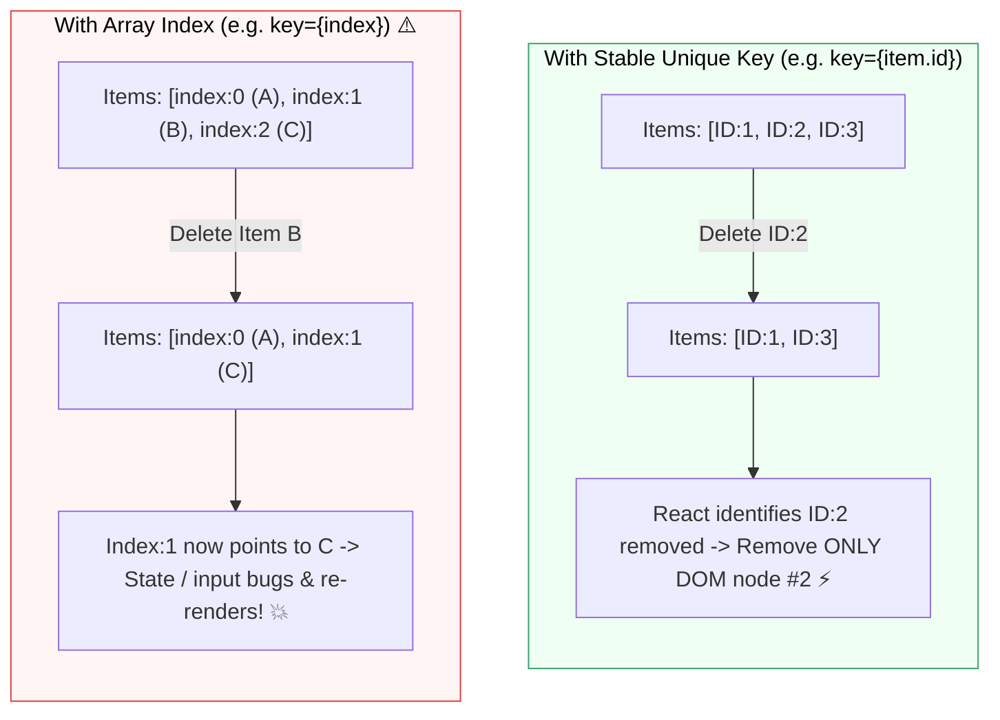

## 📋 1. ការប្រើប្រាស់ `Array.prototype.map()`

នៅក្នុង React យើងមិនប្រើ `for` ឬ `while` loops ក្នុង JSX ទេ ប៉ុន្តែយើងប្រើ **`.map()`** ដើម្បី transform items ក្នុង array ឱ្យទៅជា JSX Elements៖

```jsx
const courses = [
  { id: 'c1', title: 'React 19 Mastery', price: 49 },
  { id: 'c2', title: 'Node.js Backend Architecture', price: 59 },
  { id: 'c3', title: 'Full-Stack Next.js Project', price: 69 },
];

export function CourseList() {
  return (
    <ul className="divide-y border rounded-xl overflow-hidden">
      {courses.map((course) => (
        <li key={course.id} className="p-4 flex justify-between items-center hover:bg-gray-50">
          <span className="font-semibold text-gray-800">{course.title}</span>
          <span className="font-black text-blue-600">${course.price}</span>
        </li>
      ))}
    </ul>
  );
}
```

---

## 🔑 2. សារៈសំខាន់នៃ `key` Prop ក្នុង Diffing Algorithm



### លក្ខខណ្ឌនៃ Key ដ៏ល្អ៖
1. **Unique:** មិនស្ទួនគ្នាក្នុងចំណោម Sibling elements
2. **Stable:** មិនផ្លាស់ប្តូរតាមពេលដែល list ត្រូវ sort ឬ filter (កុំប្រើ `Math.random()`)
