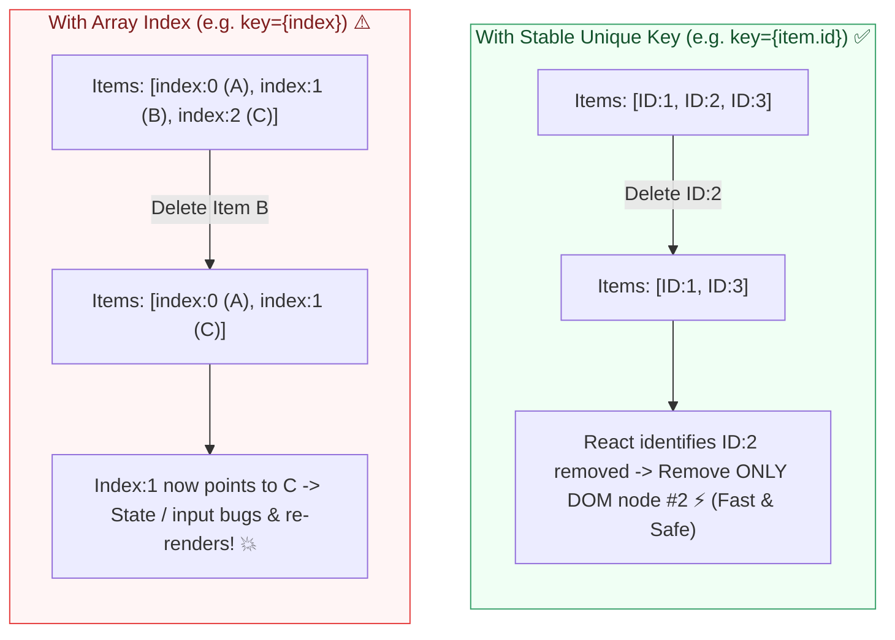

## 📋 ១. Transforming Lists with `Array.prototype.map()`

> [!IMPORTANT]
> **និយមន័យ List Rendering & Key Prop (Definition) ៖**  
> យោងតាមគេហទំព័រផ្លូវការរបស់ React (**react.dev**), **List Rendering** គឺជាការបម្លែង Array នៃទិន្នន័យឱ្យទៅជា JSX Elements ដោយប្រើប្រាស់ JavaScript `Array.prototype.map()`។  
> 
> **`key` Prop** គឺជា **Unique String ឬ Number Identifier** ដែល React ប្រើប្រាស់ក្នុង **Diffing Algorithm (Reconciliation)** ដើម្បីសម្គាល់ថាតើ Item ណាខ្លះត្រូវបាន Added, Updated, Moved, ឬ Removed។ ការកំណត់ Key ត្រឹមត្រូវជួយឱ្យ React ធ្វើបច្ចុប្បន្នភាព Real DOM តែលើ Node ណាដែលបានផ្លាស់ប្តូរប៉ុណ្ណោះ ដោយមិនបាច់ Render List ទាំងមូលឡើងវិញឡើយ។

```jsx
// src/components/CourseList.jsx
import React from 'react';

const courses = [
  { id: 'c1', title: 'React 19 Mastery', price: 49, level: 'Intermediate' },
  { id: 'c2', title: 'Node.js Backend Architecture', price: 59, level: 'Advanced' },
  { id: 'c3', title: 'Full-Stack Next.js Project', price: 69, level: 'Expert' },
];

export function CourseList() {
  return (
    <div className="max-w-md mx-auto p-6 bg-white dark:bg-slate-900 border border-slate-200 dark:border-slate-800 rounded-2xl shadow-lg space-y-4">
      <h3 className="font-black text-lg text-slate-900 dark:text-white">
        📚 វគ្គសិក្សាដែលមាន ({courses.length})
      </h3>

      <ul className="divide-y divide-slate-100 dark:divide-slate-800 border border-slate-100 dark:border-slate-800 rounded-xl overflow-hidden">
        {courses.map((course) => (
          <li 
            key={course.id} 
            className="p-4 flex justify-between items-center hover:bg-slate-50 dark:hover:bg-slate-800/50 transition"
          >
            <div>
              <p className="font-bold text-slate-800 dark:text-white text-sm">
                {course.title}
              </p>
              <span className="text-xs text-slate-400 font-medium">
                កម្រិត ៖ {course.level}
              </span>
            </div>
            <span className="font-black text-blue-600 text-base">
              ${course.price}
            </span>
          </li>
        ))}
      </ul>
    </div>
  );
}
```

---

## 🔍 ២. ការពន្យល់កូដមួយជួរៗ (Line-by-Line Breakdown)

| បន្ទាត់ (Line) | កូដ (Code) | ការពន្យល់លម្អិតបច្ចេកទេស |
| :--- | :--- | :--- |
| **Line 4-8** | `const courses = [ { id: 'c1', ... }, ... ];` | **Mock Data Source ៖** Array នៃ Objects ដែលធាតុនីមួយៗមាន Stable Unique ID (`c1`, `c2`, `c3`) សម្រាប់ប្រើជា Key។ |
| **Line 10** | `export function CourseList() {` | **Component Declaration ៖** Named Export Functional Component ដែលបង្ហាញបញ្ជីវគ្គសិក្សា។ |
| **Line 18** | `{courses.map((course) => (` | **Array `.map()` Transformation ៖** ដំណើរការ Loop លើធាតុនីមួយៗនៃ Array ដើម្បី Return ចេញជា JSX Element `<li>` ថ្មីមួយសម្រាប់ធាតុនីមួយៗ។ |
| **Line 19-22** | `<li key={course.id} className="...">` | **The Key Prop Rule ៖** ត្រូវតែដាក់ `key={course.id}` នៅលើ Top-level Element (`<li>`) ដែលត្រឡប់ចេញពី `.map()` ដើម្បីឱ្យ React អាចតាមដាន Identity នៃធាតុនីមួយៗក្នុង DOM Tree។ |
| **Line 24-29** | Title & Level Display | ស្រង់តម្លៃ `{course.title}` និង `{course.level}` មកបង្ហាញក្នុង HTML tags។ |
| **Line 31-33** | `<span ...>${course.price}</span>` | បង្ហាញតម្លៃវគ្គសិក្សាជាអក្សរដិតពណ៌ខៀវ (`text-blue-600 font-black`)។ |

---

## 🔑 ៣. The Role of the `key` Prop in React Diffing Algorithm


```mermaid
flowchart TD
    subgraph WithUniqueKey["With Stable Unique Key (e.g. key={item.id}) ✅"]
        direction TB
        K1["Items: [ID:1, ID:2, ID:3]"] -->|Delete ID:2| K2["Items: [ID:1, ID:3]"]
        K2 --> K3["React identifies ID:2 removed -> Remove ONLY DOM node #2 ⚡ (Fast & Safe)"]
    end

    subgraph WithoutKeyOrIndex["With Array Index (e.g. key={index}) ⚠️"]
        direction TB
        I1["Items: [index:0 (A), index:1 (B), index:2 (C)]"] -->|Delete Item B| I2["Items: [index:0 (A), index:1 (C)]"]
        I2 --> I3["Index:1 now points to C -> State / input bugs & re-renders! 💥"]
    end

    style WithUniqueKey fill:#f0fff4,stroke:#38a169,color:#14532d
    style WithoutKeyOrIndex fill:#fff5f5,stroke:#e53e3e,color:#7f1d1d
```

---

## ⚠️ ៤. វិធានមាសទាំង ៣ នៃ Key Prop (react.dev Rules)

1. **Keys must be unique among siblings ៖** Keys មិនបាច់ Unique នៅទូទាំង App ទាំងមូលទេ តែត្រូវតែ Unique ក្នុងចំណោមធាតុបងប្អូនក្នុង Array តែមួយ (`siblings`)។
2. **Keys must not change (Stable) ៖** កុំបង្កើត Keys តាមរយៈ `Math.random()` ឬ `Date.now()` ក្នុងពេល Render ជាដាច់ខាត ព្រោះវានឹងបង្ខំឱ្យ React បង្កើត DOM Node ថ្មីរាល់ Render ដែលនាំឱ្យបាត់ Focus និងយឺតបំផុត!
3. **Avoid using Array Index as Key ៖** ការប្រើ `key={index}` អាចអនុញ្ញាតបានលុះត្រាតែ List នោះជា Static Data (មិនដែលមានការ Sort, Filter, ឬ Add/Delete ធាតុឡើយ)។

---

## 📋 ៥. សង្ខេបចំណុចសំខាន់ៗ (Key Takeaways)

- ប្រើ **`.map()`** ជានិច្ចក្នុង JSX ដើម្បីបម្លែង Array ទៅជា UI Elements។
- **`key`** គឺជាអត្តសញ្ញាណប័ណ្ណនៃ JSX Element នីមួយៗសម្រាប់ React Reconciliation។
- ដាក់ `key` តែងតែនៅលើ **Top-level Element** នៃ `.map()` callback។
- ប្រើប្រាស់ **Database ID (`item.id`)** ឬ **Unique String** ជា Key ជានិច្ច។
