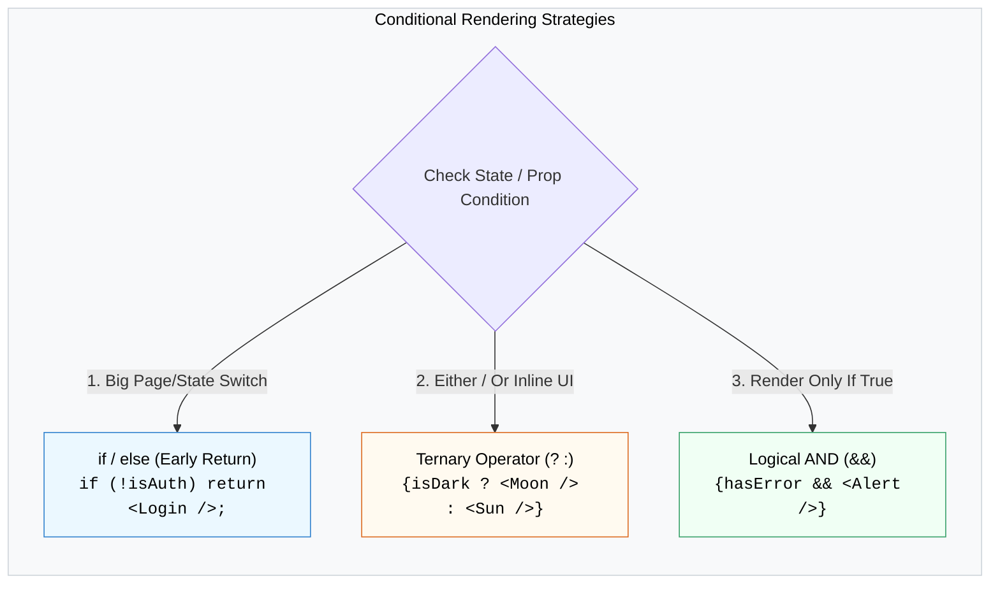

## 🚦 1. យុទ្ធសាស្ត្រ Conditional Rendering ទាំង ៣



---

## 🛠️ 2. កូដគំរូជាក់ស្តែង

```jsx
export default function OrderStatus({ order }) {
  // 1. Early Return សម្រាប់ State មិនទាន់ពេញលេញ
  if (!order) {
    return <p className="text-gray-500">កំពុងស្វែងរកទិន្នន័យ...</p>;
  }

  return (
    <div className="p-6 border rounded-xl shadow-sm">
      <h2>ការបញ្ជាទិញលេខ: #{order.id}</h2>

      {/* 2. Ternary Operator (បង្ហាញទម្រង់ ២ ផ្ទុយគ្នា) */}
      <div className="my-3">
        ស្ថានភាព: {order.isPaid ? (
          <span className="text-green-600 font-bold bg-green-50 px-2 py-1 rounded">បានទូទាត់ប្រាក់រួច</span>
        ) : (
          <span className="text-amber-600 font-bold bg-amber-50 px-2 py-1 rounded">រង់ចាំការទូទាត់</span>
        )}
      </div>

      {/* 3. Logical AND (បង្ហាញតែពេលលក្ខខណ្ឌពិត) */}
      {order.notes && (
        <p className="text-sm bg-gray-50 p-3 rounded text-gray-700">
          ចំណាំបន្ថែម: {order.notes}
        </p>
      )}
    </div>
  );
}
```
