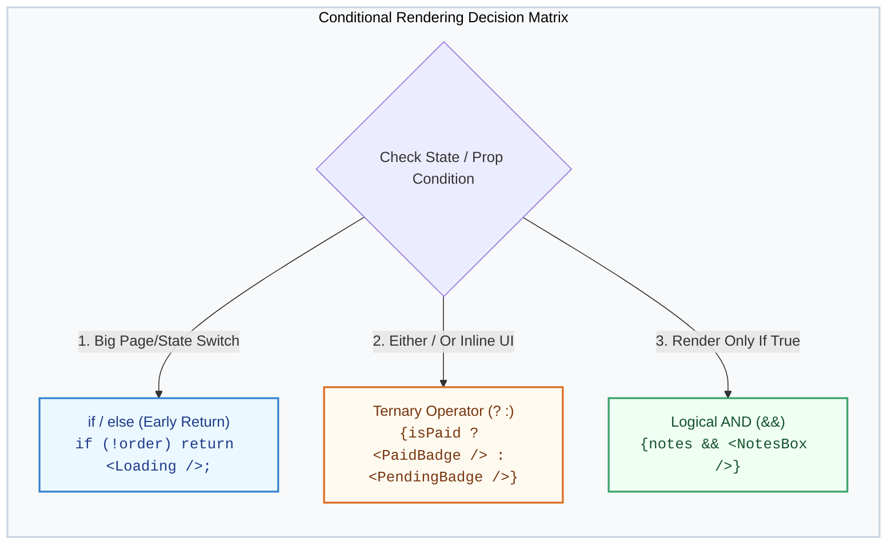

## 🚦 ១. The 3 Conditional Rendering Strategies (react.dev Guide)

> [!IMPORTANT]
> **និយមន័យ Conditional Rendering (Definition) ៖**  
> យោងតាមគេហទំព័រផ្លូវការរបស់ React (**react.dev**), **Conditional Rendering** គឺជាបច្ចេកទេសក្នុងការសម្រេចចិត្តបង្ហាញ UI Elements ឬ Components ផ្សេងៗគ្នា អាស្រ័យលើលក្ខខណ្ឌជាក់លាក់ (Conditions) នៃ State ឬ Props នៅក្នុង Component។  
> 
> នៅក្នុង React គ្មាន syntax ពិសេសដូចជា `v-if` ឬ `*ngIf` ឡើយ ប៉ុន្តែយើងប្រើ **JavaScript Native Syntax** ដូចជា ៖
> 1. **Early Return (`if/else`) ៖** សម្រាប់ដោះស្រាយស្ថានភាពទំព័រធំៗ (Loading, Error, Not Found)។
> 2. **Ternary Operator (`? :`) ៖** សម្រាប់ស្ថានភាពពីរផ្ទុយគ្នា (Either / Or ដូចជា Paid vs Pending)។
> 3. **Logical AND (`&&`) ៖** សម្រាប់បង្ហាញ UI លុះត្រាតែលក្ខខណ្ឌពិត (Render only if true)។


```mermaid
flowchart TD
    subgraph Decision["Conditional Rendering Decision Matrix"]
        direction TB
        Cond{"Check State / Prop Condition"}
        
        Cond -->|"1. Big Page/State Switch"| BranchA["if / else (Early Return)<br/><code>if (!order) return &lt;Loading /&gt;;</code>"]
        Cond -->|"2. Either / Or Inline UI"| BranchB["Ternary Operator (? :)<br/><code>{isPaid ? &lt;PaidBadge /&gt; : &lt;PendingBadge /&gt;}</code>"]
        Cond -->|"3. Render Only If True"| BranchC["Logical AND (&amp;&amp;)<br/><code>{notes &amp;&amp; &lt;NotesBox /&gt;}</code>"]
    end

    style Decision fill:#f8f9fa,stroke:#cbd5e1,stroke-width:2px,color:#000
    style BranchA fill:#ebf8ff,stroke:#3182ce,stroke-width:2px,color:#1e3a8a
    style BranchB fill:#fffaf0,stroke:#dd6b20,stroke-width:2px,color:#78350f
    style BranchC fill:#f0fff4,stroke:#38a169,stroke-width:2px,color:#14532d
```

---

## 🛠️ ២. ឧទាហរណ៍ជាក់ស្តែង ៖ OrderStatus Component

```jsx
// src/components/OrderStatus.jsx
import React from 'react';

export default function OrderStatus({ order, isLoading = false }) {
  // 1. Early Return សម្រាប់ស្ថានភាព Loading
  if (isLoading) {
    return (
      <div className="p-6 bg-slate-50 dark:bg-slate-900 border rounded-2xl text-center">
        <p className="text-slate-400 text-sm font-bold animate-pulse">⏳ កំពុងទាញយកទិន្នន័យ...</p>
      </div>
    );
  }

  // 2. Early Return សម្រាប់ករណីមិនមាន Order (Guard Clause)
  if (!order) {
    return (
      <div className="p-6 bg-rose-50 border border-rose-200 rounded-2xl text-center">
        <p className="text-rose-600 text-sm font-bold">⚠️ មិនមានទិន្នន័យការបញ្ជាទិញឡើយ!</p>
      </div>
    );
  }

  return (
    <div className="p-6 bg-white dark:bg-slate-900 border border-slate-200 dark:border-slate-800 rounded-2xl shadow-lg space-y-4 max-w-md mx-auto">
      <div className="flex justify-between items-center border-b pb-3">
        <h2 className="text-lg font-black text-slate-800 dark:text-white">
          ការបញ្ជាទិញ #{order.id}
        </h2>

        {/* 3. Ternary Operator (បង្ហាញ Paid ឬ Pending) */}
        {order.isPaid ? (
          <span className="px-2.5 py-1 bg-emerald-50 text-emerald-600 border border-emerald-200 text-xs font-bold rounded-full">
            ✓ បានទូទាត់រួច
          </span>
        ) : (
          <span className="px-2.5 py-1 bg-amber-50 text-amber-600 border border-amber-200 text-xs font-bold rounded-full">
            ⏳ រង់ចាំការទូទាត់
          </span>
        )}
      </div>

      {/* 4. Logical AND (បង្ហាញតែពេលមាន notes ពិតប្រាកដ) */}
      {order.notes && (
        <div className="bg-slate-50 dark:bg-slate-800/50 p-3 rounded-xl border border-slate-100 dark:border-slate-800 text-xs text-slate-600 dark:text-slate-300">
          <strong className="block text-slate-800 dark:text-white mb-1">📝 ចំណាំបន្ថែម ៖</strong>
          {order.notes}
        </div>
      )}
    </div>
  );
}
```

---

## 🔍 ៣. ការពន្យល់កូដមួយជួរៗ (Line-by-Line Breakdown)

| បន្ទាត់ (Line) | កូដ (Code) | ការពន្យល់លម្អិតបច្ចេកទេស |
| :--- | :--- | :--- |
| **Line 5-11** | `if (isLoading) return (...);` | **Loading Guard ៖** បើកំពុង Fetching ទិន្នន័យពី API Component នឹង return JSX Loading State ភ្លាមៗ ដោយមិនបាច់ខ្វល់ពី JSX ខាងក្រោមឡើយ។ |
| **Line 14-20** | `if (!order) return (...);` | **Null Safety Guard ៖** ប្រសិនបើ `order === null` ឬ `undefined` វានឹង return Error Alert ភ្លាមៗ ដែលជួយការពារបញ្ហា Runtime Crash ពេលទៅអាន `order.id` ខាងក្រោម។ |
| **Line 28-36** | `order.isPaid ? (<span ...>...</span>) : (<span ...>...</span>)` | **Ternary Operator ៖** វាយតម្លៃ `order.isPaid` ៖ ប្រសិនបើ `true` បង្ហាញ Badge ពណ៌បៃតង (`emerald`); ប្រសិនបើ `false` បង្ហាញ Badge ពណ៌ទឹកក្រូច (`amber`)។ |
| **Line 39-44** | `{order.notes && ( ... )}` | **Logical AND (`&&`) ៖** ប្រសិនបើ `order.notes` ជា String មានតម្លៃ (Truthy) វានឹងបង្ហាញផ្ទាំងកំណត់ចំណាំ។ ប្រសិនបើ `notes` ជា `null` ឬ `""` (Empty string) React នឹង Skip មិន render អ្វីឡើយ។ |

---

## ⚠️ ៤. អន្ទាក់ Falsy Number `0` ក្នុង JSX (The Gotcha)

រឿងដែលតែងតែបង្កជា Bug ក្នុង React ៖
```jsx
// ❌ គ្រោះថ្នាក់៖ ប្រសិនបើ unreadMessages = 0
<div>
  {unreadMessages && <span>សារថ្មី: {unreadMessages}</span>}
</div>
// ➔ អេក្រង់នឹងបង្ហាញលេខ "0" អណ្តែតចោលលើ UI!
```

> [!CAUTION]
> **មូលហេតុ ៖** នៅក្នុង JavaScript `0 && "text"` នឹង Return ចេញនូវតម្លៃ **`0`** មិនមែន `false` ឡើយ! ហើយ React យល់ថា `0` គឺជាលេខធម្មតា ដូច្នេះវានឹងយកទៅ Render លើ HTML ផ្ទាល់!  
> 
> **ដំណោះស្រាយត្រឹមត្រូវ ៖**  
> តែងតែបម្លែងលក្ខខណ្ឌទៅជា **Boolean ជាក់លាក់ (`> 0`)** ៖  
> ```jsx
> // ✅ ត្រឹមត្រូវ ១០០%
> {unreadMessages > 0 && <span>សារថ្មី: {unreadMessages}</span>}
> // ឬ
> {Boolean(unreadMessages) && <span>សារថ្មី: {unreadMessages}</span>}
> ```

---

## 📋 ៥. សង្ខេបចំណុចសំខាន់ៗ (Key Takeaways)

- ប្រើ **Early Returns** នៅដើម Component សម្រាប់ដោះស្រាយ Loading, Error, និង Guard clauses។
- ប្រើ **Ternary Operator (`? :`)** សម្រាប់ស្ថានភាព Either / Or ក្នុង JSX។
- ប្រើ **Logical AND (`&&`)** សម្រាប់ Render លុះត្រាតែលក្ខខណ្ឌពិត ប៉ុន្តែត្រូវប្រុងប្រយ័ត្នបញ្ហា Falsy Number `0` ដោយប្រើ `count > 0` ជានិច្ច។
