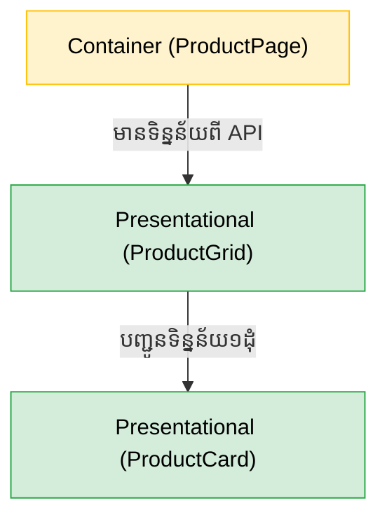

## 🏗️ រចនាសម្ព័ន្ធ Folder ស្តង់ដារ

ភាពខុសគ្នារវាងអ្នកចេះ React ធម្មតា និងអ្នកអភិវឌ្ឍន៍ React អាជីព គឺស្ថិតនៅលើរបៀបដែលពួកគេរៀបចំ Folder គម្រោង។ បើអ្នកដាក់កូដរាប់សិបឯកសារលាយឡំគ្នាក្នុង `src/components/` នោះគម្រោងអ្នកនឹងមានភាពរញ៉េរញ៉ៃ (Spaghetti Code) ជាក់ជាមិនខាន។

នេះជារចនាសម្ព័ន្ធដែលសហគមន៍ណែនាំសម្រាប់គម្រោងខ្នាតមធ្យម ទៅធំ៖

```text
src/
├── assets/          # រូបភាព, Icons, ពុម្ពអក្សរ
├── components/      # កន្លែងផ្ទុក Components ទាំងអស់
│   ├── ui/          # ប៊ូតុង, ប្រអប់វាយអក្សរ ដែលអាចប្រើបានគ្រប់ទីកន្លែង (Dumb)
│   ├── layout/      # របារម៉ឺនុយ (Navbar), Footer, Sidebar
│   └── common/      # Components ទូទៅ
├── features/        # បែងចែកតាមមុខងារ (ឧ. authentication, products, cart)
├── pages/           # Components ធំៗតំណាងអោយទំព័រនីមួយៗ
├── hooks/           # Custom Hooks ផ្ទាល់ខ្លួន
└── utils/           # អនុគមន៍ជំនួយ (ឧ. formatCurrency)
```

---

## 🎭 Presentational vs Container Components

ទស្សនវិជ្ជាដ៏សំខាន់មួយក្នុងការសរសេរ React គឺការបំបែកតួនាទី (Separation of Concerns)៖

### 1. Presentational Components (អ្នកបង្ហាញម៉ូដ / UI)
តួនាទីរបស់វាគឺ **"ធ្វើម៉េចអោយតែស្អាត"**។ វាគ្មាន State ស្មុគស្មាញ និងមិនចេះហៅ API ទេ! វារង់ចាំទទួលទិន្នន័យពី Props ហើយបង្ហាញចេញមកក្រៅ។
*ឧទាហរណ៍: `Button`, `ProductCard`, `Avatar`*

### 2. Container Components (អ្នកគ្រប់គ្រង / Logic)
តួនាទីរបស់វាគឺ **"ធ្វើការងារធ្ងន់"**។ វាមានតួនាទីហៅ API, ផ្ទុក State ធំៗ, និងគិតគូរពី Business Logic មុននឹងបញ្ជូនទិន្នន័យទៅអោយកូនៗ។
*ឧទាហរណ៍: `ProductListContainer`, `LoginForm`*



---

## ⬆️ ការលើក State ឡើងលើ (Lifting State Up)

នេះជាបញ្ហាដ៏ពេញនិយមបំផុត៖ ឧបមាថាអ្នកមាន Component ឪពុកមួយឈ្មោះ `Dashboard` ដែលមានកូនពីរគឺ `SearchBar` (សម្រាប់វាយអក្សរស្វែងរក) និង `ProductList` (សម្រាប់បង្ហាញទំនិញ)។ 

តើ `ProductList` ដឹងដោយរបៀបណាថាគេកំពុងវាយអក្សរអ្វីនៅក្នុង `SearchBar`? 
វាគ្មានផ្លូវទេ ព្រោះពួកវាជាបងប្អូននឹងគ្នា!

**ដំណោះស្រាយ:** យើងត្រូវ **លើក (Lift)** State `searchQuery` ពីក្នុង `SearchBar` យកទៅទុកក្នុង `Dashboard` វិញ។ 

```jsx
function Dashboard() {
  // 1. State ឥឡូវនេះស្ថិតនៅផ្ទះឪពុក
  const [searchQuery, setSearchQuery] = useState("");

  return (
    <div>
      {/* 2. ឪពុកបញ្ជូនសិទ្ធិកែប្រែ State ទៅអោយកូនទី១ (អ្នកវាយ) */}
      <SearchBar onSearch={setSearchQuery} />
      
      {/* 3. ឪពុកបញ្ជូនទិន្នន័យដែលបានកែប្រែរួច ទៅអោយកូនទី២ (អ្នកបង្ហាញ) */}
      <ProductList query={searchQuery} />
    </div>
  );
}
```
នេះគឺជាក្បួនដោះស្រាយបញ្ហាទិន្នន័យដ៏មានឥទ្ធិពលបំផុត មុននឹងអ្នកឈានដល់ការប្រើប្រាស់ Redux ឫ Context API!
