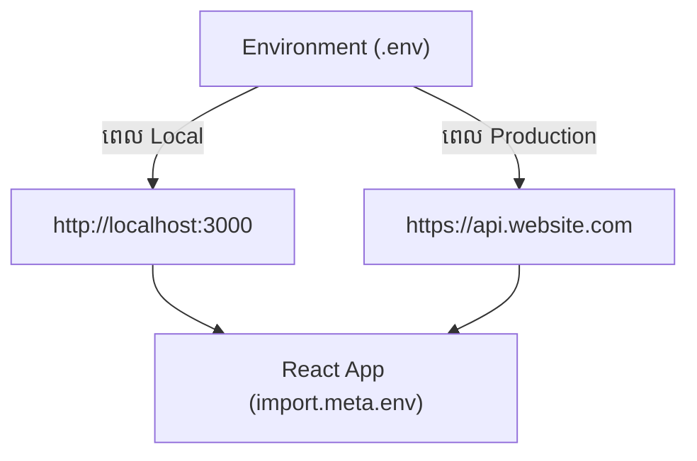

## ⚙️ ហេតុអ្វីយើងត្រូវការ `.env`?

នៅពេលសរសេរកូដ យើងតែងតែចង់អោយ API URL មានភាពខុសគ្នារវាងពេលកំពុងអភិវឌ្ឍន៍ (Local) និងពេលដាក់អោយគេប្រើប្រាស់ (Production)៖
- ពេលសរសេរកូដ: `http://localhost:3000/api`
- ពេលប្រើពិត: `https://api.mywebsite.com`

ជំនួសអោយការប្តូរកូដដោយដៃចុះឡើង យើងប្រើប្រាស់ **Environment Variables (អថេរបរិស្ថាន)** ដើម្បីអោយវាប្តូរដោយស្វ័យប្រវត្តិ។



---

## 📝 របៀបសរសេរក្នុង Vite

Vite មានច្បាប់ដ៏តឹងរ៉ឹងមួយ៖ **មានតែអថេរណាដែលផ្តើមដោយពាក្យ `VITE_` ប៉ុណ្ណោះ ទើបអាចហៅមកប្រើក្នុងកូដ React បាន!**

បង្កើតឯកសារឈ្មោះ `.env` នៅខាងក្រៅគេបង្អស់ (កម្រិតដូចគ្នាជាមួយ `package.json`)៖

```env
# ត្រឹមត្រូវ: អាចហៅបាន
VITE_API_URL=https://api.mywebsite.com
VITE_STRIPE_PUBLIC_KEY=pk_test_897534

# ខុស: មិនអាចហៅបានទេ ព្រោះអត់មាន VITE_ (Vite លាក់វាដើម្បីសុវត្ថិភាពកុំអោយច្រឡំ)
DATABASE_PASSWORD=supersecret
```

---

## 📞 របៀបហៅមកប្រើប្រាស់

នៅក្នុងកូដ React អ្នកអាចហៅអថេរទាំងនោះបានតាមរយៈ Object ឈ្មោះថា `import.meta.env`៖

```jsx
function App() {
  const fetchProducts = async () => {
    // វានឹងក្លាយជា https://api.mywebsite.com/products ពេល Production
    const response = await fetch(`${import.meta.env.VITE_API_URL}/products`);
    const data = await response.json();
    console.log(data);
  };

  return <button onClick={fetchProducts}>Load Products</button>;
}
```

---

## 🚨 ការព្រមានអំពីសុវត្ថិភាព (Security Warning)

ដូចដែលបានរៀបរាប់នៅក្នុង Quiz ខាងលើ: **Frontend មិនមែនជាកន្លែងសម្រាប់លាក់អាថ៌កំបាំងទេ!**

ទោះបីជាអ្នកទុកវាក្នុងឯកសារ `.env` ក៏ដោយ នៅពេលដែលអ្នកដំណើរការ `npm run build` Vite នឹងយកតម្លៃនោះទៅជំនួស (Replace) ចំៗនៅក្នុងកូដ JavaScript តែម្តង។ 
នេះមានន័យថា ជនខិលខូចអាចបើក `Inspect -> Sources` នៅក្នុង Browser ហើយអានឃើញ API Key សម្ងាត់នោះបានយ៉ាងងាយ។

**តើត្រូវធ្វើយ៉ាងណា?**
- **អនុញ្ញាត:** រក្សាទុក Public Keys (ដែលក្រុមហ៊ុនអនុញ្ញាតអោយបង្ហាញ), API URLs, ឫលេខ Config ជាទូទៅ។
- **ហាមឃាត់:** រក្សាទុក Secret Keys, Passwords, ឫ Token ឯកជន។ ប្រសិនបើអ្នកត្រូវការវា អ្នកត្រូវបង្កើត Backend Server មួយទៀត (ដូចជា Node.js ឫ Laravel) ដើម្បីធ្វើការងារនោះជំនួស Frontend!

*(ចំណាំ: អ្នកក៏អាចបង្កើតឯកសារ `.env.local` សម្រាប់រក្សាទុកអថេរដែលអាចប្រើបានតែលើកុំព្យូទ័ររបស់អ្នកម្នាក់ឯង ហើយត្រូវប្រាកដថាបានដាក់វាចូលក្នុង `.gitignore`)*
