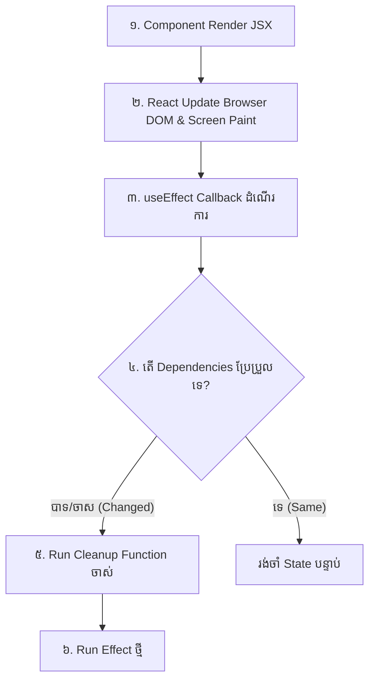

# 🔄 useEffect & Synchronization

`useEffect` អនុញ្ញាតឱ្យ Functional Component អាចធ្វើការងារជាមួយ **Side Effects** ដូចជាការតភ្ជាប់ Network, ការកែប្រែ Document Title, ការកំណត់ Timers, ឬការភ្ជាប់ Browser Event Listeners។



---

## ការប្រើប្រាស់ Cleanup Function

```tsx
import { useState, useEffect } from "react";

export function WindowSizeTracker() {
  const [windowWidth, setWindowWidth] = useState(window.innerWidth);

  useEffect(() => {
    const handleResize = () => setWindowWidth(window.innerWidth);

    window.addEventListener("resize", handleResize);

    return () => {
      window.removeEventListener("resize", handleResize);
    };
  }, []);

  return (
    <div className="p-4 bg-slate-900 rounded-xl text-white">
      ទទឹងអេក្រង់បច្ចុប្បន្ន: <span className="font-bold text-indigo-400">{windowWidth}px</span>
    </div>
  );
}
```
