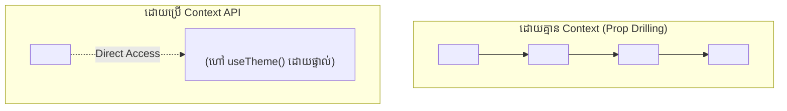

# 🌐 useContext & Context API

**Context API** អនុញ្ញាតឱ្យយើងចែករំលែកទិន្នន័យ (ដូចជា Current User, Theme, Cart) ទៅកាន់គ្រប់ Components ទាំងអស់នៅក្នុង Tree ដោយមិនចាំបាច់ឆ្លងកាត់ **Prop Drilling** ឡើយ។



---

## ការអនុវត្ត Theme Context ពេញលេញជាមួយ TypeScript

```tsx
// src/context/ThemeContext.tsx
import { createContext, useContext, useState, ReactNode } from "react";

type Theme = "light" | "dark";

interface ThemeContextType {
  theme: Theme;
  toggleTheme: () => void;
}

const ThemeContext = createContext<ThemeContextType | undefined>(undefined);

export function ThemeProvider({ children }: { children: ReactNode }) {
  const [theme, setTheme] = useState<Theme>("dark");

  const toggleTheme = () => {
    setTheme((prev) => (prev === "dark" ? "light" : "dark"));
  };

  return (
    <ThemeContext.Provider value={{ theme, toggleTheme }}>
      <div className={theme === "dark" ? "dark bg-slate-950 text-white" : "bg-white text-slate-900"}>
        {children}
      </div>
    </ThemeContext.Provider>
  );
}

export function useTheme() {
  const context = useContext(ThemeContext);
  if (!context) {
    throw new Error("useTheme must be used within a ThemeProvider");
  }
  return context;
}
```
