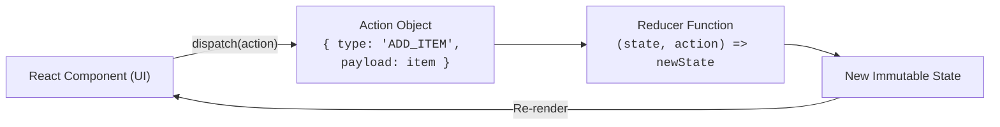

# 🗃️ useReducer: Managing Complex State

`useReducer` គឺជាជម្រើសដ៏មានឥទ្ធិពលជំនួសឱ្យ `useState` នៅពេលដែលអ្នកមាន **Complex State Logic** ដែលមាន Actions និង State Transitions ច្រើន។



---

## ឧទាហរណ៍ Shopping Cart ជាមួយ `useReducer`

```tsx
import { useReducer } from "react";

interface CartItem {
  id: string;
  name: string;
  price: number;
  quantity: number;
}

interface CartState {
  items: CartItem[];
}

type CartAction =
  | { type: "ADD_ITEM"; payload: { id: string; name: string; price: number } }
  | { type: "REMOVE_ITEM"; payload: { id: string } }
  | { type: "CLEAR_CART" };

function cartReducer(state: CartState, action: CartAction): CartState {
  switch (action.type) {
    case "ADD_ITEM": {
      const existing = state.items.find((i) => i.id === action.payload.id);
      if (existing) {
        return {
          ...state,
          items: state.items.map((i) =>
            i.id === action.payload.id ? { ...i, quantity: i.quantity + 1 } : i
          ),
        };
      }
      return { ...state, items: [...state.items, { ...action.payload, quantity: 1 }] };
    }
    case "REMOVE_ITEM":
      return { ...state, items: state.items.filter((i) => i.id !== action.payload.id) };
    case "CLEAR_CART":
      return { items: [] };
    default:
      return state;
  }
}

export function ShoppingCart() {
  const [state, dispatch] = useReducer(cartReducer, { items: [] });

  return (
    <div className="p-6 bg-slate-900 rounded-2xl text-white space-y-4">
      <h2 className="text-xl font-bold">កន្ត្រកទំនិញ ({state.items.length})</h2>
      <button
        onClick={() => dispatch({ type: "ADD_ITEM", payload: { id: "p-1", name: "Keyboard", price: 80 } })}
        className="px-4 py-2 bg-indigo-600 rounded-lg"
      >
        + ថែម Keyboard ($80)
      </button>
      <button
        onClick={() => dispatch({ type: "CLEAR_CART" })}
        className="ml-2 px-4 py-2 bg-rose-600 rounded-lg"
      >
        សម្អាតកន្ត្រក
      </button>
    </div>
  );
}
```
