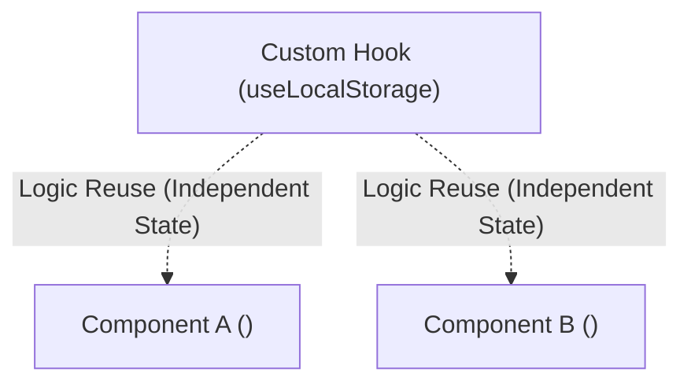

# 🪝 Building Custom React Hooks

**Custom Hook** គឺជា JavaScript Function ធម្មតាដែលចាប់ផ្តើមដោយពាក្យ `use` ហើយអាចហៅ React Hooks ផ្សេងទៀត (`useState`, `useEffect`, `useRef`) នៅខាងក្នុងខ្លួនបាន។



---

## ការបង្កើត `useDebounce` Hook (សម្រាប់ Live Search)

```tsx
// src/hooks/useDebounce.ts
import { useState, useEffect } from "react";

export function useDebounce<T>(value: T, delay: number = 500): T {
  const [debouncedValue, setDebouncedValue] = useState<T>(value);

  useEffect(() => {
    const timer = setTimeout(() => {
      setDebouncedValue(value);
    }, delay);

    return () => {
      clearTimeout(timer);
    };
  }, [value, delay]);

  return debouncedValue;
}
```
