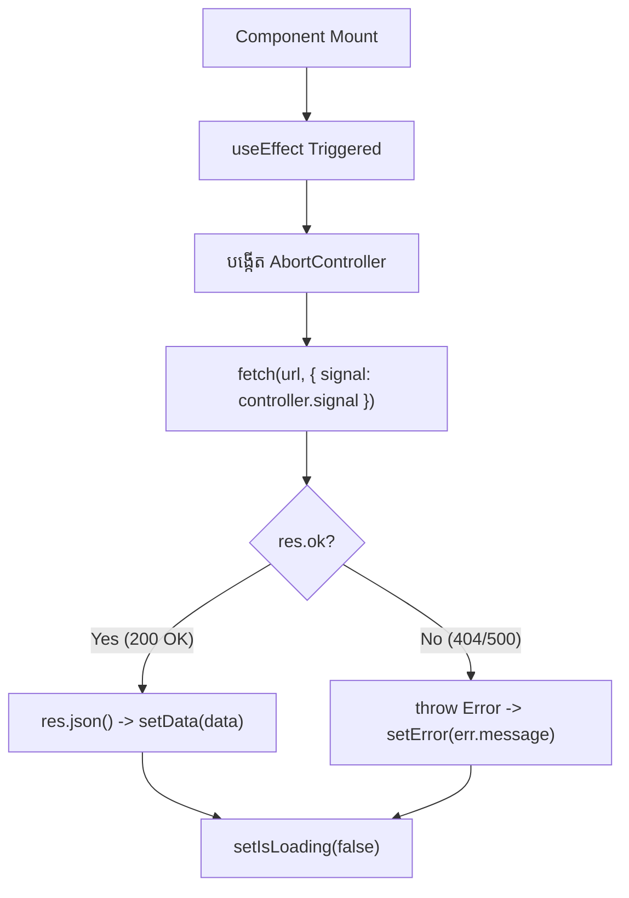

# 🌐 Data Fetching ជាមួយ Fetch API

Native **Fetch API** គឺជាមធ្យោបាយស្តង់ដាររបស់ Browser សម្រាប់ធ្វើ HTTP Requests ទៅកាន់ RESTful API ពី React។



---

## ឧទាហរណ៍៖ Complete Data Fetching ជាមួយ AbortController

```tsx
import { useState, useEffect } from "react";

interface User {
  id: number;
  name: string;
  email: string;
}

export function UserList() {
  const [users, setUsers] = useState<User[]>([]);
  const [isLoading, setIsLoading] = useState(true);
  const [error, setError] = useState<string | null>(null);

  useEffect(() => {
    const controller = new AbortController();

    async function loadUsers() {
      try {
        setIsLoading(true);
        setError(null);

        const res = await fetch("https://jsonplaceholder.typicode.com/users", {
          signal: controller.signal,
        });

        if (!res.ok) {
          throw new Error(`HTTP error! status: ${res.status}`);
        }

        const data: User[] = await res.json();
        setUsers(data);
      } catch (err: any) {
        if (err.name !== "AbortError") {
          setError(err.message || "Failed to load users");
        }
      } finally {
        setIsLoading(false);
      }
    }

    loadUsers();

    return () => {
      controller.abort(); // Cancel request if component unmounts
    };
  }, []);

  if (isLoading) return <p className="text-slate-400">កំពុងទាញយកទិន្នន័យ...</p>;
  if (error) return <p className="text-rose-400">កំហុស: {error}</p>;

  return (
    <ul className="space-y-2">
      {users.map((u) => (
        <li key={u.id} className="p-3 bg-slate-800 rounded-lg text-white">
          {u.name} ({u.email})
        </li>
      ))}
    </ul>
  );
}
```
