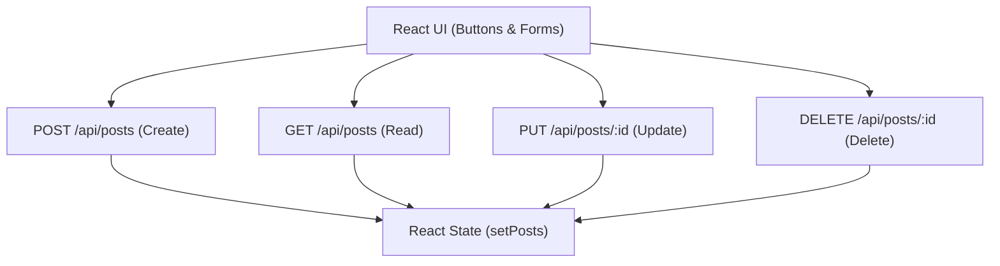

# 🔁 RESTful CRUD Operations

CRUD តំណាងឱ្យ **Create**, **Read**, **Update**, និង **Delete** ដែលជាប្រតិបត្តិការស្នូលក្នុង Web Application ភាគច្រើន។



---

## ឧទាហរណ៍៖ CRUD Service & Component Integration

```tsx
import { useState } from "react";
import { apiClient } from "../services/api";

interface Post {
  id: string;
  title: string;
  body: string;
}

export function PostManager() {
  const [posts, setPosts] = useState<Post[]>([]);

  // CREATE (POST)
  const handleCreate = async (title: string, body: string) => {
    const res = await apiClient.post<Post>("/posts", { title, body });
    setPosts((prev) => [res.data, ...prev]);
  };

  // UPDATE (PUT)
  const handleUpdate = async (id: string, updatedTitle: string) => {
    const res = await apiClient.patch<Post>(`/posts/${id}`, { title: updatedTitle });
    setPosts((prev) => prev.map((p) => (p.id === id ? res.data : p)));
  };

  // DELETE (DELETE)
  const handleDelete = async (id: string) => {
    if (!window.confirm("តើអ្នកពិតជាចង់លុបមែនទេ?")) return;
    await apiClient.delete(`/posts/${id}`);
    setPosts((prev) => prev.filter((p) => p.id !== id));
  };

  return <div className="space-y-4">{/* Render Form & List */}</div>;
}
```
